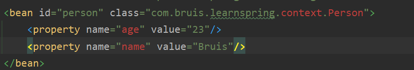

## 1.Cannot find class [com.bruis.learnspring.context.Person] for bean with name 'person' defined in class path resource [applicationContext.xml]; nested exception is java.lang.ClassNotFoundException: com.bruis.learnspring.context.Person

原因：

配置文件中的类指定错误

