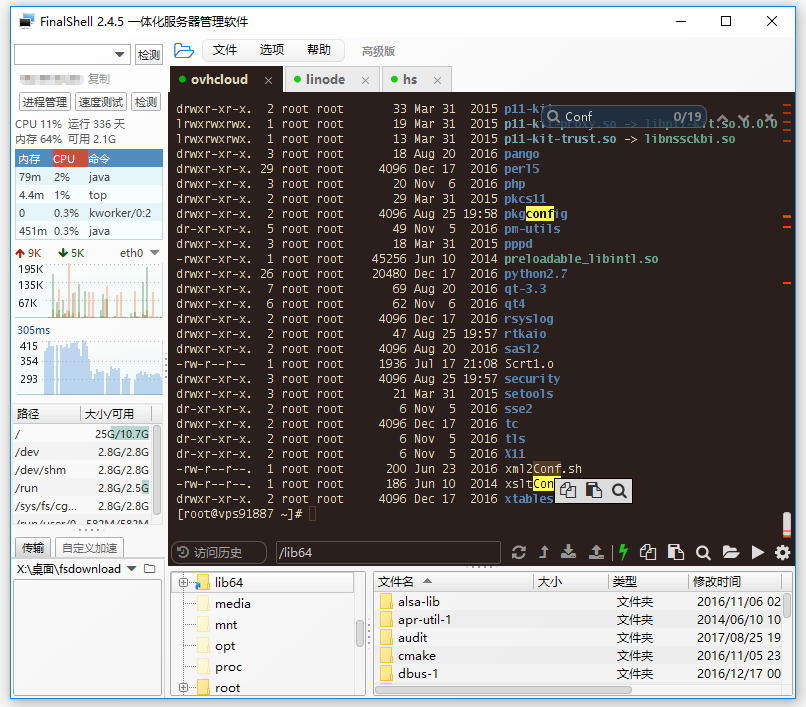
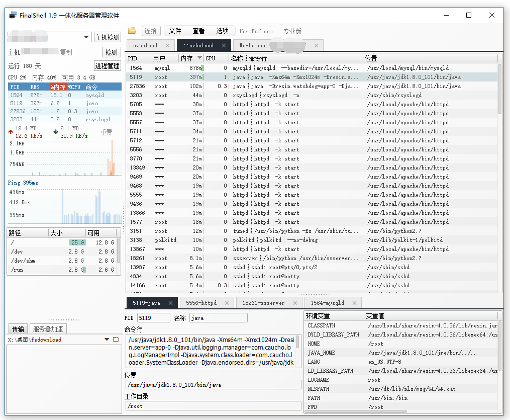
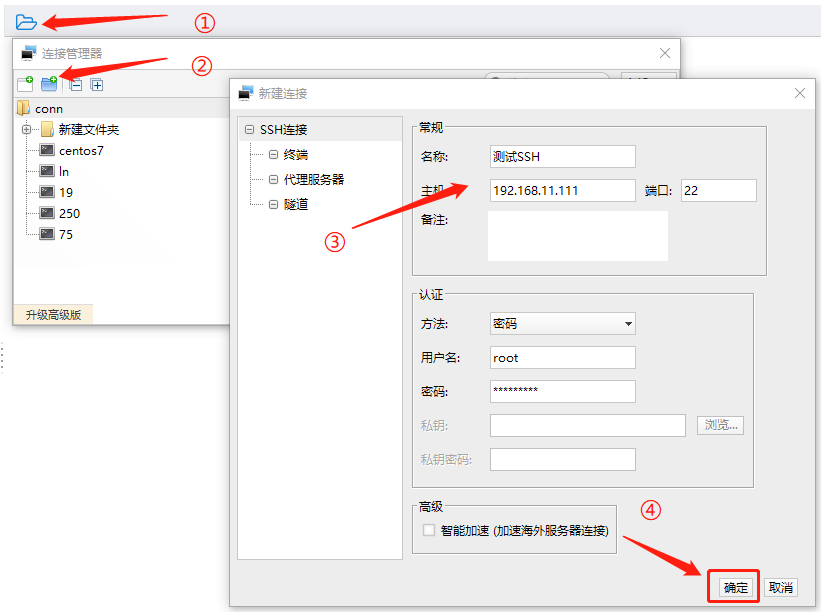
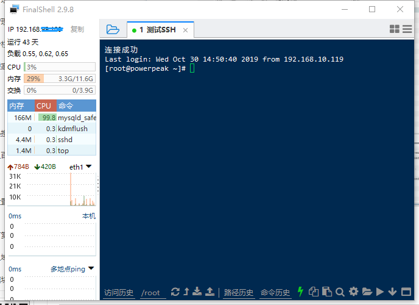
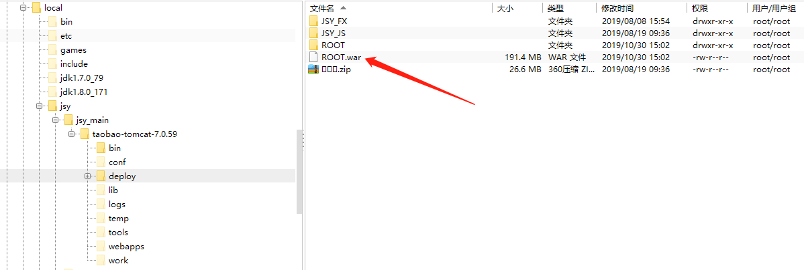
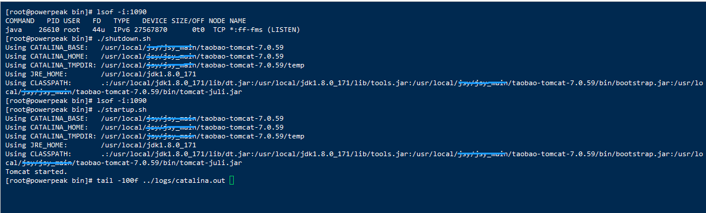

<!-- FinalShell ：简介及项目部署方法 -->

> [!TIP]
>
> 之前使用 xshell + ftp 组合的方式来部署项目，后来发现了FinalShell 这款软件，很方便，不过这款软件是Java写的，内存占用会比较大，另外听说有安全隐患，谨慎使用！

## 简介

> FinalShell 相当于 xshell + ftp 的组合，即：FinalShell =  xshell + ftp ；
>
> FinalShell 只用一个程序，将xshell 、ftp同屏显示，既可以输入命令，也可以传输数据，还能以树的形式展示文件路径；

### FinalShell 下载地址

> Windows版下载地址：http://www.hostbuf.com/downloads/finalshell_install.exe

> macOS版下载地址：http://www.hostbuf.com/downloads/finalshell_install.pkg

### FinalShell 特点

- 多平台支持Windows,Mac OS X,Linux；
- 支持登录ssh和Windows远程桌面，且均支持代理服务器. ；
- 漂亮的平滑字体显示,内置100多个配色方案 ；
- 终端,sftp同屏显示,同步切换目录 ；
- 命令自动提示,智能匹配,输入更快捷,方便；
- sftp支持,通过各种优化技术,加载更快,切换,打开目录无需等待 ；
- 服务器网络,性能实时监控,无需安装服务器插件 ；
- 内置海外服务器加速,加速远程桌面和ssh连接,操作流畅无卡顿；
- 双边加速功能,大幅度提高访问服务器速度；
- 实时硬盘监控，内存,Cpu性能监控,Ping延迟丢包,Trace路由监控 ；
- 快捷命令面板,可同时显示数十个命令
- 内置文本编辑器,支持语法高亮,代码折叠,搜索,替换
- 进程管理器
- 打包传输,自动压缩解压
- 多地点ping监控

### FinalShell 界面展示

1. Shell终端界面

   

2. 进程管理器界面

## 部署方法

### 1.连接服务器

点击右上角文件夹 --> 创建SSh连接 --> 成功进入到控制台

 进入控制台的场景：

### 2.上传文件

cd命令进入项目tomcat的webapps目录下 --> 删除ROOT.war包和ROOT文件夹 --> 传输ROOT.war包（右键就有传输命令）

### 3.启动项目

进入Tomcat的bin目录下 --> 查看服务器端口的运行状态 --> 关闭项目  --> 启动项目 --> 查看日志

### 4.简单解释下Tomcat目录

> 详细解释 ： https://blog.csdn.net/weixin_44259720/article/details/102824800

backup：保存了一些配置文件，是在第一次运行了Tomcat服务器以后产生的；
bin：主要用来存放Tomcat的命令，很多环境变量也在此处设置；
conf：存放tomcat服务器全局配置的各种文件。backup文件夹为它的备份；
lib：存放Tomcat服务器所需要的所有Jar包；
log：用来存放Tomcat执行时的日志文件；
webapps：tomcat默认部署路径。目录用来存放应用程序，当Tomcat启动时会加载webapps目录下的应用程序；
work：用来存放Tomcat运行时编译后的文件。清空work目录，重启Tomcat，可以达到清除Tomcat服务器缓存的目的

### 总结下所需的Linux命令

- lsof -i:端口号 ：查看服务器端口的运行状态；
- tail -100f catalina.out ：动态查看catalina.out文件日志的最新的100行；
- cd /usr/local：进入/usr/local文件目录；
- ls：详细展示文件夹目录内容；
- ./shutdown.sh：关闭Tomcat项目，需要在bin目录下；
- ./startup.sh：启动Tomcat项目，需要在bin目录下；
- ps -ef|grep tomcat：查看进程号；
- kill -9 进程号：强制杀死进程。

----------

> 版权声明：本文为CSDN博主「Java Punk」的原创文章，遵循CC 4.0 BY-SA版权协议，转载请附上原文出处链接及本声明。
> 原文链接：https://blog.csdn.net/weixin_44259720/article/details/102822032