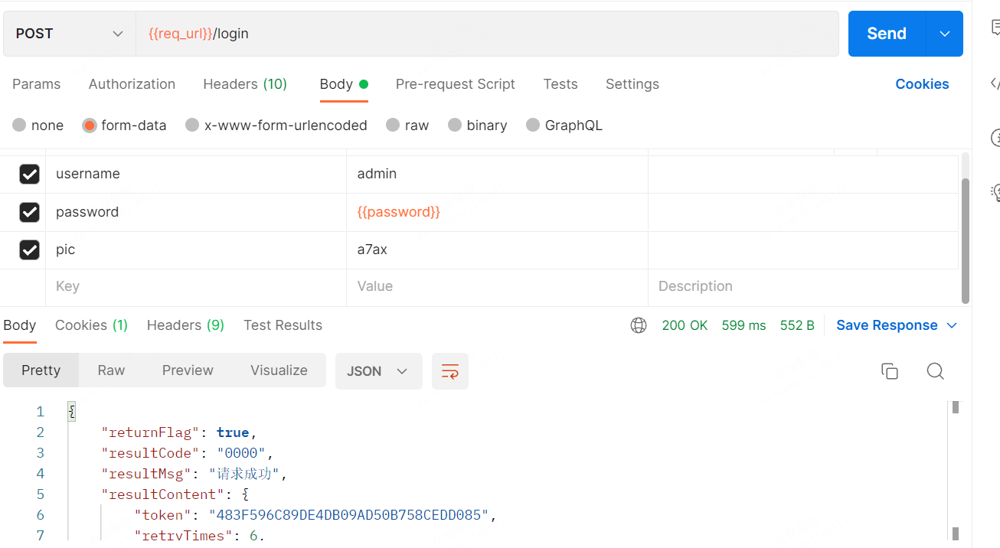
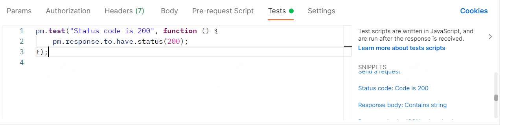
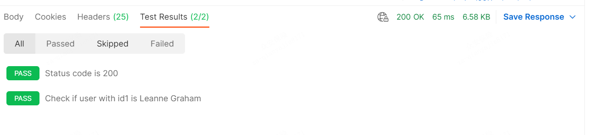
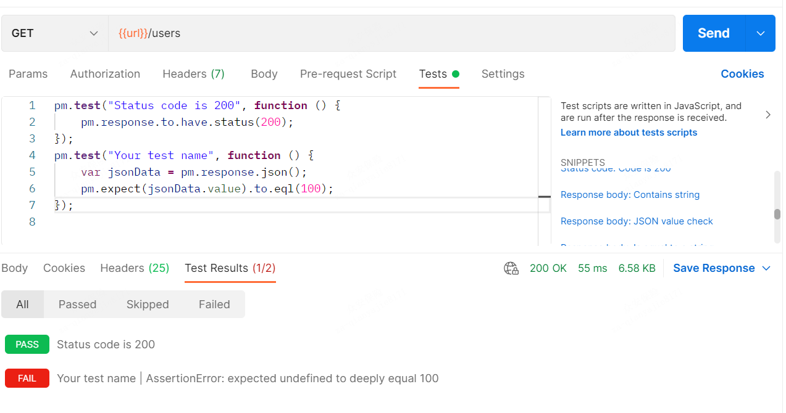
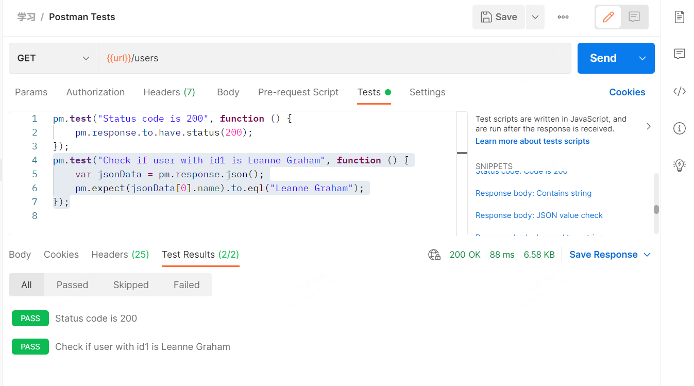

# 1 发送请求

## body的格式选则

### 1、multipart/form-data: 

就是http请求中的multipart/form-data,它会将表单的数据处理为一条消息，以标签为单元，用分隔符分开。既可以上传键值对，也可以上传文件。当上传的字段是文件时，会有Content-Type来说明文件类型；content-disposition，用来说明字段的一些信息；由于有boundary隔离，所以multipart/form-data既可以上传文件，也可以上传键值对，它采用了键值对的方式，所以可以上传多个文件。

### 2、x-www-form-urlencoded：

就是application/x-www-from-urlencoded,会将表单内的数据转换为键值对，当模拟表单上传数据时，用此选项，但当然此表单不能上传文件，只能是文本格式，要上传文件，使用上面的格式。比如,name=ah&age = 23

总结一下两位重要格式的区别：

multipart/form-data：既可以上传文件等二进制数据，也可以上传表单键值对，只是最后会转化为一条信息；

x-www-form-urlencoded：只能上传键值对，并且键值对都是间隔分开的。

### 3、raw

可以上传任意格式的文本，可以上传text、json、xml、html等，其实主要的还是传递json格式的数据，当后端要求json数据格式的时候，就要使用此种格式来测试。

### 4、binary

相当于Content-Type:application/octet-stream,只可以上传二进制数据，通常用来上传文件，由于没有键值，所以，一次只能上传一个文件。


> 原文链接：https://blog.csdn.net/elephant230/article/details/82882303/

# 2 请求参数化

- 先配置环境

  

- 选择环境

  

- 最后填入参数



# 3 Postman Tests

> Postman Tests在请求中添加JavaScript代码来协助验证结果
>
> 如：成功或失败状态、预期结果的比较等等。
>
> 通常从pm.test开始。它可以与断言相比较，验证其他工具中可用的命令。

接下来创建一个包含Tests的请求：

- Step 1） 创建一个Get请求
  1、切换到Tests选项，右边是代码片段选项。
  2、从右边的代码片段选项里面选中 “Status code: Code is 200”
  3、JS代码就自动出现在窗口中

  

- Step 2)  点击发送请求按钮。测试结果就显示出来了

  

- Step 3) 回到Tests选项卡，让我们添加另一个测试。这次我们将比较预期结果和实际结果。
  在右边的SNIPPETS区域选择"Response body:JSON value check"选项，我们将检查Leanne Graham是否拥有userid 1。

  

- Step 4）
  1、将代码中的“Your Test Name”替换为“Check if user with id1 is Leanne Graham”，以便测试名称确切描述我们想测试的内容。
  2、使用jsonData[0].name代替jsonData.value; 获取路径，在获取结果之前检查Body。因为Leanne Graham是userid 1，所以jsonData在第一个结果中，这个结果应该从0开始。如果你想获得第二个结果，那么对后续结果使用jsonData[1] 即可。
  3、在eql中，输入“Leanne Graham”

```javascript
pm.test("Check if user with id1 is Leanne Graham", function () {
    var jsonData = pm.response.json();
    pm.expect(jsonData[0].name).to.eql("Leanne Graham");
});
```

- Step 5) 点击发送请求，可以看到你的请求之后测试结果中有两项显示测试通过。

  

> 注意：
> 有不同种类的测试可以在Postman中创建。尝试探索这个工具，看看哪些测试适合你实际测试。

# 4 创建集合 Collection

# 5 运行集合

## Collection Runner

- Step 1) 单击页面底部的Runner按钮，如下图。

  

- Step 2） Collection Runner页面应该出现如下所示。以下是对各个字段的描述

Step 3) 做如下设置，运行你的测试集合

选择Postman测试集合-集合迭代次数为3
设置延迟为2500毫秒
点击Start Run按钮

Step 4) 单击Run按钮后将显示Run结果页。根据延迟的不同，你应该在测试执行的同时看到显示的结果。
1、一旦测试完成，你就可以看到测试状态是通过还是失败，以及每个迭代的结果。
2、你将看到Get请求的Pass状态；
3、由于我们没有任何Post测试，所以应该会出现请求没有任何测试的消息。

可以看出在请求中进行测试是多么重要，这样你就可以验证HTTP请求状态是否成功，以及是否创建或查询到了数据。

