<!-- 雀魂麻将 -->

# 基本规则

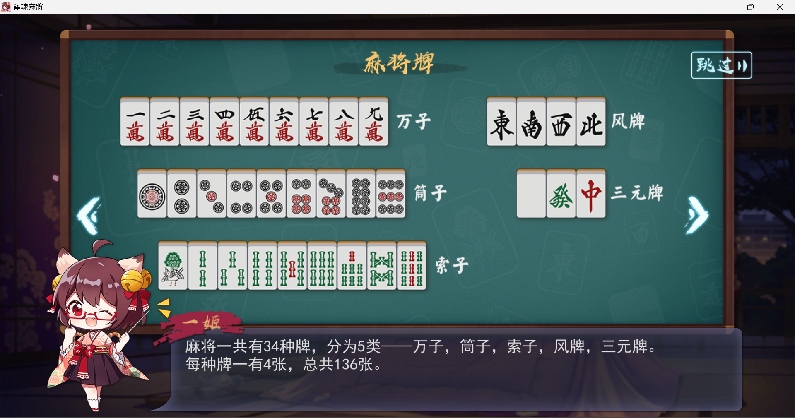

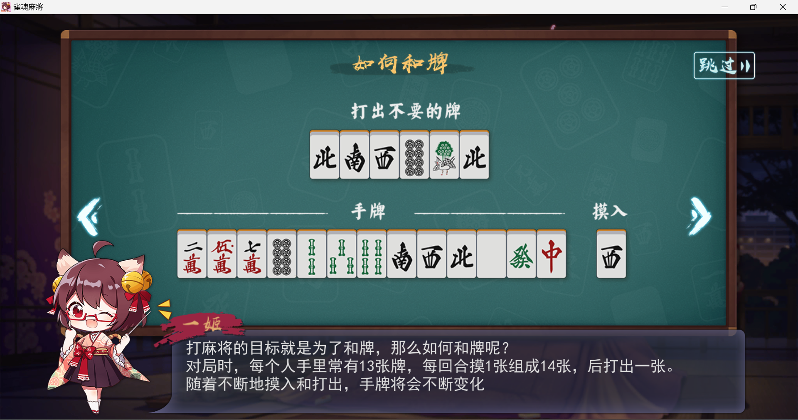

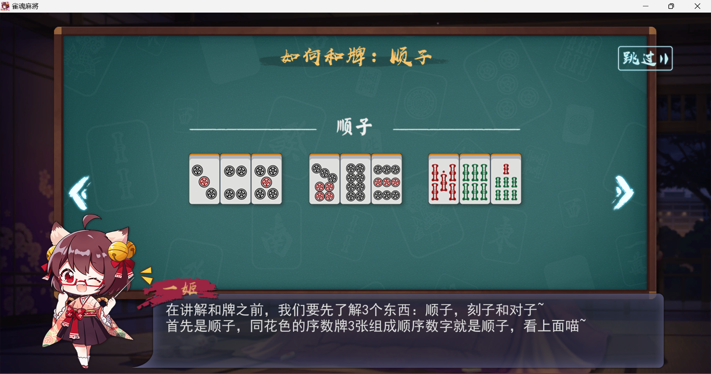

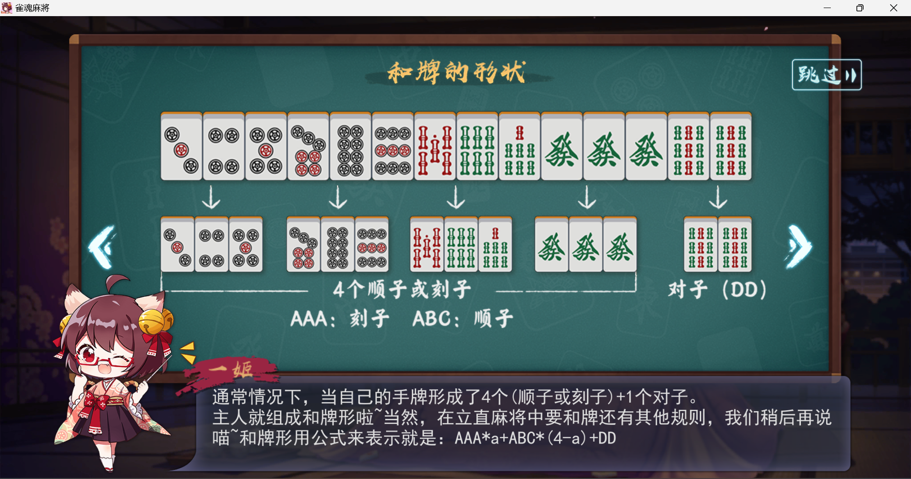

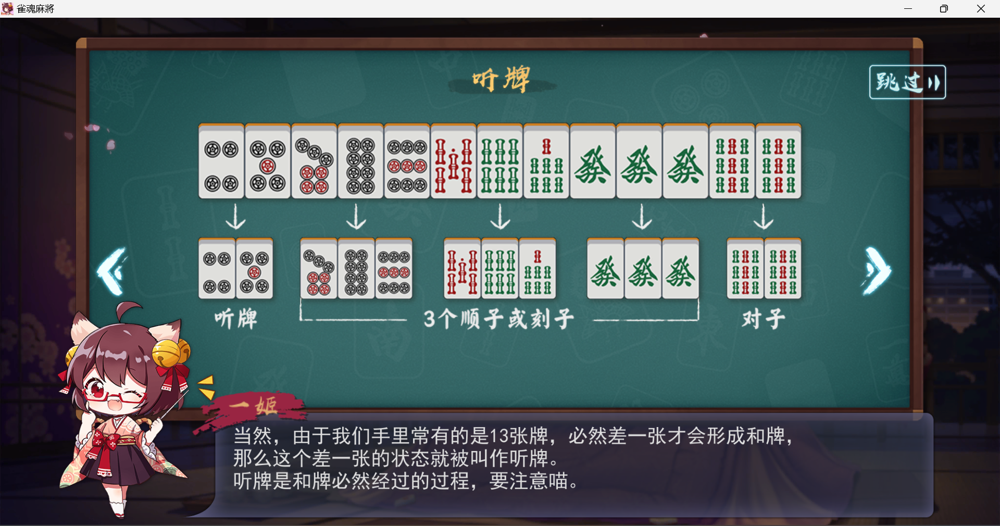

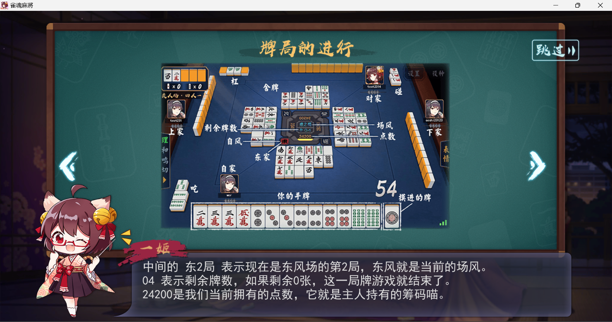

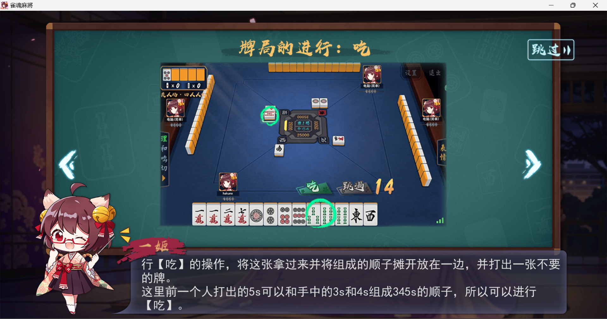

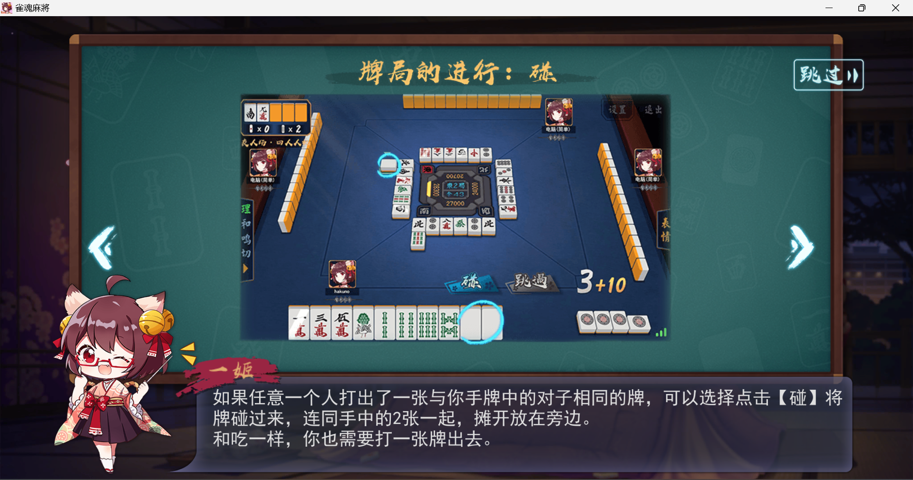

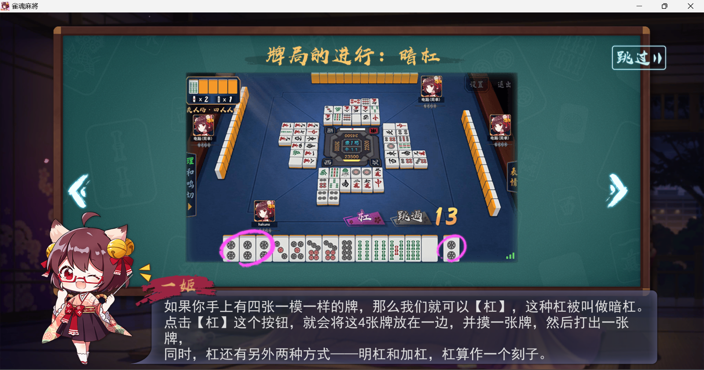

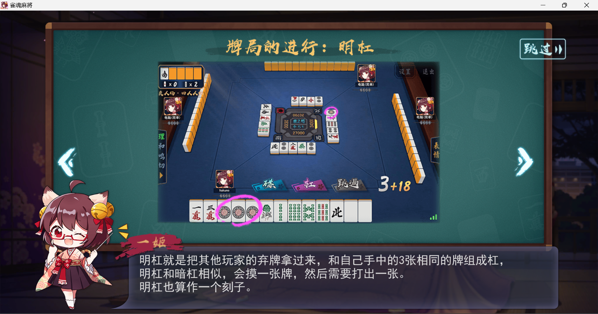

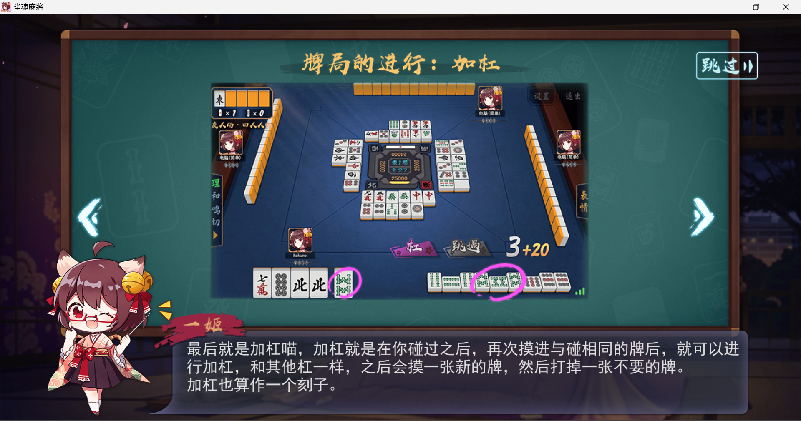

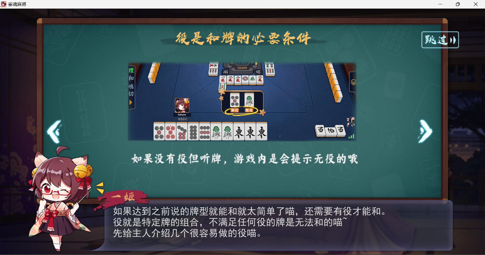

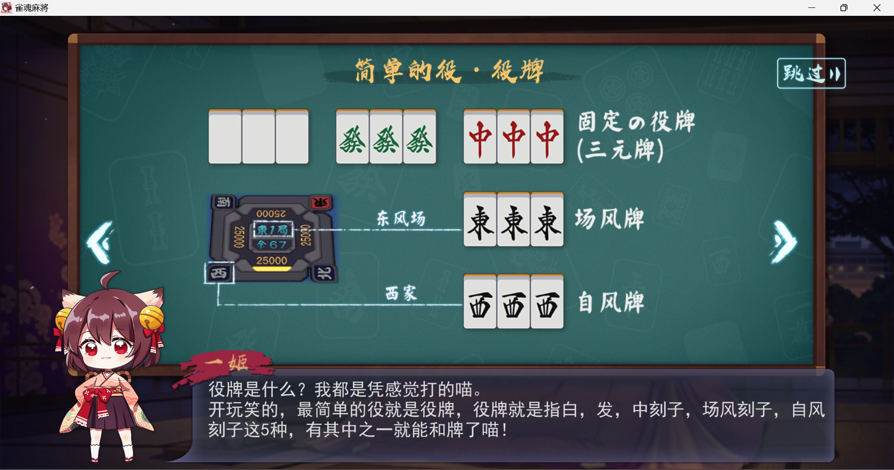

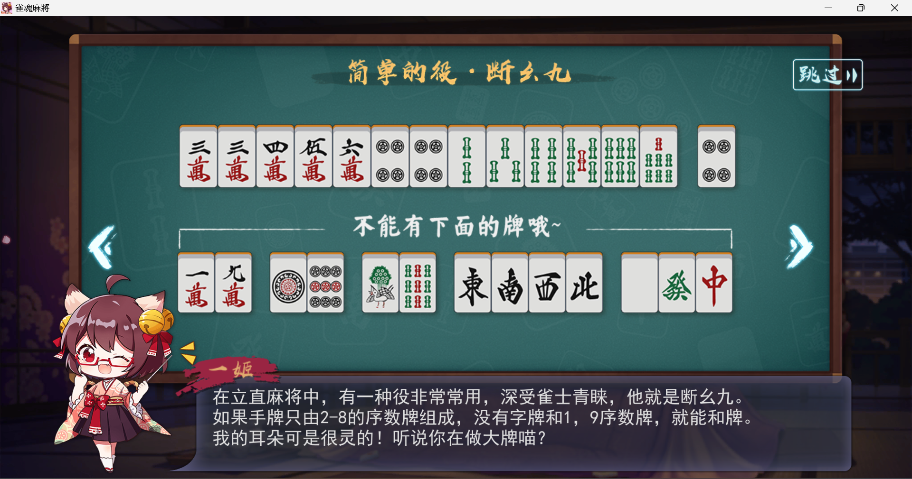

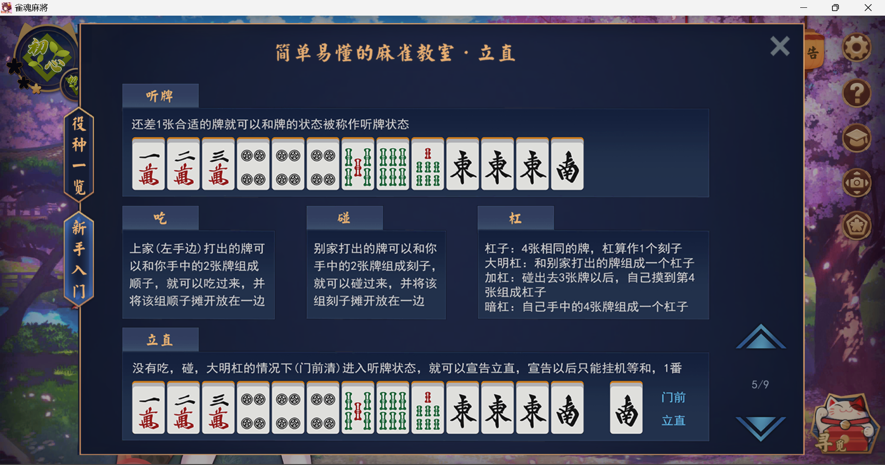

# 专业术语

点数

指牌面上的点数，也称为符数。在计算得分时会用到。

1. 副露：在自己的回合外，选择暴露手牌的动作。分为吃、碰、杠三种。

2. 食替：一种打牌技巧，即在可以选择打哪张牌的时候，尽可能地选择不让自己的手牌变差。

3. 立直：一种特殊的状态，表示只剩下一张牌没有听牌，此时可以选择立直，成为立直听牌状态。此时打出的牌如果可以胡牌，得分会翻倍。

4. 喰い下がり：在立直状态下，选择吃进自己不需要的牌，以便更快地成为听牌状态。

5. 役：指特定的组合，胡牌时可以额外得到的分数。雀魂麻将中有许多不同的役，如役牌、顺子、刻子、杠子等等。

6. 一发：表示摸到第一张牌就能够和牌，此时得分会额外翻倍。

7. 自摸：表示自己摸到最后一张牌并且和牌，此时得分会更高。

8. 海底捞月：指在牌库的最后一张牌被摸走后，能够和牌的状态。此时得分会额外翻倍。

以上是一些雀魂麻将中常见的术语，希望能对你有所帮助。