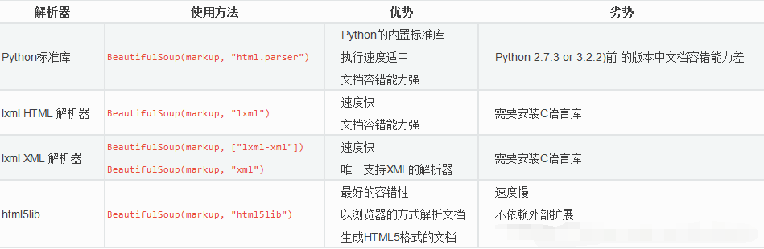

<!-- BeautifulSoap-->

## 1.Beautiful Soap概述

Beautiful Soup是一个Python库，用于从HTML和XML文件中提取数据。它可以解析HTML和XML文档，修复文档的格式，并使数据易于提取和操作。

Beautiful Soup的主要特点是它能够处理不完整或错误的HTML和XML文件，因为它使用了Python的内置HTML解析器和第三方库来构建解析树。

使用Beautiful Soup，可以通过多种方式搜索文档中的标签、内容和属性，例如按标签名、类名、id等搜索。此外，Beautiful Soup还提供了一些方便的方法和属性，例如获取标签的子标签、获取标签的文本内容、获取标签的属性值等。

Beautiful Soup被广泛应用于Web爬虫和数据抓取的领域，以及数据分析和自然语言处理等领域。

## 2.BS4主要解析器



## 3.入门案例

假设有这样一个Html，具体内容如下：

```html
<!DOCTYPE html>
<html>
<head>

	<meta content="text/html;charset=utf-8" http-equiv="content-type" />
	<meta content="IE=Edge" http-equiv="X-UA-Compatible" />
	<meta content="always" name="referrer" />
	<link href="https://ss1.bdstatic.com/5eN1bjq8AAUYm2zgoY3K/r/www/cache/bdorz/baidu.min.css" rel="stylesheet" type="text/css" />
	<title>百度一下，你就知道 </title>
</head>

<body link="#0000cc">

<div id="wrapper">

<div id="head">

<div class="head_wrapper">

<div id="u1">

<a class="mnav" href="http://news.baidu.com" name="tj_trnews">新闻

</a>

<a class="mnav" href="https://www.hao123.com"

name="tj_trhao123">hao123 </a>

<a class="mnav" href="http://map.baidu.com" name="tj_trmap">地图 </a>

<a class="mnav" href="http://v.baidu.com" name="tj_trvideo">视频 </a>

<a class="mnav" href="http://tieba.baidu.com" name="tj_trtieba">贴吧

</a>

<a class="bri" href="//www.baidu.com/more/" name="tj_briicon"
style="display: block;">更多产品 </a>
</div>
</div>
</div>
</div>
</body>
</html>
```
创建beautifulsoup4对象：
```python
from bs4 import BeautifulSoup

file = open('./aa.html', 'rb')

html = file.read()

bs = BeautifulSoup(html,"html.parser") # 缩进格式

print(bs.prettify()) # 获取title标签的所有内容

print(bs.title) # 获取title标签的名称

print(bs.title.name) # 获取title标签的文本内容

print(bs.title.string) # 获取head标签的所有内容

print(bs.head) # 获取第一个div标签中的所有内容

print(bs.div) # 获取第一个div标签的id的值

print(bs.div["id"]) # 获取第一个a标签中的所有内容

print(bs.a) # 获取所有的a标签中的所有内容

print(bs.find_all("a")) # 获取id="u1"
```

## 4.BS4四大对象类型

BS4将复杂HTML文档转换成一个复杂的树形结构,每个节点都是Python对象,所有对象可以归纳为4种:

- Tag

- NavigableString

- BeautifulSoup

- Comment

### (1) Tag

Tag通俗点讲就是HTML中的一个个标签，例如：

```python
print(bs.find(id="u1")) 

# 获取所有的a标签，并遍历打印a标签中的href的值
for item in bs.find_all("a"):
	print(item.get("href")) 
    

# 获取所有的a标签，并遍历打印a标签的文本值
for item in bs.find_all("a"):
	print(item.get_text())
```

我们可以利用 soup 加标签名轻松地获取这些标签的内容，这些对象的类型是bs4.element.Tag。
> [!NOTE]
> 它查找的是在所有内容中的第一个符合要求的标签。
对于 Tag，它有两个重要的属性，是 name 和 attrs：

```python
file = open('./aa.html', 'rb')
html = file.read()
bs = BeautifulSoup(html,"html.parser")

# 获取title标签的所有内容
print(bs.title)

# 获取head标签的所有内容
print(bs.head)

# 获取第一个a标签的所有内容
print(bs.a)

# 类型
print(type(bs.a))


# [document] #bs 对象本身比较特殊，它的 name 即为 [document]
print(bs.name)

# head #对于其他内部标签，输出的值便为标签本身的名称
print(bs.head.name)

# 在这里，我们把 a 标签的所有属性打印输出了出来，得到的类型是一个字典。
print(bs.a.attrs)

#还可以利用get方法，传入属性的名称，二者是等价的
print(bs.a['class']) # 等价 bs.a.get('class')
# 可以对这些属性和内容等等进行修改
bs.a['class'] = "newClass"
print(bs.a)
# 还可以对这个属性进行删除
del bs.a['class']
print(bs.a)
```

### (2) NavigableString

既然我们已经得到了标签的内容，那么问题来了，我们要想获取标签内部的文字怎么办呢？

很简单，用`.string` 即可，例如

```python
file = open('./aa.html', 'rb')
html = file.read()
bs = BeautifulSoup(html,"html.parser")
print(bs.title.string) 
print(type(bs.title.string)) # 类型为NavigableString
```

### (3) BeautifulSoup

BeautifulSoup对象表示的是一个文档的内容。大部分时候，可以把它当作 Tag 对象，是一个特殊的

Tag，我们可以分别获取它的名称，以及属性，例如：

```python
file = open('./aa.html', 'rb')
html = file.read()
bs = BeautifulSoup(html,"html.parser")
print(type(bs.name)) # BeautifulSoup
print(bs.name)
print(bs.attrs)
```

### (4) Comment

Comment 对象是一个特殊类型的 NavigableString 对象，其输出的内容不包括注释符号。

```python
file = open('./aa.html', 'rb')
html = file.read()
bs = BeautifulSoup(html,"html.parser")
print(bs.a)
# 此时不能出现空格和换行符，a标签如下：
# <a class="mnav" href="http://news.baidu.com" name="tj_trnews"><!--新闻--></a>
print(bs.a.string) # 新闻
print(type(bs.a.string)) # <class 'bs4.element.Comment'>
```

## 5.对象的方法

- .contents

  获取Tag的所有子节点，返回一个list

  ```python
  # tag的.content 属性可以将tag的子节点以列表的方式输出
  print(bs.head.contents)
  # 用列表索引来获取它的某一个元素
  print(bs.head.contents[1])
  ```

- .children

  获取Tag的所有子节点，返回一个生成器

- .descendants

  获取Tag的所有子孙节点

- .strings

  如果Tag包含多个字符串，即在子孙节点中有内容，可以用此获取，而后进行遍历

- .stripped_strings

  与strings用法一致，只不过可以去除掉那些多余的空白内容

- .parent

  获取Tag的父节点

- .parents

  递归得到父辈元素的所有节点，返回一个生成器

- .previous_sibling

  获取当前Tag的上一个节点，属性通常是字符串或空白，真实结果是当前标签与上一个标签之间的顿号和换行符

- .next_sibling

  获取当前Tag的下一个节点，属性通常是字符串或空白，真是结果是当前标签与下一个标签之间的顿号与换行符

- .previous_siblings

  获取当前Tag的上面所有的兄弟节点，返回一个生成器

- .next_siblings

  获取当前Tag的下面所有的兄弟节点，返回一个生成器

- .previous_element

  获取解析过程中上一个被解析的对象(字符串或tag)，可能与previous_sibling相同，但通常是不一样的

- .next_element

  获取解析过程中下一个被解析的对象(字符串或tag)，可能与next_sibling相同，但通常是不一样的

- .previous_elements

  返回一个生成器，可以向前访问文档的解析内容

- .next_elements

  返回一个生成器，可以向后访问文档的解析内容

- .has_attr

  判断Tag是否包含属性

## 6.查找方法

> [!TIP]
> 该小节主要介绍BS4常用的查找方法，这是BS4最常用，最重要的功能！

### (1) find_all

`find_all`用于查找HTML文档中符合指定标签、属性和内容的所有元素

`find_all(name, attrs, recursive, text, kwargs)` 返回一个list

下面分别介绍下其参数

- **name参数**

> **字符串过滤**：会查找与字符串完全匹配的内容

```python
a_list = bs.find_all("a")
print(a_list)
```

> **正则表达式过滤**：如果传入的是正则表达式，那么BeautifulSoup4会通过search()来匹配内容

```python
from bs4 import BeautifulSoup
import re

t_list = bs.find_all(re.compile("a"))
for item in t_list:
	print(item)
```

> **列表**：如果传入一个列表，BeautifulSoup4将会与列表中的任一元素匹配到的节点返回

```python
t_list = bs.find_all(["meta","link"])
for item in t_list:
	print(item)
```

> **方法**：传入一个方法，根据方法来匹配

```python
def name_is_exists(tag):
	return tag.has_attr("name")

t_list = bs.find_all(name_is_exists)
for item in t_list:
	print(item)
```

- **kwargs参数**

  `kwargs`参数是可选的参数，用于指定要查找的**元素的属性及其值**。

```python
# 查询id=head的Tag
t_list = bs.find_all(id="head")

# 查询href属性包含ss1.bdstatic.com的Tag
t_list = bs.find_all(href=re.compile("http://news.baidu.com"))

# 查询所有包含class的Tag(注意：class在Python中属于关键字，所以加_以示区别)
t_list = bs.find_all(class_=True)
```

- **attrs参数**

  并不是所有的属性都可以使用上面这种方式进行搜索，比如HTML的data-*属性：

```python
# 如果执行这段代码，将会报错
t_list = bs.find_all(data-foo="value")
```

我们可以使用attrs参数，定义一个字典来搜索包含特殊属性的tag：

```python
t_list = bs.find_all(attrs={"data-foo":"value"})
```

- **text参数**

通过text参数可以搜索文档中的字符串内容，与name参数的可选值一样，text参数接受字符串，正则

表达式，列表

```python
t_list = bs.find_all(attrs={"data-foo": "value"})

t_list = bs.find_all(text="hao123")

t_list = bs.find_all(text=["hao123", "地图", "贴吧"])

t_list = bs.find_all(text=re.compile("\d"))
```

当我们搜索text中的一些特殊属性时，同样也可以传入一个方法来达到我们的目的

```python
def length_is_two(text):
	return text and len(text) == 2
t_list = bs.find_all(text=length_is_two)
```

- **limit参数**

  可以传入一个limit参数来限制返回的数量，当搜索出的数据量为5，而设置了limit=2时，此时只会返回前2个数据

```python
t_list = bs.find_all("a",limit=2)
```

> [!Note]
>
> find_all除了上面一些常规的写法，还可以对其进行一些简写：
> ```python
> t_list = bs("a")
> # 等价于
> t_list = bs.find_all("a") 
> 
> t_list = bs.a(text="新闻")
> # 等价于
> t_list = bs.a.find_all(text="新闻") 
> 
> t = bs.div.div
> # 等价于
> t = bs.find("div").find("div")
> ```

### (2) find()

> `find()`将返回符合条件的第一个Tag，有时我们只需要或一个Tag时，我们就可以用find()方法。
>
> 当然，也可以使用find_all()方法，传入一个limit=1，然后再取出第一个值也是可以的，不过未免繁琐。

```python
# 返回只有一个结果的列表
t_list = bs.find_all("title",limit=1)

# 返回唯一值
t = bs.find("title")

# 如果没有找到，则返回None
t = bs.find("abc") 
```

### (3) select()

> BeautifulSoup支持发部分的CSS选择器
>
> 在Tag获取BeautifulSoup对象的.select()方法中传入字符串参数，即可使用CSS选择器的语法找到Tag

- **通过标签名查找**

  ```python
  bs.select('title')
  bs.select('a')
  ```

- **通过类名查找**

  ```python
  bs.select('.mnav')
  ```

- **通过id查找**
  ```python
  bs.select('#u1'))
  ```
  
- **组合查找**
  ```python
  bs.select('div .bri'))
  ```
  
- **属性查找**
  ```python
  bs.select('a[class="bri"]')
  bs.select('a[href="http://tieba.baidu.com"]')
  ```
  
- **直接子标签查找**
  ```python
  t_list = bs.select("head > title")
  ```
  
- **兄弟节点标签查找**
  ```python
  t_list = bs.select(".mnav ~ .bri")
  ```

## 7.获取数据

```python
bs.select('title')[0].get_text()
```
