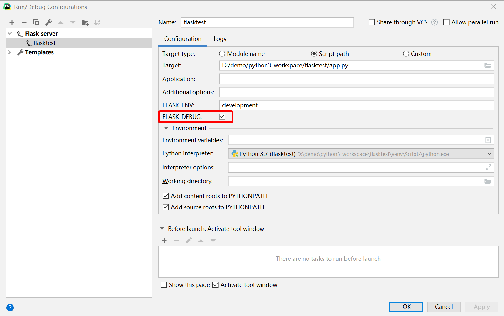

<!--
    category: python
    tag:
        - web
    title: Flask框架
-->
# 1.Flask介绍

- Flask是一个基于Python编写的轻量级Web应用框架，由Armin Ronacher于2010年创建。Flask旨在提供灵活的开发方式，能够快速地构建Web应用程序。

- Flask采用了MVC（Model-View-Controller）架构模式，但它并没有强制要求开发者遵循该模式，也没有提供ORM（对象关系映射）框架，这使得开发者可以根据自己的需要和喜好进行开发。

- Flask的核心是**Werkzeug**和**Jinja2**两个库。Werkzeug提供了Web请求和响应的基础功能，Jinja2则是一个现代化的模板引擎，能够方便地渲染HTML、XML或其他文档类型。

- 除此之外，Flask还有许多其他的扩展，如Flask-WTF（表单验证）、Flask-Login（用户认证）等等，这些扩展能够帮助开发者更快地构建Web应用程序。

- Flask非常适合小型项目和快速原型开发。它不像Django那样强制开发者遵循一定的规范和约束，因此可以灵活地应对各种需求和场景。同时，Flask也拥有广泛的社区支持和丰富的文档，这使得开发者可以轻松地找到需要的解决方案和帮助。

# 2.Flask程序运行过程

Flask程序运行的过程通常包括以下步骤：

1. 导入必要的模块和库

   首先，需要导入Flask框架的必要模块和库，例如`flask`、`render_template`等。

2. 创建Flask应用程序实例

   使用Flask框架提供的`Flask`类创建一个应用程序实例。这个应用程序实例将作为所有路由和视图的中心点。

3. 编写视图函数

   视图函数是Flask应用程序中用于处理请求和响应的函数。视图函数可以使用Flask框架提供的装饰器来定义URL路由和HTTP请求方法。

4. 运行应用程序

   使用Flask框架提供的`run()`方法来运行应用程序。该方法将启动一个开发服务器，以便在本地主机上监听HTTP请求并将其路由到相应的视图函数。

5. 处理HTTP请求和响应

   当用户发送HTTP请求时，Flask应用程序将根据请求的URL路由到相应的视图函数。该视图函数将执行必要的处理，并根据需要使用Flask框架提供的`render_template()`等函数来生成响应。

6. 渲染响应

   使用Flask框架提供的`render_template()`函数来渲染响应并将其发送回客户端。该函数使用Jinja2模板引擎生成HTML响应。

总体来说，Flask程序的运行过程可以概括为：创建应用程序实例、定义视图函数、处理HTTP请求和响应、渲染响应并将其发送回客户端。

# 3.入门案例

- 新建文件hello.py

```python
# 导入Flask类
from flask import Flask

#Flask类接收一个参数__name__
app = Flask(__name__)

# 装饰器的作用是将路由映射到视图函数index
@app.route('/')
def index():
	return 'Hello World'
# Flask应用程序实例的run方法启动WEB服务器
if __name__ == '__main__':
	app.run()
```

- 开启调试模式

Debug模式的开启，可以更好的定位错误，还可以既是刷新修改的页面，不用重启服务器。

```python
app.run(debug=True) 
```

上述语句在Pycharm中不起作用,需要在运行的环境配置中，勾选Flask Debug



点击ok，访问http://localhost:5000/即可。

# 4.路由解析

Flask是一个轻量级的Web框架，提供了强大的路由解析功能，使得我们可以通过定义路由来匹配URL请求，并且将请求发送给对应的**视图函数**进行处理。下面是对Flask路由解析功能的详细介绍和常用用法：

## 基本路由匹配

Flask中最简单的路由定义方式是使用@app.route装饰器，将一个URL路径绑定到一个视图函数上。例如：

```python
from flask import Flask

app = Flask(__name__)

@app.route('/')
def index():
    return 'Hello, World!'
```

这里我们定义了一个路由为'/'，对应的视图函数是index。当用户访问http://localhost:5000/时，Flask会匹配该请求的URL路径'/'，然后调用index视图函数，返回'Hello, World!'。

## URL变量匹配

在Flask中，我们可以定义动态的URL路径，使用冒号':'将变量名添加到路由规则中，例如：

```python
from flask import Flask

app = Flask(__name__)

@app.route('/user/<username>')
def user_profile(username):
    return f'Hello, {username}!'
```

在这个例子中，我们定义了一个路由规则'/user/\<username>'，其中'\<username>'是一个变量，Flask会从URL路径中提取该变量，并将其作为参数传递给user_profile视图函数。例如，当用户访问'http://localhost:5000/user/john'时，Flask会调用user_profile视图函数，并将'john'作为参数传递给它，返回'Hello, john!'。

> [!TIP]
>
> 变量默认为字符串类型，如何需要指定类型，可以使用转换器
>
> 具体内容见第6章

## HTTP方法匹配

Flask支持HTTP方法匹配，也就是说，我们可以为不同的HTTP方法定义不同的视图函数。例如：

```python
from flask import Flask, request

app = Flask(__name__)

@app.route('/login', methods=['GET', 'POST'])
def login():
    if request.method == 'POST':
        # 处理登录表单提交的数据
        username = request.form['username']
        password = request.form['password']
        # 验证用户名和密码
        if username == 'admin' and password == 'password':
            return '登录成功！'
        else:
            return '用户名或密码错误！'
    else:
        # 显示登录表单
        return '''
            <form method="post">
                <input type="text" name="username" placeholder="用户名"><br>
                <input type="password" name="password" placeholder="密码"><br>
                <button type="submit">登录</button>
            </form>
        '''
```

在这个例子中，我们为/login路由定义了两个视图函数，一个是用于处理GET请求的函数，用于显示登录表单，另一个是用于处理POST请求的函数，用于处理表单提交的数据并验证用户名和密码。当用户访问'http://localhost:5000/login'时，Flask会调用第一个函数，并返回登录表单，当用户提交表单时，Flask会调用第二个函数，并根据用户名和密码的验证结果返回相应的响应。

## URL构建

在Flask中，我们可以使用`url_for`函数生成一个URL，而不是手动构建URL。这种方式可以避免硬编码URL路径，使得我们的代码更加灵活和易于维护。例如：

```python
from flask import Flask, url_for

app = Flask(__name__)

@app.route('/user/<username>')
def user_profile(username):
    return f'Hello, {username}!'

@app.route('/welcome')
def welcome():
    url = url_for('user_profile', username='john')
    return f'Welcome! Please visit <a href="{url}">John\'s profile</a>.'
```

在这个例子中，我们使用url_for函数生成一个URL，该URL对应于user_profile视图函数，并将用户名'john'作为参数传递给它。在welcome视图函数中，我们将该URL嵌入到HTML页面中，以便用户可以点击该链接访问John的个人资料页面。

## 反向路由

`url_for()`函数对于动态构建特定函数的URL非常有用。该函数接受函数的名称作为第一个参数，以及一个或多个关键字参数，每个参数对应于URL的变量部分。

以下脚本演示了如何使用**url_for()**函数：

```python
from flask import Flask, redirect, url_for
app = Flask(name)

@app.route('/admin')
def hello_admin():
	return 'Hello Admin'

@app.route('/guest/')
def hello_guest(guest):
	return 'Hello %s as Guest' % guest

@app.route('/user/')
def hello_user(name):
	if name =='admin':
		return redirect(url_for('hello_admin'))
	else:
		return redirect(url_for('hello_guest',guest = name))
    
if name == 'main':
	app.run(debug = True)
```

上述脚本有一个函数`hello_user(name)`，它接受来自URL的参数的值。

`hello_user(name)`函数检查接收的参数是否与'admin'匹配。如果匹配，则使用`url_for()`将应用程序重定向到

`hello_admin()`函数，否则重定向到将接收的参数作为guest参数传递给它的`hello_guest()`函数。

## 蓝图(Blueprint)

蓝图(Blueprint)是一种将应用程序组织成可重用的组件的方式。通过将相关的视图函数和其他相关的功能打包在一起，我们可以将大型的应用程序分解成更小的部分，使得它们更加易于开发和维护。在Flask中，我们可以使用蓝图(Blueprint)来实现这一目的。例如：

```python
from flask import Flask, Blueprint

app = Flask(__name__)
blueprint = Blueprint('user', __name__)

@blueprint.route('/<username>')
def profile(username):
    return f'Hello, {username}!'

app.register_blueprint(blueprint, url_prefix='/user')
```

在这个例子中，我们定义了一个名为'user'的蓝图(Blueprint)，其中包含了一个名为'profile'的视图函数。我们使用register_blueprint函数将该蓝图(Blueprint)注册到应用程序中，并将其URL前缀设置为'/user'。这样，当用户访问'http://localhost:5000/user/jayq'时，Flask会调用'user'蓝图(Blueprint)中的'profile'视图函数，并将'jayq'作为参数传递给它，返回'Hello, jayq!'。

## 总结

Flask的路由解析功能非常强大，可以根据不同的URL路径、HTTP方法和其他参数匹配不同的视图函数，并且可以灵活地使用URL变量和蓝图(Blueprint)来组织应用程序。这些功能使得Flask成为一个非常强大的Web框架，适用于各种规模的应用程序开发。

# 5.模板渲染

Flask是一种Python web框架，提供了强大的模板功能来帮助开发人员构建动态网站。模板功能允许开发人员将网站中的静态部分与动态部分分离，从而使代码更易于维护和重用。

Flask的模板功能基于Jinja2模板引擎，可以使用标记语言来创建HTML页面。

1. 继承模板：Flask模板允许开发人员创建基本模板，并将其他模板扩展为其子模板。这种模板继承的方法可以减少模板代码的重复，并使代码更易于维护。
2. 变量传递：开发人员可以使用变量将数据传递给模板。在Flask中，变量可以通过render_template()函数传递到模板中，并使用{{ variable_name }}语法在HTML页面中显示。
3. 控制结构：Flask模板允许使用控制结构（如if语句、for循环等）来动态显示网站内容。在HTML页面中使用和等语法可以实现这些控制结构。
4. 静态文件：在Flask中，可以将CSS、JavaScript和图像等静态文件存储在静态文件夹中，并在HTML页面中使用{{ url_for('static', filename='filename.extension') }}语法来引用它们。
5. URL生成：Flask模板还提供了一个方便的方法来生成URL链接。在HTML页面中使用{{ url_for('view_function_name', arg1='value1', arg2='value2') }}语法可以生成指向指定视图函数的URL。
6. ......

这些都是Flask模板功能的一些基本用法，但还有很多其他功能可以探索和使用。Flask模板功能的主要目的是使开发人员可以轻松地创建动态网站，同时减少代码的重复和提高代码的可维护性。

[Jinja2官方文档](http://docs.jinkan.org/docs/jinja2/)

以下是Flask模板功能的一些具体用法：

## 继承模板

模板继承是一种重要的模板功能，可以减少模板代码的重复，并使代码更易于维护。在Flask中，可以使用Jinja2模板引擎来实现模板继承。开发人员可以创建一个基本模板，并在其他模板中使用语句来扩展这个基本模板。

例如，创建一个名为`base.html`的基本模板文件，包含HTML页面的通用部分，如导航栏、页脚等。

```html
<!DOCTYPE html>
<html>
  <head>
    <title></title>
  </head>
  <body>
    <header>
      <!-- 导航栏等通用部分 -->
    </header>
    
    <main>
      
    </main>
    
    <footer>
      <!-- 页脚等通用部分 -->
    </footer>
  </body>
</html>
```

然后，可以创建其他模板并扩展基本模板。例如，创建一个名为`index.html`的模板文件，该文件继承`base.html`并覆盖`content`块。

```jinja2


Home


  <h1>Welcome to my website!</h1>
  <p>This is the home page.</p>

```

这样，`index.html`文件将继承`base.html`文件中的通用部分，同时在`content`块中添加特定于该页面的内容。

## 变量传递

Flask模板还可以使用变量将数据传递到模板中，并在HTML页面中显示。在Flask中，变量可以通过`render_template()`函数传递到模板中，并使用`{{ variable_name }}`语法在HTML页面中显示。

例如，在Flask应用程序中定义一个视图函数，该函数将将字符串变量`name`传递给`index.html`模板。

```python
from flask import Flask, render_template

app = Flask(__name__)

@app.route("/")
def index():
    name = "Jayq"
    return render_template("index.html", name=name)
```

然后，在`index.html`模板中，可以使用`{{ name }}`语法来显示该变量。

```jinja2


Home


  <h1>Welcome to my website, {{ name }}!</h1>
  <p>This is the home page.</p>

```

## 控制结构

Flask模板还支持使用控制结构，例如条件语句和循环语句。在Flask中，可以使用Jinja2的控制结构语法来实现这些功能。

### (1) 条件语句

可以使用if语句在模板中根据条件显示不同的内容。例如，在Flask应用程序中定义一个视图函数，该函数将一个整数变量`age`传递到`index.html`模板中，并根据年龄显示不同的消息。

```python
from flask import Flask, render_template

app = Flask(__name__)

@app.route("/")
def index():
    age = 25
    return render_template("index.html", age=age)
```

然后，在`index.html`模板中，可以使用if语句来根据`age`变量显示不同的消息。

```jinja2


Home


  
    <h1>You are not old enough to view this website.</h1>
  
    <h1>Welcome to my website!</h1>
    <p>This is the home page.</p>
  

```

### (2) 循环语句

可以使用for循环语句在模板中重复显示内容。例如，在Flask应用程序中定义一个视图函数，该函数将一个列表`items`传递到`index.html`模板中，并在列表中的每个项目上循环。

```python
from flask import Flask, render_template

app = Flask(__name__)

@app.route("/")
def index():
    items = ["apple", "banana", "cherry"]
    return render_template("index.html", items=items)
```

然后，在`index.html`模板中，可以使用for循环语句在列表中重复显示内容。

```jinja2


Home


  <h1>My favorite fruits:</h1>
  <ul>
    
      <li>{{ item }}</li>
    
  </ul>

```

## 包含模板

在Flask模板中，还可以使用include语句包含其他模板。这可以帮助将模板代码分解为更小的模块，从而使代码更易于维护和重用。

例如，创建一个名为`header.html`的模板文件，该文件包含网站的标题和标志图像。

```html
<header>
  <h1>My Website</h1>
  
</header>
```

然后，在其他模板中，可以使用``语句包含此模板。

```jinja2


Home


  
  
  <p>This is the home page.</p>

```

这样，每个页面都可以包含相同的标头，而无需在每个页面中重复相同的HTML代码。

## 过滤器

在Flask模板中，还可以使用过滤器对变量进行格式化和处理。过滤器是在变量后面添加的方法调用，用于对变量进行转换和处理。

例如，在Flask应用程序中定义一个视图函数，该函数将一个字符串变量`message`传递到`index.html`模板中，并将其转换为大写字母。

```python
from flask import Flask, render_template

app = Flask(__name__)

@app.route("/")
def index():
    message = "hello, world!"
    return render_template("index.html", message=message)
```

然后，在`index.html`模板中，可以使用`|`符号和过滤器名称来对变量进行转换和处理。

```html


Home


  <h1>{{ message|upper }}</h1>

```

在这个例子中，`upper`过滤器将`message`变量转换为大写字母，并在模板中显示结果。

## 总结

Flask的模板功能是一个强大而灵活的工具，可以帮助开发人员轻松地构建动态网页。通过使用模板，可以将业务逻辑和视图分离，并实现代码的重用和维护。在Flask模板中，可以使用变量、控制结构、包含模板、继承模板和过滤器等功能来实现各种需求。掌握这些功能，可以使开发人员更加高效地构建Web应用程序。

# 6.转换器

Flask中的转换器是一种机制，用于将动态部分的URL（Uniform Resource Locator）路径参数从字符串转换为Python对象，例如整数、浮点数、路径等。Flask内置了许多转换器，同时还可以定义自定义转换器。

## 默认转换器

默认情况下，Flask使用以下转换器：

- string: （默认值）接受任何没有斜杠的文本，不包括路径分隔符
- int: 接受正整数
- float: 接受正浮点数
- path: 接受任何文本，包括路径分隔符

下面是一个使用默认转换器的代码示例：

```python
from flask import Flask

app = Flask(__name__)

@app.route('/<string:name>')
def hello(name):
    return f'Hello, {name}!'

@app.route('/<int:num>/<string:name>')
def hello(num, name):
    return f'Hello, {name}!{num}'


if __name__ == '__main__':
    app.run()
```

在上面的示例中，URL路径中的字符串参数会被转换为Python字符串，并传递给视图函数。例如，如果访问URL路径“/jayq”，则将调用视图函数hello（）并将字符串“jayq”传递给它。

另外，还使用了两个默认转换器来匹配URL路径中的整数和字符串参数。我们将整数参数命名为“num”，将字符串参数命名为“name”，并将它们作为参数传递给视图函数。例如，如果访问URL路径“/123/jayq”，则将调用视图函数hello（）并将整数“123”和字符串“jayq”传递给它。

## 自定义转换器

您可以定义自己的转换器，以便将URL路径中的参数转换为您需要的Python对象。自定义转换器必须是一个类，并实现两个方法：`to_python()`和`to_url()`。`to_python()`方法将URL参数转换为Python对象，而`to_url()`方法将Python对象转换为URL参数。下面是一个使用自定义转换器的代码示例：

```python
from flask import Flask, url_for
from werkzeug.routing import BaseConverter

class MyIntConverter(BaseConverter):
    def to_python(self, value):
        return int(value)

    def to_url(self, value):
        return str(value)

app = Flask(__name__)
app.url_map.converters['myint'] = MyIntConverter

@app.route('/<myint:num>')
def hello(num):
    return f'Hello, {num}!'

with app.test_request_context():
    print(url_for('hello', num=42))  # 输出：/42

if __name__ == '__main__':
    app.run()
```

在上面的示例中，我们定义了一个名为MyIntConverter的自定义转换器，它将URL参数转换为整数。我们将自定义转换器添加到Flask应用程序的转换器字典中，并将其用作视图函数的参数类型。在测试请求上下文中，我们使用url_for（）函数生成URL，并传递整数参数。该函数使用自定义转换器将整数转换为字符串，并生成URL“/42”。

> 总之，Flask中的转换器是一种强大的机制，可以将动态URL路径参数转换为Python对象。Flask提供了许多内置的转换器，同时也允许您定义自定义转换器和正则表达式转换器，以便更好地控制URL参数的格式和类型。
