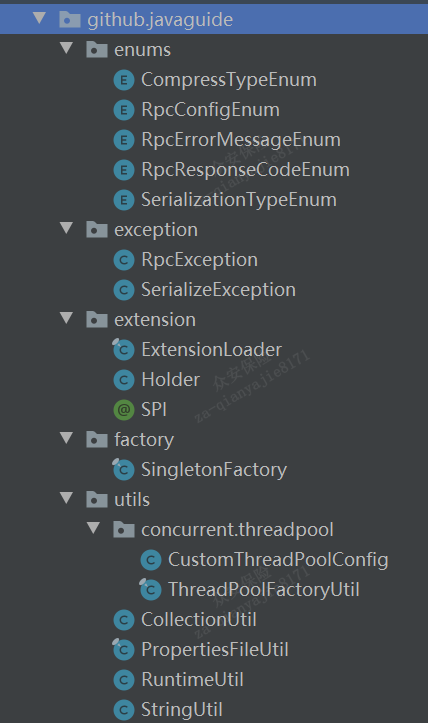
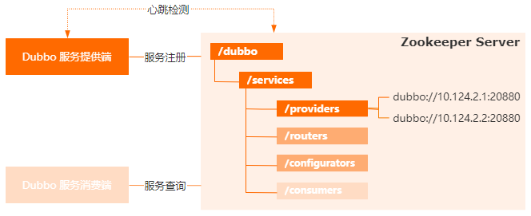
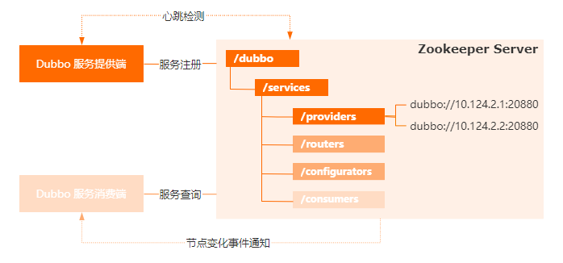

# 技术点

使用spring特性在服务器启动时进行服务扫描，服务注册

- 使用SpringBeanPostProcessor在bean初始化前时将服务注册发布，bean初始化后动态代理进行扫描服务

- 通过实现 ImportBeanDefinitionRegistrar进行服务扫描

运用zk作为注册中心

设计传输协议解决TCP拆包,粘包问题

基于netty进行网络通信

负载均衡、集群容错

注册中心、动态代理、网络传输、自定义协议、序列化、负载均衡、集群容错等等。

使用SPI使得RPC协议可扩展

双重检验实现懒汉式单例

压缩报文体，提高传输效率

# 模块

### rpc-common



```java
- javaguide
	- enums //枚举类
		- CompressTypeEnum //压缩类型
		- RpcConfigEnum //rpc配置文件地址（包括zk地址）
		- RpcErrorMessageEnum//rpc错误消息（包括客户端连接服务端失败，服务调用失败，没有找到指定的服务，注册的服务没有实现任何接口/请求和返回不匹配）
		- RpcResponseCodeEnum//rpc响应码（200，成功/500，连接失败）
		- SerializationTypeEnum//序列化类型
	- exception //异常类
		- RpcException //rpc异常类，抛出的是RpcErrorMessageEnum
		- SerializeException//序列化异常类，抛出的是（序列化失败/反序列化失败）
	- extension //扩展类（用于SPI）
		- ExtensionLoader /*- 读取并解析配置文件
							- 缓存所有扩展实现
							- 基于用户执行的扩展名，实例化对应的扩展实现
							- 进行扩展实例属性的 IOC 注入以及实例化扩展的包装类，实现 AOP 特性 */
		- Holder
		- SPI
	- factory //工厂类
		- SingletonFactory //单例工厂类
	- utils //工具类
		- threadpool
			- CustomThreadPoolConfig //线程池参数配置
			- ThreadPoolFactoryUtil //线程工厂类
		- CollectionUtil //集合工具类
		- PropertiesFileUtil //读取配置
		- RuntimeUtil//主要用于获取当前CPU核心数
		- StringUtil //字符串工具类
```

### rpc-simple

```java
- javaguide
	- annotation //注解包
		- RpcReference //加上该注解后服务实现类自动注入
		- RpcScan // 包扫描注解，扫描指定包下的类
		- RpcService // 自定义服务注册注解
	- compress //压缩包
  	- gzip //gzip类型
  		- GzipCompress
		- Compress
	- config //配置包
  	- CustomShutdownHook // 钩子类，当服务器关闭时，自动清除注册
  	- RpcServiceConfig // rpcservice配置类，将注解的属性以及对象放在配置类中方便注册
	- loadbalance
  	- loadbalancer // 具体的负载均衡策略
  		- ConsistentHashLoadBalance // 
  		- RandomLoadBalance // 随机选一个
  	- AbstractLoadBalance // 抽象类 实现了LoadBalance接口
  	//如果只有一个服务，直接调用，如果有多个，调doSelect方法实现负载均衡
    - LoadBalance // 接口 
  	//String selectServiceAddress(List<String> serviceUrlList, RpcRequest rpcRequest);
	- provider // 通过zk提供相关功能
  	- impl
  		- ZkServiceProviderImpl  //实现类
  - ServiceProvider //接口
  // 将服务加入本地缓存 void addService(RpcServiceConfig rpcServiceConfig);
  // 根据服务名获取服务 Object getService(String rpcServiceName);
  // 发布服务到zk void publishService(RpcServiceConfig rpcServiceConfig);
	- proxy //代理
  	- RpcClientProxy //通过动态代理隐藏底层通信细节
	- registry //注册
  	- zk
  		- util
  			- CuratorUtils //Curator工具类 Curator是zk的客户端框架
  		- ZkServiceDiscoveryImpl // 实现类，有lookupService(RpcRequest rpcRequest)
  		- ZkServiceRegistryImpl // 实现类，有registerService(String rpcServiceName, InetSocketAddress inetSocketAddress)
  	- ServiceDiscovery //服务发现
  	- ServiceRegistry //服务注册
	- remoting // 远程调用模块
		- constants // 常量
  		- RpcConstants 
		- dto
  		- RpcMessage
  		- RpcRequest
  		- RpcResponse
		- handler
  		- RpcRequestHandler // 处理请求
	- transport // 传输，通信
		- netty
			- client 
  			- ChannelProvider // 
  			- NettyRpcClient
  			- NettyRpcClientHandler
  			- UnprocessedRequests
			- codec
  			- RpcMessageDecoder
  			- RpcMessageEncoder
  		- server
  			- NettyRpcServer
  			- NettyRpcServerHandler
  		- RpcRequestTransport
	- serialize
		- hessian
			- HessianSerializer
		- kyro
			- KryoSerializer
			protostuff
ProtostuffSerializer
Serializer
	- spring 利用spring特性实现服务扫描，服务注册
  	- CustomScanner //注解扫描，主要用来扫描rpcservice
		- CustomScannerRegistrar //服务注册
		- SpringBeanPostProcessor //在Bean初始化时就进行服务注册发布
```


# 通信模块

## 传输协议

> 0      1       2      3      4             5     6     7     8      9                       10        11                12    13    14   15  16
>
> +-----+-----+-----+-----+-----------+----+----+----+----+--------------------+---------+----- --------+-----+-----+-----+----+
>
> |   magic   code      |version| full length        | messageType| codec|compress|    RequestId       |
> +-------------------------+-----------+---------------------+---------------------+---------+--------------+------------------------+
> |                                                                                                                                                                        |
> |                                                                           body                                                                                    |
> |                                                                                                                                                                        |
> |                                                                             ... ...                                                                                    |
> +----------------------------------------------------------------------------------------------------------------------------------------+

 * 4B  magic code（魔法数）   

   筛选来到服务端的数据包

   方式：服务端首先去除前面4个字节进行比对，如果不匹配可以直接关闭连接以节省资源

 * 1B version（版本）   

 * 4B full length（消息长度）    

   运行时计算出来

 * 1B messageType（消息类型）

 * 1B compress（压缩类型） 

 * 1B codec（序列化器类型）

   标识序列化的方式 

   比如是使用jdk自带的序列化，还是json，kyro等序列化方式

 * 4B  requestId（请求的Id）

# 注册中心

## 服务注册

先发布服务

- 获取服务器自己的地址

- 本地缓存添加服务

  

- 注册服务到zookeeper

  - 拼接服务路径

    

  - 在zk上创建持久节点

## 服务发现

从请求中获取中获取接口名（接口名+接口实现组+版本号）

与zp连接

根据接口名获取接口名下注册的节点

进行负载均衡获取其中一个服务器ip端口号返回

## 负载均衡策略

如果接口对应的服务器只有一个，则直接返回

默认采用一致性哈希算法

# RPC项目技术点

运用zookeeper作为注册中心，实现服务注册，服务发现，负载均衡

运用建造者模式封装消息类，对消息创建过程逐步细化，且对其它模块产生任何影响，便于控制细节风险。

引入CompletableFuture进行异步处理

- 用于获取服务器的channel
- 用于处理返回消息的获取

运用socket进行网络通信并用线程池管理线程避免资源的浪费

运用netty的NIO优化网络传输的效率并加入心跳机制

# SPI


主要步骤为 4 个：

- 读取并解析配置文件
- 缓存所有扩展实现
- 基于用户执行的扩展名，实例化对应的扩展实现
- 进行扩展实例属性的 IOC 注入以及实例化扩展的包装类，实现 AOP 特性

# 相关难点

## 1.怎么利用spring来自动注册服务的

首先，写了一个包扫描注解RPCScan，有一个属性basepackage，通过设置basePackage获得在拿个包扫描

然后，写了一个自定义服务注册注解rpcservice，有2个属性，版本号和group，版本号是为了兼容，group是为了同一个service类有多个实现类的情况，同时，rpcservice也会有@Component属性来保证其会在spring启动时被容器初始化

接下来，我们实现 `BeanPostProcessor` 接口，Spring Bean 在实例化之前会调用 `BeanPostProcessor` 接口的 `postProcessBeforeInitialization()`方法。

被我们使用 `RpcService`注解的类也算是 Spring Bean，所以，我们可以在`postProcessBeforeInitialization()`方法中去判断类上是否有`RpcService` 注解，如果有的话，就取出 `group` 和 `version` 的值。然后，再调用 `ServiceProvider` 的 `publishService()` 方法发布服务即可！

```java
@Component
@Slf4j
public class SpringBeanPostProcessor implements BeanPostProcessor {


    private final ServiceProvider serviceProvider;

    public SpringBeanPostProcessor() {
        serviceProvider = SingletonFactory.getInstance(ServiceProviderImpl.class);
    }

    @SneakyThrows
    @Override
    public Object postProcessBeforeInitialization(Object bean, String beanName) throws BeansException {
        if (bean.getClass().isAnnotationPresent(RpcService.class)) {
            log.info("[{}] is annotated with  [{}]", bean.getClass().getName(), RpcService.class.getCanonicalName());
            // 获取注解
            RpcService rpcService = bean.getClass().getAnnotation(RpcService.class);
            RpcServiceProperties rpcServiceConfig = RpcServiceProperties.builder()
                    .group(rpcService.group()).version(rpcService.version()).build();
            // 发布服务
            serviceProvider.publishService(bean, rpcServiceConfig);
        }
        return bean;
    }

}

```

## 2.负载均衡怎么做的？


## 3.怎么实现服务发现的

- 心跳机制具体怎么做的

  首先，Dubbo默认采用[Zookeeper](https://so.csdn.net/so/search?q=Zookeeper&spm=1001.2101.3001.7020)实现服务的注册与服务发现，简单来说啊，就是多个Dubbo服务之间的通信地址，是使用Zookeeper来维护的。

  在Zookeeper上，会采用树形结构的方式来维护Dubbo服务提供端的协议地址

  

  Dubbo服务消费端会从Zookeeper Server上去查找目标服务的地址列表，从而完成服务的注册和消费的功能。

  Zookeeper会通过心跳检测机制，来判断Dubbo服务提供端的运行状态，来决定是否应该把这个服务从地址列表剔除。

  

  当Dubbo服务提供方出现故障导致Zookeeper剔除了这个服务的地址，

  那么Dubbo服务消费端需要感知到地址的变化，从而避免后续的请求发送到故障节点，导致请求失败。

  也就是说Dubbo要提供服务下线的动态感知能力。

  这个能力是通过Zookeeper里面提供的Watch机制来实现的

  

  

## 4.什么是 TCP 粘包/拆包?有什么解决办法呢？ 

假设客户端向服务端连续发送了两个数据包，用 packet1 和 packet2 来表示，那么服务端收到的数据可以分为三种，现列举如下

- 第一种：服务端正常接收到这两个数据包 package1 和 package2，即没有发生拆包和粘包
- 第二种：接收端只接收到一个包，由于tcp不会出现丢包的现象。所以这一个数据包中包含了发送端发送的两个数据包的信息，这种现象即为粘包。这种情况由于接收端不知道这两个数据包的界限，所以对于接收端来说很难处理。
- 第三种：这种情况有两种表现形式，接收端收到了两个数据包，但是这两个数据包要么是不完整的，要么就是多出来一块，这种情况即发生了拆包和粘包。（package1不完整，package2多了package1一部分；package1多了package2的一部分，package2不完整）

## 为什么会发生tcp粘包拆包？

- 滑动窗口
- MTU/MSS限制
- Nagle算法

### MTU/MSS限制

当需要传输的数据大于MSS或者MTU时，数据会被拆分成多个包进行传输。由于MSS是根据MTU计算出来的，因此当发送的数据满足MSS时，必然满足MTU。

MTU是以太网(数据链路层)传输数据方面的限制

由于MTU限制了一次最多可以发送1500个字节，而TCP协议在发送DATA时，还会加上额外的TCP Header和Ip Header，因此刨去这两个部分，就是TCP协议一次可以发送的实际应用数据的最大大小，也就是MSS。

MSS长度=MTU长度-IP Header-TCP Header

TCP Header的长度是20字节，IPv4中IP Header长度是20字节，IPV6中IP Header长度是40字节，因此：在IPV4中，以太网MSS可以达到1460byte；在IPV6中，以太网MSS可以达到1440byte。

需要注意的是MSS表示的一次可以发送的DATA的最大长度，而不是DATA的真实长度。发送方发送数据时，当数据量大于MSS时，操作系统会将数据进行拆分，使得每一部分都小于MSS，这就是拆包，然后每一部分都加上TCP Header，构成多个完整的TCP报文进行发送，当然经过网络层和数据链路层的时候，还会分别加上相应的内容。

### 滑动窗口

TCP流量控制主要使用滑动窗口协议，滑动窗口是接收端使用的窗口大小，用来告诉发送端接收端的缓存大小，以此可以控制发送端发送数据的大小，从而达到流量控制的目的。这个窗口大小就是我们一次传输几个数据。对所有数据帧按顺序赋予编号，发送方在发送过程中始终保持着一个发送窗口，只有落在发送窗口内的帧才允许被发送；同时接收方也维持着一个接收窗口，只有落在接收窗口内的帧才允许接收。这样通过调整发送方窗口和接收方窗口的大小可以实现流量控制。

**滑动窗口大小这个字段是接收端告诉发送端自己还有多少缓冲区可以接收数据。于是发送端就可以根据这个接收端的处理能力来发送数据，而不会导致接收端处理不过来。**

来看一下滑动窗口是如何造成粘包、拆包的？

- 粘包：假设发送方的每256 bytes表示一个完整的报文，接收方由于数据处理不及时，这256个字节的数据都会被缓存到接收缓存区中。如果接收方的接收缓存区中缓存了多个报文，那么对于接收方而言，这就是粘包。
- 拆包：考虑另外一种情况，假设接收方的窗口只剩了128，意味着发送方最多还可以发送128字节，而由于发送方的数据大小是256字节，因此只能发送前128字节，等到接收方ack后，才能发送剩余字节。这就造成了拆包。

### Nagle算法

Nagle算法就是为了尽可能发送大块数据，避免网络中充斥着许多小数据块。

Nagle算法的基本定义是任意时刻，最多只能有一个未被确认的小段。 所谓“小段”，指的是小于MSS尺寸的数据块，所谓“未被确认”，是指一个数据块发送出去后，没有收到对方发送的ACK确认该数据已收到。

Nagle算法的实现规则：

- 如果发送缓存区的包长度达到MSS，则允许发送；
- 如果发送缓存区中含有FIN，表示请求关闭连接，则先将发送缓存区中的剩余数据发送，再关闭；
- 设置了TCP_NODELAY=true选项，则允许发送。TCP_NODELAY是取消TCP的确认延迟机制，相当于禁用了Nagle 算法。
- 未设置TCP_CORK选项时，若所有发出去的小数据包（包长度小于MSS）均被确认，则允许发送;
- 上述条件都未满足，但发生了超时（一般为200ms），则立即发送。

> tcp_nodelay：禁止nagle算法，有需要发送的就立即发送，比较常见
>
> tcp_cork：它是一种加强的nagle算法，过程和nagle算法类似，都是累计数据然后发送。但在设置cork后，即使所有ack都已经收到，但我还是不想发送数据，我还想继续等待应用层更多的数据，所以它的效果比nagle更好。效率上与Nagle算法相比，Nagle算法主要避免网络因为太多的小包(协议头的比例非常之大)而拥塞，而CORK算法则是为了提高网络的利用率，使得总体上协议头占用的比例尽可能的小

## 粘包、拆包解决办法

- 长度编码：发送端给每个数据包添加包首部，首部中应该至少包含数据包的长度，这样接收端在接收到数据后，通过读取包首部的长度字段，便知道每一个数据包的实际长度了。
- 特殊字符分隔符协议：可以在数据包之间设置边界，如添加特殊符号，这样，接收端通过这个边界就可以将不同的数据包拆分开。
- 定长协议：发送端将每个数据包封装为固定长度（不够的可以通过补0填充），这样接收端每次从接收缓冲区中读取固定长度的数据就自然而然的把每个数据包拆分开来。

## 补充：为什么UDP不会发生拆包和粘包？

- TCP协议是面向流的协议，UDP是面向消息的协议

UDP每一段都是一条消息，应用程序必须以消息为单位提取数据，不能一次提取任意字节的数据

- UDP具有保护消息边界，在每个UDP包中就有了消息头（消息来源地址，端口等信息），这样对于接收端来说就容易进行区分处理了。传输协议把数据当作一条独立的消息在网上传输，接收端只能接收独立的消息。接收端一次只能接收发送端发出的一个数据包,如果一次接受数据的大小小于发送端一次发送的数据大小，就会丢失一部分数据，即使丢失，接受端也不会分两次去接收

### 5.怎么感知服务器下线的？

简单来说呢，Dubbo服务消费端会使用Zookeeper里面的Watch来针对Zookeeper Server端的`/providers`节点注册监听，

一旦这个节点下的子节点发生变化，Zookeeper Server就会发送一个事件通知Dubbo Client端.

Dubbo Client端收到事件以后，就会把本地缓存的这个服务地址删除，这样后续就不会把请求发送到失败的节点上，完成服务下线感知

# 实体类

## 1.请求类 RpcRequest

用于将请求信息包装起来

比如HelloService.hello(new Hello(message=111, description=222))

| 字段          | 含义         | 样例                                 |
| ------------- | ------------ | ------------------------------------ |
| requestId     | id           | 0b6319bb-8568-41f1-a9c5-fdb1f5942c79 |
| interfaceName | 请求服务接口 | github.javaguide.HelloService        |
| methodName    | 请求方法     | hello                                |
| parameters    | 方法参数     | Hello(message=111, description=222)  |
| paramTypes    | 参数类型     | Hello.Class                          |
| version       | 版本号       | version1                             |
| group         | 所属类       | test1                                |

## 2.消息类
| 字段        | 含义       | 样例                                 |
| ----------- | ---------- | ------------------------------------ |
| messageType | 消息类型   | 0b6319bb-8568-41f1-a9c5-fdb1f5942c79 |
| codec       | 序列化方式 | github.javaguide.HelloService        |
| compress    | 压缩方式   | hello                                |
| requestId   | 请求id     | Hello(message=111, description=222)  |
| data        | 数据       | Hello.Class                          |


```java
public class RpcMessage {

    /**
     * rpc message type
     */
    private byte messageType;
    /**
     * serialization type
     */
    private byte codec;
    /**
     * compress type
     */
    private byte compress;
    /**
     * request id
     */
    private int requestId;
    /**
     * request data
     */
    private Object data;

}
```

## 3.响应类

| 字段      | 含义     | 样例                                 |
| --------- | -------- | ------------------------------------ |
| requestId | 消息类型 | 0b6319bb-8568-41f1-a9c5-fdb1f5942c79 |
| code      | 响应码   | github.javaguide.HelloService        |
| message   | 消息     | hello                                |
| data      | 响应体   | Hello(message=111, description=222)  |

## 4.常量

| 字段                    | 含义           | 默认值                                           |
| ----------------------- | -------------- | ------------------------------------------------ |
| MAGIC_NUMBER            | 魔数           | {(byte) 'g', (byte) 'r', (byte) 'p', (byte) 'c'} |
| Charset DEFAULT_CHARSET | 字符集         | StandardCharsets.UTF_8                           |
| VERSION                 | 版本号占的字节 | 1                                                |
| TOTAL_LENGTH            | 消息头长度     | 16                                               |
| REQUEST_TYPE            | 请求类型       | 1                                                |
| RESPONSE_TYPE           | 响应类型       | 2                                                |
| HEARTBEAT_REQUEST_TYPE  | 心跳请求类型   | 3                                                |
| HEARTBEAT_RESPONSE_TYPE | 心跳响应类型   | 4                                                |
| HEAD_LENGTH             | 头长度         | 16                                               |
| PING                    |                |                                                  |
| PONG                    |                |                                                  |
| MAX_FRAME_LENGTH        | 消息最大值     | 8 * 1024 * 1024                                  |

```java
public class RpcConstants {


    /**
     * Magic number. Verify RpcMessage
     */
    public static final byte[] MAGIC_NUMBER = {(byte) 'g', (byte) 'r', (byte) 'p', (byte) 'c'};
    public static final Charset DEFAULT_CHARSET = StandardCharsets.UTF_8;
    //version information
    public static final byte VERSION = 1;
    public static final byte TOTAL_LENGTH = 16;
    public static final byte REQUEST_TYPE = 1;
    public static final byte RESPONSE_TYPE = 2;
    //ping
    public static final byte HEARTBEAT_REQUEST_TYPE = 3;
    //pong
    public static final byte HEARTBEAT_RESPONSE_TYPE = 4;
    public static final int HEAD_LENGTH = 16;
    public static final String PING = "ping";
    public static final String PONG = "pong";
    public static final int MAX_FRAME_LENGTH = 8 * 1024 * 1024;

}
```

