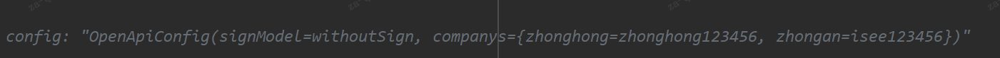

# callback接口

## 请求参数

message

- request
- companyId
- UUID
- requestType
- sendTime

sign签名 

## 01后端逻辑

### 控制层

- 把message从字符串转成对象
- 获取companyId和UUID
- 如果companyId，UUID，sign有任何一个为空，则返回`必填项校验失败`错误
- 调服务层

### 服务层

#### OpenBizServiceImpl

- 获取companyId和UUID
- 幂等校验，如果已经存在来源和uid并且sign相同的日志,直接返回原报文

- 执行callBack0方法

  > BizResult callBack0(JSONObject request, String message, String sign)

#### callBack0

- 获取companyId，UUID，requestType，sendTime
- 参数校验，如果有任何一个为空，则返回`回调数据必输项为空`错误

- 在sign需要的情况下验证签名（不需要签名）

  

- 获取请求体request

- serviceMap获取请求类型

  

  - 如果没拿到，则返回`回调数据参数格式不正确`错误

- 根据请求类型获取对应的Dto

  

- 把request填到Dto里面
- 对Dto进行校验
  
- 验证用户信息customer，核保时间applytime，承保时间，营销名称，回溯码
  
- 执行handle方法

#### handle

- 回溯码校验
  - 非子回溯码需要去除中间状态
- 保存videopolicy信息