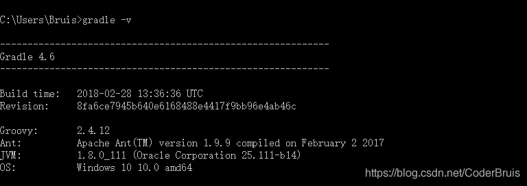

## 前言——万里长征的第一步
要学习Spring源码，导入Spring源码到IDE是必不可少的一步，因为Spring源码各个包、各个类之间的各种关联关系非常复杂。如果仅仅是通过Spring源码文档来看，相信没多少人能坚持学下去。因此将Spring源码包导入IDE是非常必要的。本人使用IDEA较多，所以也就将Spring源码导入至IDEA中。

## 准备工作

### Spring源码包下载
在本地磁盘下载Spring源码包，笔者在写这篇文章时下载的为Spring5源码。下载地址：https://github.com/spring-projects/spring-framework

然后选在本地磁盘目录下，使用git命令下载Spring源码（git工具怎么安装，度娘吧）。
```
git clone https://github.com/spring-projects/spring-framework
```
待源码下载完后，本地磁盘就会生成Spring源码。

### gradle工具下载
gradle是一个基于Groovy的构建工具，它使用Groovy来编写构建脚本，支持依赖管理和多项目创建，类似Maven但又比Maven更加简单便捷。

gradle下载地址：http://downloads.gradle.org/distributions/gradle-4.6-bin.zip

下载好gradle之后需要配置gradle的环境变量。

在系统属性——>环境变量——>**系统变量**创建两个变量
```
变量：GRADLE_HOME
值：X:\gradle-4.6
```
```
变量：GRADLE_USER_HOME
值：%GRADLE_HONE%\.gradle
```
```
变量：path
值：;%GRADLE_HOME%/bin
```

配置好gradle之后，在cmd窗口下使用gradle -v命令查看是否安装成功。


如上图显示gradle版本，即显示安装成功。

## 编译Spring源码
在Spring源码目录下，打开cmd窗口（windows系统），运行以下命令：
```
gradlew.bat cleanIdea :spring-oxm:compileTestJava
```
执行完命令，如下图所示：


## 将Spring源码导入IDEA中
（1）打开IDEA，选择File->New->Project From Existing Sources…

（2）选中Spring-framework文件夹，OK->Import project from external model

（3）选中Gradle，点击Next，然后点击Finish，等待IDEA导入以及下载相关联的包即可。


这样，Spring源码就导入成功了。