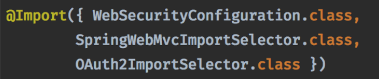

> 上篇文章粗略的讲解了SpringSecurity里的几个核心概念，本篇文章就来深扒一下安全过滤器FilterChainProxy的底层原理。

## 1.  FilterChainProxy什么时候注入Spring容器中的
在SpringSecurity中，`FilterChainProxy`是作为整个框架的核心，它是一个过滤器。在SpringSecurity中，一个过滤器名字叫`springSecurityFilterChain`，它的类型就是`FilterChainProxy`。

在`@EnableWebSecurity`注解中，@Import了一个关键类：`WebSecurityConfiguration`。



首先，`WebSecurityConfiguration`实现了`ImportAware`和`BeanClassLoaderAware`接口，分别实现了`setImportMetadata()`和`setBeanClassLoader()`

`setImportMetadata()`方法的作用是注入注解元数据。

```Java
	public void setImportMetadata(AnnotationMetadata importMetadata) {
		// 从注入的importMetadata中获取@EnableWebSecurity注解map值
		Map<String, Object> enableWebSecurityAttrMap = importMetadata
				.getAnnotationAttributes(EnableWebSecurity.class.getName());
		// 将map值封装成AnnotationAttributes
		AnnotationAttributes enableWebSecurityAttrs = AnnotationAttributes
				.fromMap(enableWebSecurityAttrMap);
		// 从AnnotationAttributes中获取debug属性值
		debugEnabled = enableWebSecurityAttrs.getBoolean("debug");
		if (webSecurity != null) {
			// 将debugEnabled存到WebSecurity属性中
			webSecurity.debug(debugEnabled);
		}
	}
```
`setBeanClassLoader`方法作用就是注入类加载器ClassLoader。

```Java
	public void setBeanClassLoader(ClassLoader classLoader) {
		this.beanClassLoader = classLoader;
	}
```

废话不多说，看下`FilterChainProxy`是什么时候注入到Spring容器中的。

答案就在`WebSecurityConfiguration`的`springSecurityFilterChain()`方法中

```Java
	// AbstractSecurityWebApplicationInitializer.DEFAULT_FILTER_NAME的值是：springSecurityFilterChain
	// 所以springSecurityFilterChain()的作用就是想Spring容器中注入一个名为springSecurityChain的bean。
	@Bean(name = AbstractSecurityWebApplicationInitializer.DEFAULT_FILTER_NAME)
	public Filter springSecurityFilterChain() throws Exception {
		// 判断是否有webSecurityConfigurers
		boolean hasConfigurers = webSecurityConfigurers != null
				&& !webSecurityConfigurers.isEmpty();
		// 如果没有配置，则通过objectObjectPostProcessor来生成一个新的WebSecurityConfigurerAdapter		
		if (!hasConfigurers) {
			WebSecurityConfigurerAdapter adapter = objectObjectPostProcessor
					.postProcess(new WebSecurityConfigurerAdapter() {
					});
			webSecurity.apply(adapter);
		}
		return webSecurity.build();
	}
```

## 2. WebSecurityConfiguration类
在深入`springSecurityFilterChain()`方法底层原理之前，需要先了解`WebSecurityConfiguration`中几个重要的成员变量。
```Java
@Configuration
public class WebSecurityConfiguration implements ImportAware, BeanClassLoaderAware {

	// WebSecurity是用于建造FilterChainProxy过滤器的核心类
	private WebSecurity webSecurity;

	// 读取@EnableWebSecurity中的注解属性debugEnabled的值
	private Boolean debugEnabled;
	
	// SecurityConfigurer属性值集合
	private List<SecurityConfigurer<Filter, WebSecurity>> webSecurityConfigurers;
	
	// 类加载器
	private ClassLoader beanClassLoader;
	
	// 省略
}
```

## 3. WebSecurity类
第一个重要的类就是`WebSecurity`。

由WebSecurity的类注释可以了解到：

- `WebSecurity`是由`WebSecurityConfiguration`创建的，用于创建`FilterChainProxy`
- `FilterChainProxy`在SpringSecurity中，以`springSecurityFilterChainProxy`的bean名称暴露于容器之中的
- 可以通过基础抽象类`WebSecurityConfigurerAdapter`来定制化`WebSecurity`

由于`@EnableWebSecurity`导入了`WebSecurityConfiguration`，因而`WebSecurity`也被创建。

我们先来看下`WebSecurity`的类结构：

```Java
public final class WebSecurity extends
		AbstractConfiguredSecurityBuilder<Filter, WebSecurity> implements
		SecurityBuilder<Filter>, ApplicationContextAware {
		// 省略
}
```

首先，`WebSecurity`是一个final修饰的类，即该类：

- 不能被继承，没有子类
- 该类方法都为final

其次，`WebSecurity`继承了`AbstractConfiguredSecurityBuilder<Filter, WebSecurity>`。继续跟进看下`AbstractConfiguredSecurityBuilder`这个类有什么作用？

## 4. AbstractConfiguredSecurityBuilder类
由其类名：`AbstractConfiguredSecurityBuilder`就可以知道，该类是一个抽象类，作为抽象类，必然会抽象出abstract方法让子类去实现。浏览`AbstractConfiguredSecurityBuilder`的方法定义，可以看到它内部只定义了一个抽象方法：
```Java
protected abstract O performBuild() throws Exception;
```

这个方法会在建造`FilterChainProxy`时有使用到，这里先留个印象。

回到AbstractConfiguredSecurityBuilder类定义
```Java
public abstract class AbstractConfiguredSecurityBuilder<O, B extends SecurityBuilder<O>>
		extends AbstractSecurityBuilder<O> {
	// 省略
}		
```
可以知道它继承了`AbstractSecurityBuilder<O>`，但自身带的一个泛型`<O, B extends SecurityBuilder<O>>`让人捉摸不透是啥意思。O是啥？B又是啥？

这里其实是用到了**建造者模式**。

目光聚焦到`SecurityBuilder`这个接口

```Java
// 安全建造者
// 顾名思义是一个builder建造者，创建并返回一个类型为O的对象
public interface SecurityBuilder<O> {
    O build() throws Exception;
}
```

```Java
// 抽象安全建造者
public abstract class AbstractSecurityBuilder<O> implements SecurityBuilder<O> {
    private AtomicBoolean building = new AtomicBoolean();
    private O object;

	// build建造方法被final修饰，不允许子类覆盖。
    public final O build() throws Exception {
        if (this.building.compareAndSet(false, true)) {
            this.object = doBuild();
            return this.object;
        }
        throw new AlreadyBuiltException("This object has already been built");
    }

    // 子类需要重写doBuild()方法
    protected abstract O doBuild() throws Exception;
}
```
所以`B extends SecurityBuilder<O>`就是指B是`SecurityBuilder`的子类，用于建造O。

从`WebSecurity`中的类定义可以发现
```Java
AbstractConfiguredSecurityBuilder<Filter, WebSecurity>
```

`AbstractConfiguredSecurityBuilder`作用就是通过`WebSecurity`这个建造者建造出一个Filter，而这个Filter就是`FilterChainProxy`。

**因此O就是指`FilterChainProxy`，B就是指的安全建造者`WebSecurity`。**

<br/> <br/> <br/> 

再来看下`AbstractConfiguredSecurityBuilder`的成员变量。

```Java
public abstract class AbstractConfiguredSecurityBuilder<O, B extends SecurityBuilder<O>>
		extends AbstractSecurityBuilder<O> {
	private final Log logger = LogFactory.getLog(getClass());

	// 安全配置器的子类集合，这个configurers就是用于初始化以及配置FilterChainProxy中的filters用的
	private final LinkedHashMap<Class<? extends SecurityConfigurer<O, B>>, List<SecurityConfigurer<O, B>>> configurers = new LinkedHashMap<>();
	// 初始化期间添加的配置类
	private final List<SecurityConfigurer<O, B>> configurersAddedInInitializing = new ArrayList<>();
	// 缓存
	private final Map<Class<?>, Object> sharedObjects = new HashMap<>();

	private final boolean allowConfigurersOfSameType;

	// 建造者的建造状态，初始状态为：未建造
	private BuildState buildState = BuildState.UNBUILT;

	// 用于生成bean
	private ObjectPostProcessor<Object> objectPostProcessor;
	// 省略
}
```


## 5. SecurityConfigurer类
`SecurityConfigurer`是一个接口，它就是指的安全配置器，看下它的类定义信息。

- `SecurityConfigurer`允许用于配置安全建造者（`SecurityBuilder`）
- 安全建造者`（SecurityBuilder）`在初始化时调用`init`方法，同时会初始化所有的`SecurityConfigurer`
- 安全建造者`（SecurityBuilder）`在调用`configure`方法时，同时会调用所有`SecurityConfigurer`的`configure`

```Java
public interface SecurityConfigurer<O, B extends SecurityBuilder<O>> {

	void init(B builder) throws Exception;

	void configure(B builder) throws Exception;
}
```

`SecurityConfigurer<O, B extends SecurityBuilder<O>>`   这个该怎么理解呢？

这里同上，O指的FilterChainProxy，B指的SecurityBuilder。

那么这里的SecurityConfigurer到底有什么作用呢？

> 答：`SecurityConfigurer`就是用于向`FilterChainProxy`中添加过滤器。

<br/><br/>

```Java
private final LinkedHashMap<Class<? extends SecurityConfigurer<O, B>>, List<SecurityConfigurer<O, B>>> configurers = new LinkedHashMap<>();
```
所以configurers就是以建造者为key，各种配置类为value的一个LinkedHashMap。

## 6. doBuild()方法
下面来看下`AbstractConfiguredSecurityBuilder`的`doBuild()`方法。`doBuild()`方法在之前提到过，它是`AbstractSecurityBuilder`抽象出来的方法，由`AbstractConfiguredSecurityBuilder`类来实现。这个方法会通过使用`SecurityConfigurer`去执行建造逻辑，建造逻辑主要分为五大步：

1. 执行初始化前的所需做的额外工作（beforeInit()）
2. 执行初始化（init()）
3. 执行配置前所需的额外工作（beforeConfigure()）
4. 执行配置调用（configure）
5. **执行建造（performBuild()）**

```Java
	@Override
	protected final O doBuild() throws Exception {
		synchronized (configurers) {
			// 标记建造状态为初始化中
			buildState = BuildState.INITIALIZING;

			beforeInit();
			init();

			// 标记正在配置
			buildState = BuildState.CONFIGURING;

			beforeConfigure();
			configure();
			
			// 标记正在建造
			buildState = BuildState.BUILDING;

			O result = performBuild();
	
			// 标记以及建造完成
			buildState = BuildState.BUILT;

			return result;
		}
	}

```

`performBuild()`方法是`AbstractConfiguredSecurityBuilder`提供的抽象方法，具体有其子类：`HttpSecurity`和`WebSecurity`来实现。

## 7. WebSecurity什么时候被创建的？
答案就是在`WebSecurityConfiguration`的`setFilterChainProxySecurityConfiguere()`方法里。
```Java
	@Autowired(required = false)
	public void setFilterChainProxySecurityConfigurer(
			ObjectPostProcessor<Object> objectPostProcessor,
			@Value("#{@autowiredWebSecurityConfigurersIgnoreParents.getWebSecurityConfigurers()}") List<SecurityConfigurer<Filter, WebSecurity>> webSecurityConfigurers)
			throws Exception {
			
		// 通过objectPostProcessor来创建一个WebSecurity，同时将objectPostProcessor传进WebSecurity对象中	
		webSecurity = objectPostProcessor
				.postProcess(new WebSecurity(objectPostProcessor));
		// 从@EnableWebSecurity中获取debugEnabled注解值，是否开启debug模式		
		if (debugEnabled != null) {
			webSecurity.debug(debugEnabled);
		}
		
		// 对webSecurityConfigurers进行排序
		webSecurityConfigurers.sort(AnnotationAwareOrderComparator.INSTANCE);

		Integer previousOrder = null;
		Object previousConfig = null;

		for (SecurityConfigurer<Filter, WebSecurity> config : webSecurityConfigurers) {
			Integer order = AnnotationAwareOrderComparator.lookupOrder(config);
			if (previousOrder != null && previousOrder.equals(order)) {
				throw new IllegalStateException(
						"@Order on WebSecurityConfigurers must be unique. Order of "
								+ order + " was already used on " + previousConfig + ", so it cannot be used on "
								+ config + " too.");
			}
			previousOrder = order;
			previousConfig = config;
		}

		// 遍历webSecurityConfigurers
		for (SecurityConfigurer<Filter, WebSecurity> webSecurityConfigurer : webSecurityConfigurers) {
			// 添加进WebSecurity中的配置器Map中
			webSecurity.apply(webSecurityConfigurer);
		}
		this.webSecurityConfigurers = webSecurityConfigurers;
	}
```
方法中的`webSecurityConfigurers`是通过了`@Value`注解来注入的bean集合，`@Value`表达式中又包含了一个`autowiredWebSecurityConfigurersIgnoreParents.getWebSecurityConfigurers()`的调用。

进入`AutowiredWebSecurityConfigurersIgnoreParents`类，查看其方法`getWebSecurityConfigurers()`方法。
```Java
	public List<SecurityConfigurer<Filter, WebSecurity>> getWebSecurityConfigurers() {
		// 初始化webSecurityConfigurers集合
		List<SecurityConfigurer<Filter, WebSecurity>> webSecurityConfigurers = new ArrayList<>();
		// 通过beanFactory来获取所有注入Spring容器中的WebSecurityConfigurer子类，实际就是WebSecurityConfigurer
		Map<String, WebSecurityConfigurer> beansOfType = beanFactory
				.getBeansOfType(WebSecurityConfigurer.class);
		for (Entry<String, WebSecurityConfigurer> entry : beansOfType.entrySet()) {
			// 遍历出bean对象
			webSecurityConfigurers.add(entry.getValue());
		}
		return webSecurityConfigurers;
	}
```

## 总结
全文讲解了FilterChainProxy以及WebSecurityConfiguration，但是对于doBuild()方法没有进行细致的分析讲解，由于doBuild()的逻辑比较复杂，将在下一章进行细致分析。

在WebSecurityConfiguration中，需要关注两个方法：

1. springSecurityFilterChain()方法
2. setFilterChainProxySecurityConfigurer()方法

**springSecurityFilterChain方法用于通过安全建造器WebSecurity来建造出FilterChainProxy。**

**setFilterChainProxySecurityConfigurer()方法是用于创建出安全建造起WebSecurity。**

**在SpringSecurity中，对于WebSecurity，使用了建造者设计模式。**


## 参考
- [深入浅出Spring Security（一）：三句话解释框架原理](https://blog.csdn.net/zimou5581/article/details/102457672)

## 相关文章
- [从零开始系统学习SpringSecurity和OAuth2（一）—— 初识SpringSecurity](https://github.com/coderbruis/JavaSourceCodeLearning/blob/master/note/SpringSecurity/%E4%BB%8E%E9%9B%B6%E5%BC%80%E5%A7%8B%E7%B3%BB%E7%BB%9F%E5%AD%A6%E4%B9%A0SpringSecurity%E5%92%8COAuth2%EF%BC%88%E4%B8%80%EF%BC%89%E2%80%94%E2%80%94%20%E5%88%9D%E8%AF%86SpringSecurity.md)
- [从零开始系统学习SpringSecurity和OAuth2（三）—— WebSecurity建造核心逻辑](https://github.com/coderbruis/JavaSourceCodeLearning/blob/master/note/SpringSecurity/%E4%BB%8E%E9%9B%B6%E5%BC%80%E5%A7%8B%E7%B3%BB%E7%BB%9F%E5%AD%A6%E4%B9%A0SpringSecurity%E5%92%8COAuth2%EF%BC%88%E4%B8%89%EF%BC%89%E2%80%94%E2%80%94%20WebSecurity%E5%BB%BA%E9%80%A0%E6%A0%B8%E5%BF%83%E9%80%BB%E8%BE%91.md)
