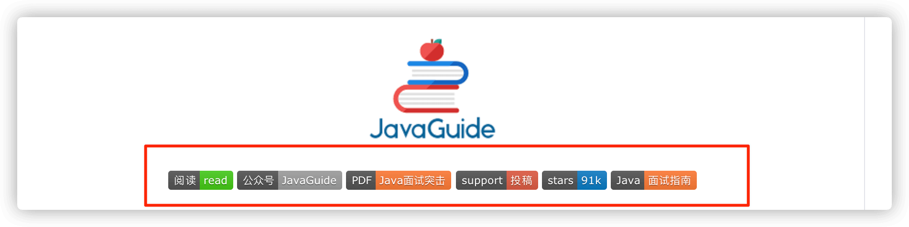
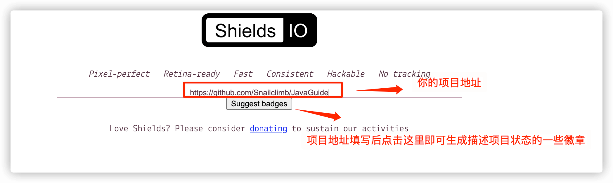
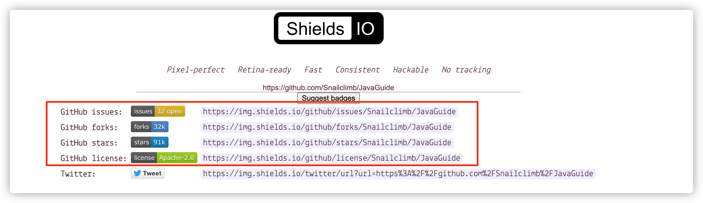

## github徽章生成

 [https://shields.io/](https://shields.io/) 

并且，你不光可以生成静态徽章，shield.io 还可以动态读取你项目的状态并生成对应的徽章。

生成的描述项目状态的徽章效果如下图所示。

## logo设计

pornhub风格logo自动生成

https://www.logoly.pro/

## emoji大全

https://emojixd.com/