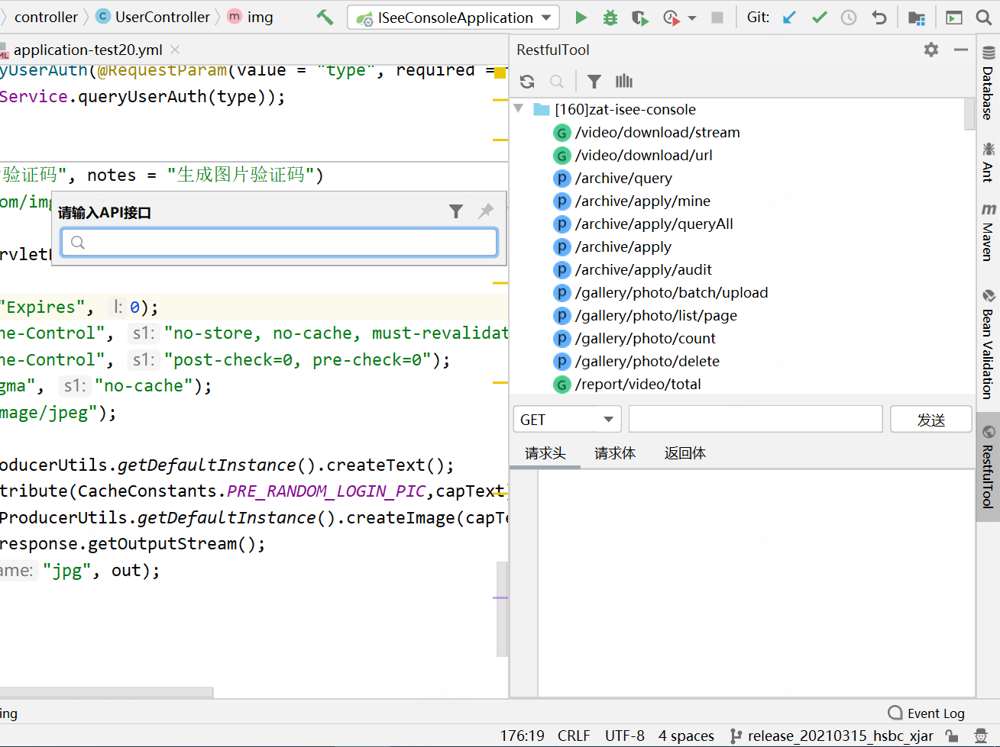
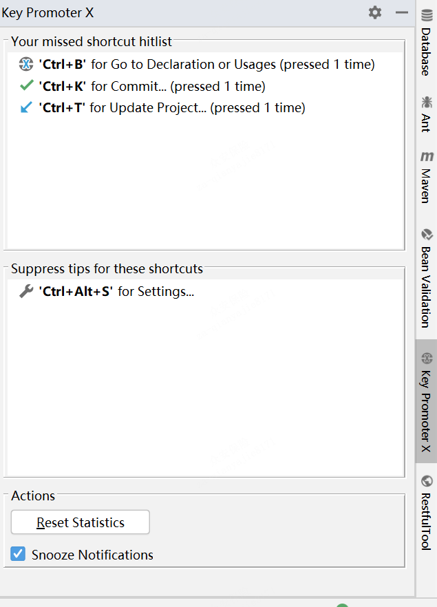
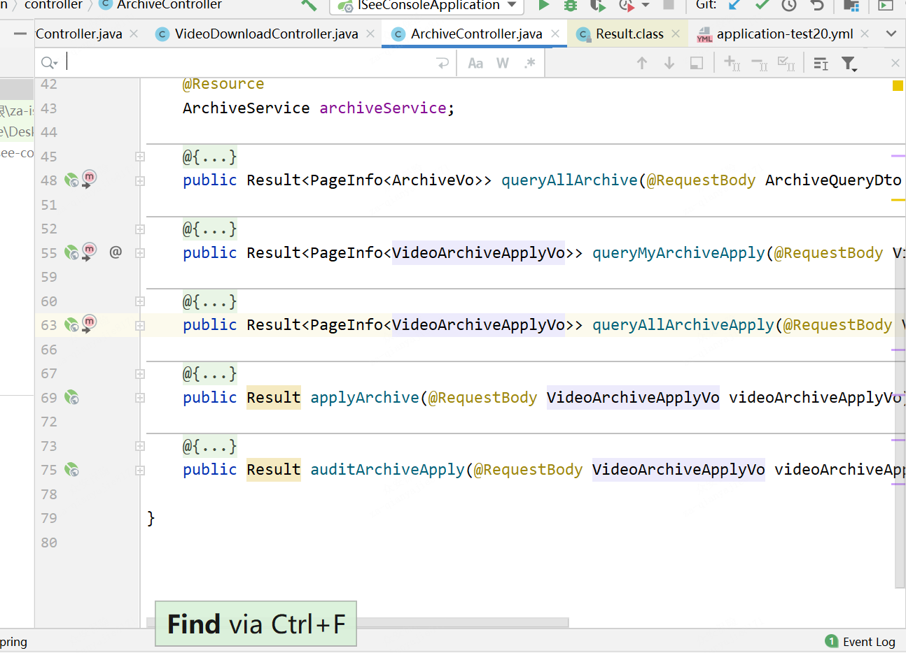
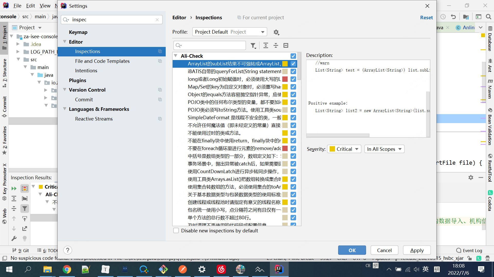
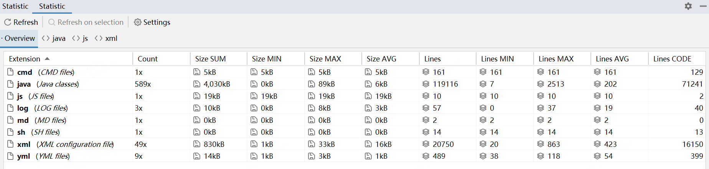

# idea 好用插件

> 引自 [guide哥](https://blog.csdn.net/qq_34337272/article/details/105626975)

概览：

IDE Features Trainer—IDEA交互式教程
RestfulToolkit—RESTful服务开发
Key Promoter X—快捷键
Presentation Assistant—快捷键展示
Codota—代码智能提示
Alibaba Java Code Guidelines—阿里巴巴 Java 代码规范
GsonFormat+RoboPOJOGenerator—JSON转类对象
Statistic—项目信息统计
Translation-必备的翻译插件
CamelCase-多种命名格式之间切换
“

## IDE Features Trainer—IDEA交互式教程

可以在 IDEA 中以交互方式学习IDEA最常用的快捷方式和最基本功能。

当我们安装了这个插件之后，你会发现我们的IDEA 编辑器的右边多了一个“Learn”的选项，我们点击这个选项就可以看到如下界面,可以在里面进行学习。

## RestfulTool—RESTful服务开发

专为 RESTful 服务开发而设计的插件，有了它之后，你可以：

1. 根据 URL 直接跳转到对应的方法定义 ctrl + Alt + / 并且提供了一个 Services tree 的可视化显示窗口。 

2. 作为一个简单的 http 请求工具来使用。

在请求方法上添加了有用功能: 复制生成 URL、复制方法参数…

---

## Key Promoter X+Presentation Assistant—快捷键提示+统计

> 前者用于快捷键统计，后者用于提示快捷键

## 

## TabNine/Codota—代码智能提示(还在体验中)

> 用于智能代码补全，它基于数百万Java程序，能够根据程序上下文提示补全代码。
>
> 相比于IDEA自带的智能提示来说，TabNine 的提示更加全面一些.

我们创建线程池现在变成下面这样：

上面只是为了演示这个插件的强大，实际上创建线程池不推荐使用这种方式， 推荐使用 ThreadPoolExecutor 构造函数创建线程池。我下面要介绍的一个阿里巴巴的插件-Alibaba Java Code Guidelines 就检测出来了这个问题，所以，Executors下面用波浪线标记了出来。

除了，在写代码的时候智能提示之外。你还可以直接选中代码然后搜索相关代码示例。

> Codota 还有一个在线网站，在这个网站上你可以根据代码关键字搜索相关代码示例。
>
> 网站地址：https://www.codota.com/code 

## Alibaba Java Code Guidelines—阿里巴巴 Java 代码规范

阿里巴巴 Java 代码规范，对应的Github地址为：https://github.com/alibaba/p3c 。非常推荐安装！

根据官方描述：

> 目前这个插件实现了开发手册中的的53条规则，大部分基于PMD实现，其中有4条规则基于IDEA实现，并且基于IDEA Inspection实现了实时检测功能。部分规则实现了Quick Fix功能，对于可以提供Quick Fix但没有提供的，我们会尽快实现，也欢迎有兴趣的同学加入进来一起努力。目前插件检测有两种模式：实时检测、手动触发。

上述提到的开发手册也就是在Java开发领域赫赫有名的《阿里巴巴Java开发手册》。

你还可以手动配置相关 inspection规则：

这个插件会实时检测出我们的代码不匹配它的规则的地方，并且会给出修改建议。

## GsonFormat+RoboPOJOGenerator—JSON转类对象(还未使用)

这个插件可以根据Gson库使用的要求,将JSONObject格式的String 解析成实体类。

这个插件使用起来非常简单，我们新建一个类，然后在类中使用快捷键 option + s(Mac)或alt + s (win)调出操作窗口（必须在类中使用快捷键才有效），如下图所示。

这个插件是一个国人几年前写的，不过已经很久没有更新了，可能会因为IDEA的版本问题有一些小Bug。而且，这个插件无法将JSON转换为Kotlin（这个其实无关痛痒，IDEA自带的就有Java转Kotlin的功能）。

另外一个与之相似的插件是 ：RoboPOJOGenerator ，这个插件的更新频率比较快。

File-> new -> Generate POJO from JSON

然后将JSON格式的数据粘贴进去之后，配置相关属性之后选择“Generate”

## Statistic—项目信息统计

有了这个插件之后你可以非常直观地看到你的项目中所有类型的文件的信息比如数量、大小等等，可以帮助你更好地了解你们的项目。

你还可以使用它看所有类的总行数、有效代码行数、注释行数、以及有效代码比重等等这些东西。

## Translation-必备的翻译插件

- 支持多种翻译源：
  - Google 翻译
  - Youdao 翻译
  - Baidu 翻译

除了翻译功能之外还提供了语音朗读、单词本等实用功能。

Github地址 : https://github.com/YiiGuxing/TranslationPlugin 

- 使用方法

  > 选中你要翻译的单词或者句子
  >
  > 使用快捷键 shift+ctrl+y
  >
  > 如果你忘记了快捷的话，鼠标右键操作即可！

- 快速打开翻译框，使用快捷键 ctrl + shift + o(win/linux)

如果你需要将某个重要的单词添加到生词本的话，只需要点击单词旁边的收藏按钮即可！

## CamelCase-多种命名格式之间切换(暂时没用)

非常有用！这个插件可以实现包含6种常见命名格式之间的切换。并且，你还可以对转换格式进行相关配置（转换格式），如下图所示：

有了这个插件之后，你只需要使用快捷键 shift+option+u(mac) / shift+alt+u 对准你要修改的变量或者方法名字，就能实现在多种格式之间切换了，如下图所示：

如果你突然忘记快捷键的话，可以直接在IDEA的菜单栏的 Edit 部分找到。

使用这个插件对开发效率提升高吗？拿我之前项目组的情况举个例子：

我之前有一个项目组的测试名字是驼峰这种形式:ShouldReturnTicketWhenRobotSaveBagGiven1LockersWith2FreeSpace 。但是，使用驼峰形式命名测试方法的名字不太明显，一般建议用下划线_的形式：should_return_ticket_when_robot_save_bag_given_1_lockers_with_2_free_space

如果我们不用这个插件，而是手动去一个一个改的话，工作量想必会很大，而且正确率也会因为手工的原因降低。
