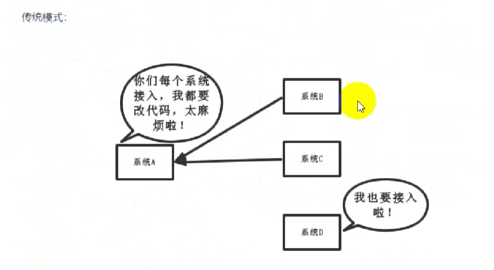
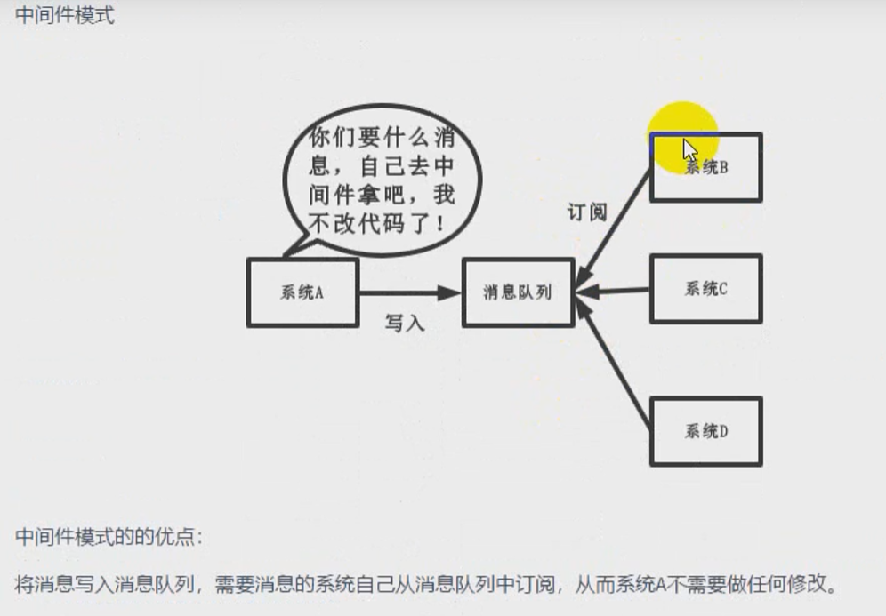
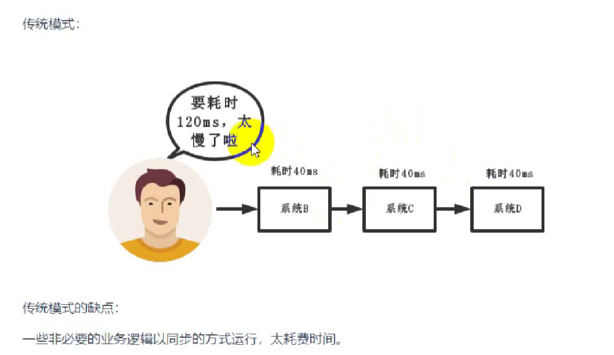
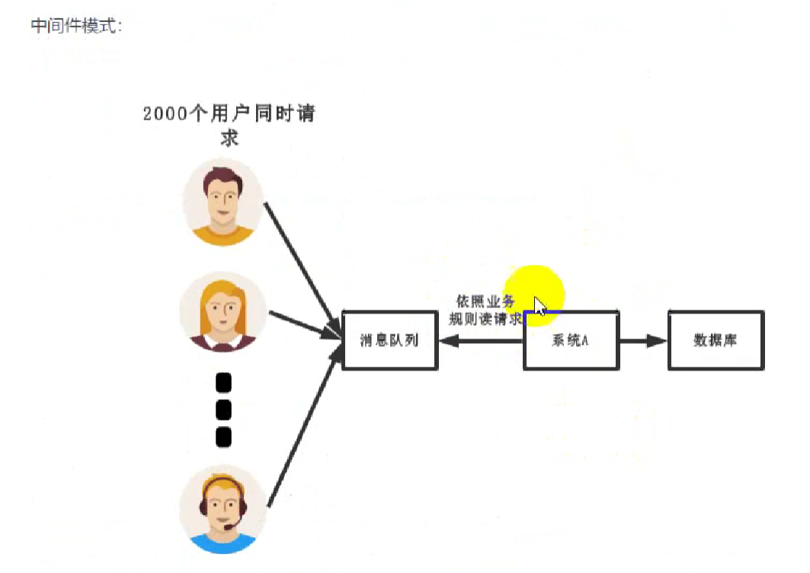
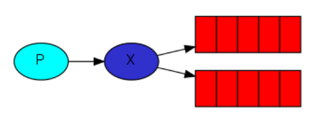
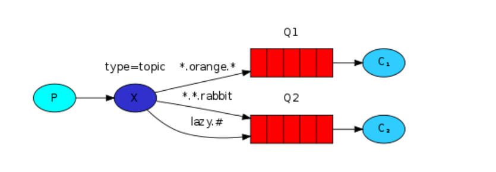
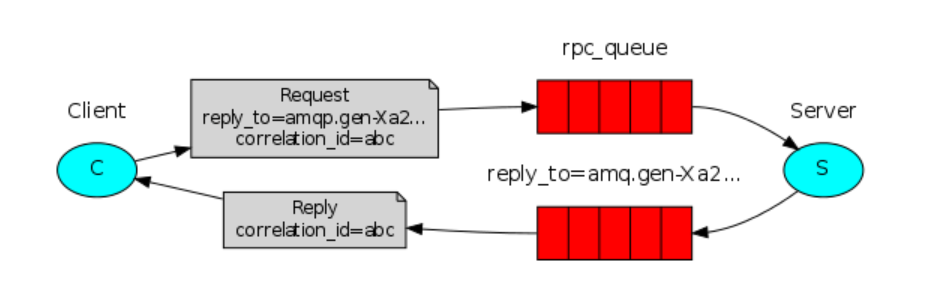
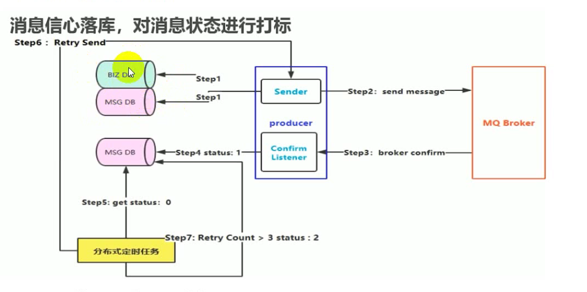
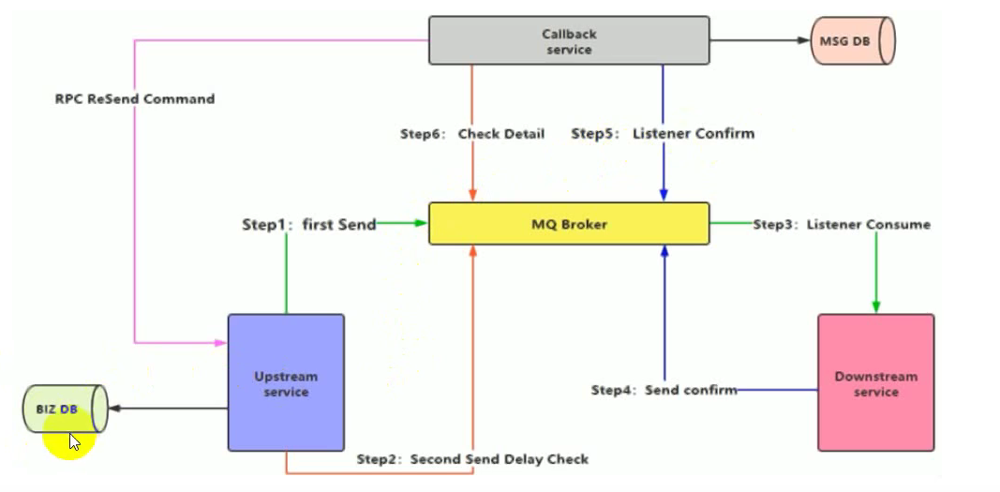

### 1.优点

应用耦合，异步处理，流量削峰

- 解耦

  

  
  
  

- 异步

  

  

- 削峰

  

### 2. 入门案例

导入依赖

```java
<!-- https://mvnrepository.com/artifact/com.rabbitmq/amqp-client -->
<dependency>
    <groupId>com.rabbitmq</groupId>
    <artifactId>amqp-client</artifactId>
    <version>5.6.0</version>
</dependency>

```


##### 2.1 简单队列

生产者

```java
import com.rabbitmq.client.Channel;
import com.rabbitmq.client.Connection;
import com.rabbitmq.client.ConnectionFactory;

import java.nio.charset.StandardCharsets;

public class Send {

    private final static String QUEUE_NAME = "hello";

    public static void main(String[] argv) throws Exception {
        //连接工厂建立连接
        ConnectionFactory factory = new ConnectionFactory();
        factory.setHost("localhost");
        factory.setUsername("yeb");
        factory.setVirtualHost("/yeb");
        factory.setPassword("admin");
        //连接工厂建立连接
        try (Connection connection = factory.newConnection();
             //创建信道
             Channel channel = connection.createChannel()) {
            /*
            * 绑定队列
            * 参数:
            * 1 队列名
            * 2 是否持久化
            * 3 是否排他队列(该队列仅对首次声明他的连接可见)
            * 4 是否自动删除
            * 5 额外参数
            */
            channel.queueDeclare(QUEUE_NAME, false, false, false, null);
            //发送消息
            String message = "Hello World!";
            channel.basicPublish("", QUEUE_NAME, null, message.getBytes(StandardCharsets.UTF_8));
            System.out.println(" [x] Sent '" + message + "'");
        }
    }
}
```

消费者

```java
import com.rabbitmq.client.Channel;
import com.rabbitmq.client.Connection;
import com.rabbitmq.client.ConnectionFactory;
import com.rabbitmq.client.DeliverCallback;
import java.nio.charset.StandardCharsets;

public class Recv {

    private final static String QUEUE_NAME = "hello";

    public static void main(String[] argv) throws Exception {
        //创建工厂
        ConnectionFactory factory = new ConnectionFactory();
        factory.setHost("localhost");
        factory.setUsername("yeb");
        factory.setVirtualHost("/yeb");
        factory.setPassword("admin");
        //工厂建立连接
        Connection connection = factory.newConnection();
        //创建信道
        Channel channel = connection.createChannel();
		//绑定队列
        channel.queueDeclare(QUEUE_NAME, false, false, false, null);
        System.out.println(" [*] Waiting for messages. To exit press CTRL+C");
		//接收队列消息
        DeliverCallback deliverCallback = (consumerTag, delivery) -> {
            String message = new String(delivery.getBody(), StandardCharsets.UTF_8);
            System.out.println(" [x] Received '" + message + "'");
        };
        // 监听队列消费（队列名称、自动回值（当我的消费者收到消息后，告诉队列我收到消息了））
        // false:手动去确认消息给队列
        channel.basicConsume(QUEUE_NAME, true, deliverCallback, consumerTag -> { });
    }
}
```

##### 2.2 工作队列

###### 2.2.1 轮询

核心代码

```java
//手动确认
//multiple：是否确认多条
channel.basicAck(delivery.getEnvelope().getDeliveryTag(), false);
```

生产者发送20条消息

```java
package com.jayq.work.rr.send;

import com.rabbitmq.client.Channel;
import com.rabbitmq.client.Connection;
import com.rabbitmq.client.ConnectionFactory;

import java.nio.charset.StandardCharsets;
// 工作队列-轮询-生产者
public class Send {

    private final static String QUEUE_NAME = "work_rr";

    public static void main(String[] argv) throws Exception {
        //连接工厂建立连接
        ConnectionFactory factory = new ConnectionFactory();
        factory.setHost("localhost");
        factory.setUsername("yeb");
        factory.setVirtualHost("/yeb");
        factory.setPassword("admin");
        //连接工厂建立连接
        try (Connection connection = factory.newConnection();
             //创建信道
             Channel channel = connection.createChannel()) {
            /*
            * 绑定队列
            * 参数:
            * 1 队列名
            * 2 是否持久化
            * 3 是否排他队列(该队列仅对首次声明他的连接可见)
            * 4 是否自动删除
            * 5 额外参数
            */
            channel.queueDeclare(QUEUE_NAME, false, false, false, null);
            //发送20条消息
            for (int i = 0;i < 20;i++) {
                String message = "Hello World!" + i;
                channel.basicPublish("", QUEUE_NAME, null, message.getBytes(StandardCharsets.UTF_8));
                System.out.println(" [x] Sent '" + message + "'" + i );
            }

        }
    }
}
```

消费者轮询去手动获取消息

```java
package com.jayq.work.rr.rec;

import com.rabbitmq.client.Channel;
import com.rabbitmq.client.Connection;
import com.rabbitmq.client.ConnectionFactory;
import com.rabbitmq.client.DeliverCallback;

import java.nio.charset.StandardCharsets;

// 工作队列-轮询-消费者1
public class Recv1 {

    private final static String QUEUE_NAME = "work_rr";

    public static void main(String[] argv) throws Exception {
        //创建工厂
        ConnectionFactory factory = new ConnectionFactory();
        factory.setHost("localhost");
        factory.setUsername("yeb");
        factory.setVirtualHost("/yeb");
        factory.setPassword("admin");
        //工厂建立连接
        Connection connection = factory.newConnection();
        //创建信道
        Channel channel = connection.createChannel();
        //绑定队列
        channel.queueDeclare(QUEUE_NAME, false, false, false, null);
        System.out.println(" [*] Waiting for messages. To exit press CTRL+C");
        //接收消息
        DeliverCallback deliverCallback = (consumerTag, delivery) -> {
            //模拟消费时长
            try {
                Thread.sleep(2000);
            } catch (InterruptedException e) {
                e.printStackTrace();
            }
            String message = new String(delivery.getBody(), StandardCharsets.UTF_8);
            System.out.println(" [x] Received '" + message + "'");
            //手动确认
            //multiple：是否确认多条
            channel.basicAck(delivery.getEnvelope().getDeliveryTag(), false);
        };
        //监听消息
        channel.basicConsume(QUEUE_NAME, false, deliverCallback, consumerTag -> {
        });
    }
}
```

轮询模式缺点:

消费者按序轮询,如果其中有人消费时间过长,则影响整个消费时间

###### 2.2.2 公平(能者多劳)

核心代码

```java
//限制消费者每次只能接受一条消息，处理完才能接受下一条消息,加在消费者消息之前
int prefetchCount=1;
channel.basicQos(prefetchCount);
```

##### 2.3 发布与订阅

对于微信公众号，相信每个人都订阅过，当公众号发送新的消息后，对于订阅过该公众号的所有用户均可以收到消息，这个场景大家都能明白，同样对于RabbitMQ消息的处理也支持这种消息处理，当生产者把消息投送出去后，不同的消费者均可以对该消息进行消费，而不是**消息被一个消费者消费后就立即从队列中删除**，对于这种消息处理，我们通常称之为消息的发布与订阅模式，凡是消费者订阅了该消息，均能够收到对应消息进行处理，比较常见的如用户注册操作。模型图如下:



核心思想:

由一个交换机EXCHANGE负责生成排他队列(基于连接,自动删除)

###### 2.3.1 广播(FANOUT)


核心代码

```java
生产者:
//生产者只需绑定交换机，选择交换机模式为广播
channel.exchangeDeclare(EXCHANGE_NAME, BuiltinExchangeType.FANOUT);

//发布时注意参数改变
channel.basicPublish( EXCHANGE_NAME,"", null, message.getBytes(StandardCharsets.UTF_8));

消费者:
//绑定交换机
channel.exchangeDeclare(EXCHANGE_NAME, BuiltinExchangeType.FANOUT);
//交换机生成队列
String queueName = channel.queueDeclare().getQueue();
//队列与交换机进行绑定
channel.queueBind(queueName,EXCHANGE_NAME,"");
```

生产者

```java
package com.jayq.exchanges.send;

import com.rabbitmq.client.BuiltinExchangeType;
import com.rabbitmq.client.Channel;
import com.rabbitmq.client.Connection;
import com.rabbitmq.client.ConnectionFactory;

import java.nio.charset.StandardCharsets;
// 发布订阅-生产者
public class Send {
    //定义交换机名称
    private final static String EXCHANGE_NAME = "exchange_fanout";

    public static void main(String[] argv) throws Exception {
        //连接工厂建立连接
        ConnectionFactory factory = new ConnectionFactory();
        factory.setHost("localhost");
        factory.setUsername("yeb");
        factory.setVirtualHost("/yeb");
        factory.setPassword("admin");
        //连接工厂建立连接
        try (Connection connection = factory.newConnection();
             //创建信道
             Channel channel = connection.createChannel()) {
            //生产者只需绑定交换机，选择交换机模式为广播
            channel.exchangeDeclare(EXCHANGE_NAME, BuiltinExchangeType.FANOUT);
            //发送消息
            String message = "Hello World!";
            //发布时注意参数改变
            channel.basicPublish( EXCHANGE_NAME,"", null, message.getBytes(StandardCharsets.UTF_8));
            System.out.println(" [x] Sent '" + message + "'");
        }
    }
}
```

消费者

```java
package com.jayq.direct.rec;

import com.rabbitmq.client.*;

import java.nio.charset.StandardCharsets;

// 发布订阅-消费者
public class Recv01 {

    private final static String EXCHANGE_NAME = "exchange_fanout";

    public static void main(String[] argv) throws Exception {
        //创建工厂
        ConnectionFactory factory = new ConnectionFactory();
        factory.setHost("localhost");
        factory.setUsername("yeb");
        factory.setVirtualHost("/yeb");
        factory.setPassword("admin");
        //工厂建立连接
        Connection connection = factory.newConnection();
        //创建信道
        Channel channel = connection.createChannel();
		//绑定交换机
        channel.exchangeDeclare(EXCHANGE_NAME, BuiltinExchangeType.FANOUT);
        //交换机生成队列
        String queueName = channel.queueDeclare().getQueue();
        //队列与交换机进行绑定
        channel.queueBind(queueName,EXCHANGE_NAME,"");
        System.out.println(" [*] Waiting for messages. To exit press CTRL+C");

        DeliverCallback deliverCallback = (consumerTag, delivery) -> {
            String message = new String(delivery.getBody(), StandardCharsets.UTF_8);
            System.out.println(" [x] Received '" + message + "'");
        };
        channel.basicConsume(queueName, true, deliverCallback, consumerTag -> { });
    }
}
```


##### 2.4 路由队列 (DIRECT)

需求:订阅公众号的才能收到消息,没订阅的不能收到

核心思想:为每个信息设定路由key,为每个消费者绑定能收到的路由key

);
channel.basicPublish( EXCHANGE_NAME,errorRoutingKey, null, errormessage.getBytes(StandardCharsets.UTF_8));
channel.basicPublish( EXCHANGE_NAME,warningRoutingKey, null, warningmessage.getBytes(StandardCharsets.UTF_8));

消费者
//准备对应的路由
String infoRoutingKey = "info";
String errorRoutingKey = "error";
String warningRoutingKey = "warning";
//队列与交换机以及路由进行绑定
channel.queueBind(queueName,EXCHANGE_NAME,errorRoutingKey);    
```

生产者

```java
package com.jayq.direct.send;

import com.rabbitmq.client.BuiltinExchangeType;
import com.rabbitmq.client.Channel;
import com.rabbitmq.client.Connection;
import com.rabbitmq.client.ConnectionFactory;

import java.nio.charset.StandardCharsets;

// 路由队列-生产者
public class Send {
    //定义交换机名称
    private final static String EXCHANGE_NAME = "exchange_direct";

    public static void main(String[] argv) throws Exception {
        //连接工厂建立连接
        ConnectionFactory factory = new ConnectionFactory();
        factory.setHost("localhost");
        factory.setUsername("yeb");
        factory.setVirtualHost("/yeb");
        factory.setPassword("admin");
        //连接工厂建立连接
        try (Connection connection = factory.newConnection();
             //创建信道
             Channel channel = connection.createChannel()) {
            //生产者只需绑定交换机，选择交换机模式为广播
            channel.exchangeDeclare(EXCHANGE_NAME, BuiltinExchangeType.DIRECT);
            //发送不同权限的消息
            String infomessage = "普通信息！";
            String errormessage = "错误信息！";
            String warningmessage = "警告信息！";
            //准备对应的路由
            String infoRoutingKey = "info";
            String errorRoutingKey = "error";
            String warningRoutingKey = "warning";
            channel.basicPublish( EXCHANGE_NAME,infoRoutingKey, null, infomessage.getBytes(StandardCharsets.UTF_8));
            channel.basicPublish( EXCHANGE_NAME,errorRoutingKey, null, errormessage.getBytes(StandardCharsets.UTF_8));
            channel.basicPublish( EXCHANGE_NAME,warningRoutingKey, null, warningmessage.getBytes(StandardCharsets.UTF_8));
            System.out.println(" [x] Sent '" + infomessage + "'");
            System.out.println(" [x] Sent '" + errormessage + "'");
            System.out.println(" [x] Sent '" + warningmessage + "'");
        }
    }
}
```

消费者1

```java
package com.jayq.direct.rec;

import com.rabbitmq.client.*;

import java.nio.charset.StandardCharsets;

// 路由队列-消费者
public class Recv01 {

    private final static String EXCHANGE_NAME = "exchange_direct";

    public static void main(String[] argv) throws Exception {
        //创建工厂
        ConnectionFactory factory = new ConnectionFactory();
        factory.setHost("localhost");
        factory.setUsername("yeb");
        factory.setVirtualHost("/yeb");
        factory.setPassword("admin");
        //工厂建立连接
        Connection connection = factory.newConnection();
        //创建信道
        Channel channel = connection.createChannel();
		//绑定交换机
        channel.exchangeDeclare(EXCHANGE_NAME, BuiltinExchangeType.DIRECT);
        //交换机生成队列
        String queueName = channel.queueDeclare().getQueue();
        //准备对应的路由
        String infoRoutingKey = "info";
        String errorRoutingKey = "error";
        String warningRoutingKey = "warning";
        //队列与交换机以及路由进行绑定
        channel.queueBind(queueName,EXCHANGE_NAME,errorRoutingKey);
        System.out.println(" [*] Waiting for messages. To exit press CTRL+C");

        DeliverCallback deliverCallback = (consumerTag, delivery) -> {
            String message = new String(delivery.getBody(), StandardCharsets.UTF_8);
            System.out.println(" [x] Received '" + message + "'");
        };
        channel.basicConsume(queueName, true, deliverCallback, consumerTag -> { });
    }
}
```

消费者2

```java
package com.jayq.direct.rec;

import com.rabbitmq.client.*;

import java.nio.charset.StandardCharsets;

// 路由队列-消费者
public class Recv02 {

    private final static String EXCHANGE_NAME = "exchange_direct";

    public static void main(String[] argv) throws Exception {
        //创建工厂
        ConnectionFactory factory = new ConnectionFactory();
        factory.setHost("localhost");
        factory.setUsername("yeb");
        factory.setVirtualHost("/yeb");
        factory.setPassword("admin");
        //工厂建立连接
        Connection connection = factory.newConnection();
        //创建信道
        Channel channel = connection.createChannel();
        //绑定交换机
        channel.exchangeDeclare(EXCHANGE_NAME, BuiltinExchangeType.DIRECT);
        //交换机生成队列
        String queueName = channel.queueDeclare().getQueue();
        //准备对应的路由
        String infoRoutingKey = "info";
        String errorRoutingKey = "error";
        String warningRoutingKey = "warning";
        //队列与交换机进行绑定
        channel.queueBind(queueName,EXCHANGE_NAME,infoRoutingKey);
        channel.queueBind(queueName,EXCHANGE_NAME,errorRoutingKey);
        channel.queueBind(queueName,EXCHANGE_NAME,warningRoutingKey);
        System.out.println(" [*] Waiting for messages. To exit press CTRL+C");

        DeliverCallback deliverCallback = (consumerTag, delivery) -> {
            String message = new String(delivery.getBody(), StandardCharsets.UTF_8);
            System.out.println(" [x] Received '" + message + "'");
        };
        channel.basicConsume(queueName, true, deliverCallback, consumerTag -> { });
    }
}
```

补充:

- 简单队列虽然没有指定交换机,但是会自动分配一个默认的交换机,类型为DIRECT

- 简单队列生产者发送消息时绑定的QUEUE_NAME实际上就是路由key

  ```java
  channel.basicPublish("", QUEUE_NAME, null, message.getBytes(StandardCharsets.UTF_8));
  ```

##### 2.5 主题队列(TOPIC)

工作中用的最多的就是主题队列

需求:

当路由key成千上万个,如何对路由key进行管理，此时简单的路由队列无法满足需求



核心思想：

- \* (star) can substitute for exactly one word.（任意一个）
- \# (hash) can substitute for zero or more words.（0或多个）

生产者

```java
package com.jayq.topic.send;

import com.rabbitmq.client.BuiltinExchangeType;
import com.rabbitmq.client.Channel;
import com.rabbitmq.client.Connection;
import com.rabbitmq.client.ConnectionFactory;

import java.nio.charset.StandardCharsets;

// 主题队列-生产者
public class Send {
    //定义交换机名称
    private final static String EXCHANGE_NAME = "exchange_topic";

    public static void main(String[] argv) throws Exception {
        //连接工厂建立连接
        ConnectionFactory factory = new ConnectionFactory();
        factory.setHost("localhost");
        factory.setUsername("yeb");
        factory.setVirtualHost("/yeb");
        factory.setPassword("admin");
        //连接工厂建立连接
        try (Connection connection = factory.newConnection();
             //创建信道
             Channel channel = connection.createChannel()) {
            //生产者只需绑定交换机，选择交换机模式为广播
            channel.exchangeDeclare(EXCHANGE_NAME, BuiltinExchangeType.TOPIC);
            //发送不同权限的消息
            String infomessage = "普通信息！";
            String errormessage = "错误信息！";
            String warningmessage = "警告信息！";
            //准备对应的路由
            String infoRoutingKey = "info.message.orange";
            String errorRoutingKey = "error.rabbit.lazy";
            String warningRoutingKey = "orange.warning.message";
            channel.basicPublish( EXCHANGE_NAME,infoRoutingKey, null, infomessage.getBytes(StandardCharsets.UTF_8));
            channel.basicPublish( EXCHANGE_NAME,errorRoutingKey, null, errormessage.getBytes(StandardCharsets.UTF_8));
            channel.basicPublish( EXCHANGE_NAME,warningRoutingKey, null, warningmessage.getBytes(StandardCharsets.UTF_8));
            System.out.println(" [x] Sent '" + infomessage + "'");
            System.out.println(" [x] Sent '" + errormessage + "'");
            System.out.println(" [x] Sent '" + warningmessage + "'");
        }
    }
}
```

消费者1

```java
package com.jayq.topic.rec;

import com.rabbitmq.client.*;

import java.nio.charset.StandardCharsets;

// 主题队列-消费者1
public class Recv01 {

    private final static String EXCHANGE_NAME = "exchange_topic";

    public static void main(String[] argv) throws Exception {
        //创建工厂
        ConnectionFactory factory = new ConnectionFactory();
        factory.setHost("localhost");
        factory.setUsername("yeb");
        factory.setVirtualHost("/yeb");
        factory.setPassword("admin");
        //工厂建立连接
        Connection connection = factory.newConnection();
        //创建信道
        Channel channel = connection.createChannel();
		//绑定交换机
        channel.exchangeDeclare(EXCHANGE_NAME, BuiltinExchangeType.TOPIC);
        //交换机生成队列
        String queueName = channel.queueDeclare().getQueue();
        //准备对应的路由
        String routingKey = "#.message.#";
        //队列与交换机以及路由进行绑定
        channel.queueBind(queueName,EXCHANGE_NAME,routingKey);
        System.out.println(" [*] Waiting for messages. To exit press CTRL+C");

        DeliverCallback deliverCallback = (consumerTag, delivery) -> {
            String message = new String(delivery.getBody(), StandardCharsets.UTF_8);
            System.out.println(" [x] Received '" + message + "'");
        };
        channel.basicConsume(queueName, true, deliverCallback, consumerTag -> { });
    }
}
```

消费者2

```java
package com.jayq.topic.rec;

import com.rabbitmq.client.*;

import java.nio.charset.StandardCharsets;

// 主题队列-消费者2
public class Recv02 {

    private final static String EXCHANGE_NAME = "exchange_topic";

    public static void main(String[] argv) throws Exception {
        //创建工厂
        ConnectionFactory factory = new ConnectionFactory();
        factory.setHost("localhost");
        factory.setUsername("yeb");
        factory.setVirtualHost("/yeb");
        factory.setPassword("admin");
        //工厂建立连接
        Connection connection = factory.newConnection();
        //创建信道
        Channel channel = connection.createChannel();
        //绑定交换机
        channel.exchangeDeclare(EXCHANGE_NAME, BuiltinExchangeType.TOPIC);
        //交换机生成队列
        String queueName = channel.queueDeclare().getQueue();
        //准备对应的路由
        String routingKey = "*.rabbit.*";
        //队列与交换机进行绑定
        channel.queueBind(queueName,EXCHANGE_NAME,routingKey);
        System.out.println(" [*] Waiting for messages. To exit press CTRL+C");

        DeliverCallback deliverCallback = (consumerTag, delivery) -> {
            String message = new String(delivery.getBody(), StandardCharsets.UTF_8);
            System.out.println(" [x] Received '" + message + "'");
        };
        channel.basicConsume(queueName, true, deliverCallback, consumerTag -> { });
    }
}
```

##### 2.6 RPC模式

需求

- C 发送请求，包含reply_to 和 correlation_id

- S 收到请求后，处理并转发转发到reply_to指定的队列中，并设定correlation_id

- C 根据correlation_id从队列中拿消息



客户端（常开）

```java
package com.jayq.rpc;

import com.rabbitmq.client.AMQP;
import com.rabbitmq.client.Channel;
import com.rabbitmq.client.Connection;
import com.rabbitmq.client.ConnectionFactory;

import java.io.IOException;
import java.util.UUID;
import java.util.concurrent.ArrayBlockingQueue;
import java.util.concurrent.BlockingQueue;
import java.util.concurrent.TimeoutException;
// RPC模式队列-客户端
public class RPCClient implements AutoCloseable {

    private Connection connection;
    private Channel channel;
    // 请求队列名称
    private String requestQueueName = "rpc_queue";
    //创建客户端
    public RPCClient() throws IOException, TimeoutException {
        //创建工厂
        ConnectionFactory factory = new ConnectionFactory();
        factory.setHost("localhost");
        factory.setUsername("yeb");
        factory.setVirtualHost("/yeb");
        factory.setPassword("admin");

        connection = factory.newConnection();
        channel = connection.createChannel();
    }

    public static void main(String[] argv) {
        try (RPCClient fibonacciRpc = new RPCClient()) {
            for (int i = 0; i < 32; i++) {
                String i_str = Integer.toString(i);
                System.out.println(" [x] Requesting fib(" + i_str + ")");
                String response = fibonacciRpc.call(i_str);
                System.out.println(" [.] Got '" + response + "'");
            }
        } catch (IOException | TimeoutException | InterruptedException e) {
            e.printStackTrace();
        }
    }
    //请求服务端
    public String call(String message) throws IOException, InterruptedException {
        //生成唯一id
        final String corrId = UUID.randomUUID().toString();
        //获取队列名称
        String replyQueueName = channel.queueDeclare().getQueue();
        //设置reply_to 和 correlation_id
        AMQP.BasicProperties props = new AMQP.BasicProperties
                .Builder()
                .correlationId(corrId)
                .replyTo(replyQueueName)
                .build();
        //信道发送消息
        channel.basicPublish("", requestQueueName, props, message.getBytes("UTF-8"));
        //设置线程等待，每次只处理一个响应结果
        final BlockingQueue<String> response = new ArrayBlockingQueue<>(1);
        // 接收服务器返回结果
        String ctag = channel.basicConsume(replyQueueName, true, (consumerTag, delivery) -> {
            if (delivery.getProperties().getCorrelationId().equals(corrId)) {
                //将给定的元素在给定的时间内放入队列中，如果成功返回true,失败返回false
                response.offer(new String(delivery.getBody(), "UTF-8"));
            }
        }, consumerTag -> {
        });
        // 从线程队列中获取值，失败会一直阻塞，直到取到该值
        String result = response.take();
        // 从队列中删除这个值
        channel.basicCancel(ctag);
        return result;
    }

    public void close() throws IOException {
        connection.close();
    }
}
```

服务端（必须先启动，常开）

```java
package com.jayq.rpc;

import com.rabbitmq.client.*;
// RPC模式队列-服务端
public class RPCServer {

    private static final String RPC_QUEUE_NAME = "rpc_queue";
    //斐波那契数列
    private static int fib(int n) {
        if (n == 0) return 0;
        if (n == 1) return 1;
        return fib(n - 1) + fib(n - 2);
    }

    public static void main(String[] argv) throws Exception {
        //创建工厂
        ConnectionFactory factory = new ConnectionFactory();
        factory.setHost("localhost");
        factory.setUsername("yeb");
        factory.setVirtualHost("/yeb");
        factory.setPassword("admin");
        //建立连接
        try (Connection connection = factory.newConnection();
             //创建信道
             Channel channel = connection.createChannel()) {
            //信道绑定队列
            channel.queueDeclare(RPC_QUEUE_NAME, false, false, false, null);
            channel.queuePurge(RPC_QUEUE_NAME);
            //限制RabbitMq每次只能发送一条消息给同一个消费者
            //当消息处理完有反馈后才能发送第二条
            channel.basicQos(1);

            System.out.println(" [x] Awaiting RPC requests");

            Object monitor = new Object();
            //获取消息
            DeliverCallback deliverCallback = (consumerTag, delivery) -> {
                //获取reply_to 和 correlation_id
                AMQP.BasicProperties replyProps = new AMQP.BasicProperties
                        .Builder()
                        .correlationId(delivery.getProperties().getCorrelationId())
                        .build();

                String response = "";

                try {
                    // 接收客户端消息
                    String message = new String(delivery.getBody(), "UTF-8");
                    int n = Integer.parseInt(message);

                    System.out.println(" [.] fib(" + message + ")");
                    response += fib(n);
                } catch (RuntimeException e) {
                    System.out.println(" [.] " + e.toString());
                } finally {
                    //将处理结果发送到replyTo队列，同时携带correlationId属性
                    channel.basicPublish("", delivery.getProperties().getReplyTo(), replyProps, response.getBytes("UTF-8"));
                    channel.basicAck(delivery.getEnvelope().getDeliveryTag(), false);
                    // RabbitMq consumer worker thread notifies the RPC server owner thread
                    synchronized (monitor) {
                        monitor.notify();
                    }
                }
            };

            channel.basicConsume(RPC_QUEUE_NAME, false, deliverCallback, (consumerTag -> { }));
            // Wait and be prepared to consume the message from RPC client.
            while (true) {
                synchronized (monitor) {
                    try {
                        monitor.wait();
                    } catch (InterruptedException e) {
                        e.printStackTrace();
                    }
                }
            }
        }
    }
}
```

##### 2.7 事务机制（了解）

在使用RabbitMQ的时候，我们可以通过消息持久化操作来解决因为服务器的异常奔溃导致的消息丢失，除此之外我们还会遇到一个问题，当消息的发布者在将消息发送出去之后，消息到底有没有正确到达broker代理服务器呢？如果不进行特殊配置的话，默认情况下发布操作是不会返回任何信息给生产者的，也就是默认情况下我们的生产者是不知道消息有没有正确到达broker的，如果在消息到达broker之前已经丢失的话，持久化操作也解决不了这个问题，因为消息根本就没到达代理服务器，你怎么进行持久化，那么这个问题该怎么解决呢？

RabbitMQ为我们提供了两种方式：

- 通过AMQP事务机制实现，这也是AMQP协议层面提供的解决方案；
- 通过将channel设置成confirm模式来实现；

RabbitMQ中与事务机制有关的方法有三个： txSelect() , txCommit() 以及 txRollback()

- txSelect() 用于将当前channel设置成transaction模式

- txCommit() 用于提交事务

- txRollback() 用于回滚事务

在通过txSelect() 开启事务之后，我们便可以发布消息给broker代理服务器了，如果 txCommit() 提交成功了，则消息一定到达了broker了，如果在 txCommit() 执行之前broker异常崩溃或者由于其他原因抛出异常，这个时候我们便可以捕获异常通过 txRollback() 回滚事务。

总结：事务会降低性能
事务确实能够解决producer与broker之间消息确认的问题，只有消息成功被broker接受，事务提交才能成功，否则我们便可以在捕获异常进行事务回滚操作同时进行消息重发，但是使用事务机制的话会降低RabbitMQ的性能，那么有没有更好的方法既能保障producer知道消息已经正确送到，又能基本上不带来性能上的损失呢？从AMQP协议的层面看是没有更好的方法，但是RabbitMQ提供了一个更好的方案，即**将channel信道设置成confirm模式**

##### 2.8 确认模式(confirm)

通过AMQP协议层面为我们提供了事务机制解决了这个问题，但是采用事务机制实现会降低RabbitMQ的消息吞吐量，此时处理AMQP协议层面能够实现消息事物控制外，我们还有第二种方式即:Confirm模式。

###### 2.8.1 原理

生产者将信道设置成confirm模式，一旦信道进入confirm模式，所有在该信道上面发布的消息都会被指派一个唯一的ID(从1开始)，一旦消息被投递到所有匹配的队列之后，**broker**就会发送一个确认给生产者（包含消息的唯一ID）,这就使得生产者知道消息已经正确到达目的队列了，如果消息和队列是可持久化的，那么确认消息会将消息写入磁盘之后发出，broker回传给生产者的确认消息中deliver-tag域包含了确认消息的序列号，此外broker也可以设置basic.ack的multiple域，表示到这个序列号之前的所有消息都已经得到了处理。

confirm模式最大的好处在于他是**异步**的，一旦发布一条消息，生产者应用程序就可以在等信道返回确认的同时继续发送下一条消息，当消息最终得到确认之后，生产者应用便可以通过回调方法来处理该确认消息，如果RabbitMQ因为自身内部错误导致消息丢失，就会发送一条nack消息，生产者应用程序同样可以在回调方法中处理该nack（未确定）消息。
在channel 被设置成 confirm 模式之后，所有被 publish 的后续消息都将被 confirm（即 ack） 或者被nack一次。但是没有对消息被 confirm 的快慢做任何保证，并且同一条消息不会既被 confirm又被nack 。

注意:两种事物控制形式不能同时开启！

###### 2.8.2 实现机制

​	实现生产者confirm 机制有三种方式:

- 普通confirm模式-串行-同步：每发送一条消息后，调用waitForConfirms()方法，等待服务器端confirm确认。实际上是一种串行confirm了。

- 批量confirm模式-串行-同步：每发送一批消息后，调用waitForConfirmsOrDie()方法，等待服务器端confirm。

- 异步confirm模式：提供一个回调方法，服务端confirm了一条或者多条消息后Client端会回调这个方法。

###### 2.8.3 核心代码

```java
Channel channel = connection.createChannel();
//开启确认模式
channel.confirmSelect();
```

单条确认

```java
while (thereAreMessagesToPublish()) {
    byte[] body = ...;
    BasicProperties properties = ...;
    channel.basicPublish(exchange, queue, properties, body);
    // uses a 5 second timeout
    channel.waitForConfirmsOrDie(5_000);
}
```

批量确认

```java
int batchSize = 100;
int outstandingMessageCount = 0;
while (thereAreMessagesToPublish()) {
    byte[] body = ...;
    BasicProperties properties = ...;
    channel.basicPublish(exchange, queue, properties, body);
    outstandingMessageCount++;
    if (outstandingMessageCount == batchSize) {
        ch.waitForConfirmsOrDie(5_000);
        outstandingMessageCount = 0;
    }
}
if (outstandingMessageCount > 0) {
    ch.waitForConfirmsOrDie(5_000);
}
```

异步确认

```java
Channel channel = connection.createChannel();
channel.confirmSelect();
channel.addConfirmListener((sequenceNumber, multiple) -> {
    // code when message is confirmed
}, (sequenceNumber, multiple) -> {
    // code when message is nack-ed
});
```

###### 2.8.4 异步confirm

异步：你发消息，我等待确认，然而，在我等待时，我还可以发送消息。确认了消息返回，返回的时候生产者有回调的方法，能收到确认消息。

异步confirm模式的编程实现最复杂，Channel对象提供的`ConfirmListener()` 【该方法用来监听返回的消息】回调方法只包含`deliveryTag` 【当前Chanel发出的消息序号】，我们需要自己为每一个Channel维护一个 unconfirm的消息序号集合，每publish一条数据，集合中元素加1，每回调一次`handleAck` 方法【确认的一个处理】， unconfirm 集合删掉相应的一条 （multiple=false）或多条 （multiple=true） 记录。从程序运行效率上看，这个 unconfirm集合最好采用有序集合SortedSet存储结构（有序集合）。实际上waitForConfirms() 方法也是通过SortedSet维护消息序号的。

3、代码：

```java
/**
 * 信道确认模式-异步-生产者
 * 异步模式的优点就是执行效率高，不需要等待消息执行完，只需要监听消息即可。
 */
public class Send {
    // 队列名称
    public static final String QUEUE_NAME = "confirm_async";
    public static void main(String[] args) {
        // 定义连接工厂
        ConnectionFactory factory = new ConnectionFactory();
        factory.setHost("localhost");
        factory.setPort(5672);
        factory.setUsername("yeb");
        factory.setPassword("yeb");

        Connection connection = null;
        Channel channel = null;
        try {
            // 维护信息发送回执deliveryTag
            final SortedSet<Long>
                    confirmSet=Collections.synchronizedSortedSet(new TreeSet<Long>());
            // 创建连接
            connection = factory.newConnection();
            // 获取通道
            channel = connection.createChannel();
            // 开启confirm确认模式
            channel.confirmSelect();
            // 声明队列
            channel.queueDeclare(QUEUE_NAME, false, false, false, null);
            // 添加channel 监听
            channel.addConfirmListener(new ConfirmListener() {
                // 已确认
                @Override
                public void handleAck(long deliveryTag, boolean multiple) throws IOException {
                    // multiple=true已确认多条， false已确认单条
                    if (multiple) {
                        System.out.println("handleAck--success-->multiple" + deliveryTag);
                        // 清除前 deliveryTag 项标识id 。 删除多条
                        confirmSet.headSet(deliveryTag + 1L).clear();
                    } else {
                        System.out.println("handleAck--success-->single" + deliveryTag);
                        //如果是单条，就删除单条
                        confirmSet.remove(deliveryTag);
                    }
                }

                // 未确认
                @Override
                public void handleNack(long deliveryTag, boolean multiple)
                        throws IOException {
                    // multiple=true未确认多条 false未确认单条
                    if (multiple) {
                        System.out.println("handleNack--failed-->multiple-->" +
                                deliveryTag);
                        // 清除前 deliveryTag 项标识id
                        confirmSet.headSet(deliveryTag + 1L).clear();
                    } else {
                        System.out.println("handleNack--failed-->single" +
                                deliveryTag);
                        confirmSet.remove(deliveryTag);
                    }
                }
            });

            // 循环发送消息演示消息确认
            while (true) {
                // 创建消息
                String message = "Hello World!";
                // 获取unconfirm的消息序号deliveryTag. 对应发送消息的序列号
                Long seqNo = channel.getNextPublishSeqNo();
                channel.basicPublish("", QUEUE_NAME, null,
                        message.getBytes("utf-8"));
                // 将消息序号deliveryTag添加至SortedSet
                confirmSet.add(seqNo);
            }

        } catch (IOException | TimeoutException e) {
            e.printStackTrace();
        } finally {
            try {
                // 关闭通道
                if (null != channel && channel.isOpen())
                { channel.close();}
                // 关闭连接
                if (null != connection && connection.isOpen())
                { connection.close();}
            } catch (TimeoutException e) {
                e.printStackTrace();
            } catch (IOException e) {
                e.printStackTrace();
            }
        }
    }
}
```

```java
/**
 * 确认模式-异步-消息接收者。消费者
 */
public class Recv {
    // 队列名称
    private final static String QUEUE_NAME = "confirm_async";
    public static void main(String[] args) {
        // 创建连接工厂
        ConnectionFactory factory = new ConnectionFactory();
        factory.setHost("localhost");
        factory.setPort(5672);
        factory.setUsername("yeb");
        factory.setPassword("admin");
        try {
            // 通过工厂创建连接
            Connection connection = factory.newConnection();
            // 获取通道，创建信道
            Channel channel = connection.createChannel();
            // 指定队列
            channel.queueDeclare(QUEUE_NAME, false, false, false, null);
            System.out.println(" [*] Waiting for messages. To exit pressCTRL+C");

            // 获取消息
            DeliverCallback deliverCallback = (consumerTag, delivery) -> {
                String message = new String(delivery.getBody(), "UTF-8");
                System.out.println(" [x] Received '" + message + "'");
            };
            // 监听队列消费（）
            channel.basicConsume(QUEUE_NAME, true, deliverCallback, consumerTag
                    -> {
            });
        } catch (IOException e) {
            e.printStackTrace();
        } catch (TimeoutException e) {
            e.printStackTrace();
        }
    }
}

```
### 3.Spring集成RabbitMq

##### 3.1 父工程

导入依赖

```xml
  <!--父部依赖，做依赖管理的-->
  <parent>
    <groupId>org.springframework.boot</groupId>
    <artifactId>spring-boot-starter-parent</artifactId>
    <version>2.1.7.RELEASE</version>
    <relativePath/> <!-- lookup parent from repository -->
  </parent>
```

##### 3.2 子模块发送端send

导入依赖

```xml
<dependencies>
        <dependency>
            <groupId>org.springframework.boot</groupId>
            <artifactId>spring-boot-starter-amqp</artifactId>
        </dependency>
        <dependency>
            <groupId>org.springframework.boot</groupId>
            <artifactId>spring-boot-starter-web</artifactId>
        </dependency>
        <dependency>
            <groupId>org.springframework.boot</groupId>
            <artifactId>spring-boot-starter-test</artifactId>
        </dependency>
    </dependencies>
```

配置文件

```yml
spring:
  rabbitmq:
    host: localhost
    port: 5672
    username: yeb
    password: admin
    virtual-host: /yeb
server:
  port: 8081
```

配置类

```java
package com.jayq.send.config;

import org.springframework.amqp.core.Binding;
import org.springframework.amqp.core.BindingBuilder;
import org.springframework.amqp.core.Queue;
import org.springframework.amqp.core.TopicExchange;
import org.springframework.context.annotation.Bean;
import org.springframework.context.annotation.Configuration;

@Configuration
public class RabbitMQConfig {
    /**
     * 配置类需要哪些东西？
     * 1.交换机
     * 2.队列
     * 3.交换机和队列做绑定
     *
     */

    /**
     * 声明队列
     * @return
     */
    @Bean
    public Queue queue(){
        return new Queue("amqp_queue");
    }

    /**
     * 主题模式：工作中主要是用主题模式
     * 声明交换机
     *
     */
    @Bean
    public TopicExchange topicExchange(){
        return new TopicExchange("amqp_exchange");
    }

    /**
     * 绑定交换机和队列，  主题配置路由："*.amqp.#"
     *    用通配符进行绑定
     *
     */
    @Bean
    public Binding binding(){
        return BindingBuilder.bind(queue()).to(topicExchange()).with("*.amqp.#");
    }

}
```

测试类

```java
@SpringBootTest
@RunWith(SpringRunner.class)
public class RabbitMQTest {
    @Autowired
    private RabbitTemplate rabbitTemplate;
    @Test
    public void testSend(){
        String message = "hell0";
        System.out.println("发送消息： " + message);
        //发送消息：
        //(交换机、路由、消息)
        //其中配置类路由是："*.amqp.#"  而 test.amqp是可以找到的。
        rabbitTemplate.convertAndSend("amqp_exchange","test.amqp",message);
    }

}
```


##### 3.3 子模块接收端recv

与send基本一致，除了把配置文件中的端口号改为8082，没有配置类和测试类

监听队列

```java
@Component
//监听队列：
@RabbitListener(queues = "amqp_queue")
public class RecvInit {

    //监听后获取消息的方法：
    @RabbitHandler
    public void testRecv(String message){
        System.out.println("接收到的消息:  " + message);
    }
}
```

### 4.生产端可靠性投递方案

需求：丢弃重复发送的消息

核心思想

- 保证消息成功发出

- 保证队列成功接收到消息

- 保证生产端能收到消费者发送的确认消息

方案设计

1. 消息落库，对消息状态进行打标

   

2. 消息延迟投递，做二次确认，回调检查

   

### 5. 消费者幂等性解决方案

##### 5.1 什么是幂等性问题

有可能投递多次id一样的消息。
例如上述的定时重发，例如发送了第一条消息，处于投递中。刚发完还没有收到监听回调，还没有变更状态时，定时任务抓到了该消息，会第二次重发消息。从而会发送两次一样的消息。消费端如何应对呢？？ 如果是订单方法呢？该怎么处理呢？

##### 5.2 主流的幂等性操作

1. 唯一的Id+指纹码。 

   唯一id可以是自增id，指纹码用msgid（也就是uuid）
   消息过来的时候，消费之前，根据id进行数据查询有没有数据，如果有数据说明消费过了，没有数据说明，会进行消费。同时将数据放到数据库里面。

   总结：简单。缺点：高并发数据库会有瓶颈

2. redis原子性

   问题：业务数据要不要入库，考虑数据库和redis做缓存。

   如果不考虑入库，那么都存在内存里面，考虑定时同步策略。
