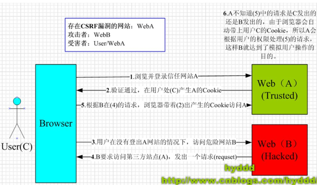

### CSRF攻击概述

CSRF（Cross Site Request Forgery, 跨站域请求伪造）是一种网络的攻击方式，它在 2007 年曾被列为互联网 20 大安全隐患之一。其他安全隐患，比如 SQL 脚本注入，跨站域脚本攻击等在近年来已经逐渐为众人熟知，很多网站也都针对他们进行了防御。然而，对于大多数人来说，CSRF 却依然是一个陌生的概念。即便是大名鼎鼎的 Gmail, 在 2007 年底也存在着 CSRF 漏洞，从而被黑客攻击而使 Gmail 的用户造成巨大的损失。

### CSRF攻击原理

网站是通过`cookie`来实现登录功能的。而`cookie`只要存在浏览器中，那么浏览器在访问这个`cookie`的服务器的时候，就会自动的携带`cookie`信息到服务器上去。那么这时候就存在一个漏洞了，如果你访问了一个别有用心或病毒网站，这个网站可以在网页源代码中插入js代码，使用js代码给其他服务器发送请求（比如ICBC的转账请求）。那么因为在发送请求的时候，浏览器会自动的把`cookie`发送给对应的服务器，这时候相应的服务器（比如ICBC网站），就不知道这个请求是伪造的，就被欺骗过去了。从而达到在用户不知情的情况下，给某个服务器发送了一个请求（比如转账）。

### 那为什么说Token可以防止CSRF攻击呢？

token 验证的规则是，服务器从请求体（POST）或者请求参数（GET）中获取设置的 token，然后和 Cookie 中的 token 进行比较，一致之后才执行请求。

而 CSRF 攻击只是借用了 Cookie，并不能获取 Cookie 中的信息，所以不能获取 Cookie 中的 token，也就不能在发送请求时在 POST 或者 GET 中设置 token，把请求发送到服务器端时，token 验证不通过，也就不会处理请求了。

所以，token 可以防止 CSRF 攻击。

### CSRF防护策略

CSRF通常从第三方网站发起，被攻击的网站无法防止攻击发生，只能通过增强自己网站针对CSRF的防护能力来提升安全性。

CSRF有两个特点：

- CSRF（通常）发生在第三方域名。
- CSRF攻击者不能获取到Cookie等信息，只是使用。

针对这两点，我们可以专门制定防护策略，如下：

- 阻止不明外域的访问
  - 同源检测，即直接禁止外域（或者不受信任的域名）对我们发起请求。
  - Samesite Cookie，为了从源头上解决这个问题，Google起草了一份草案来改进HTTP协议，那就是为Set-Cookie响应头新增Samesite属性，它用来标明这个 Cookie是个“同站 Cookie”，同站Cookie只能作为第一方Cookie，不能作为第三方Cookie。
- 提交时要求附加本域才能获取的信息
  - CSRF Token
  - 双重Cookie验证
    