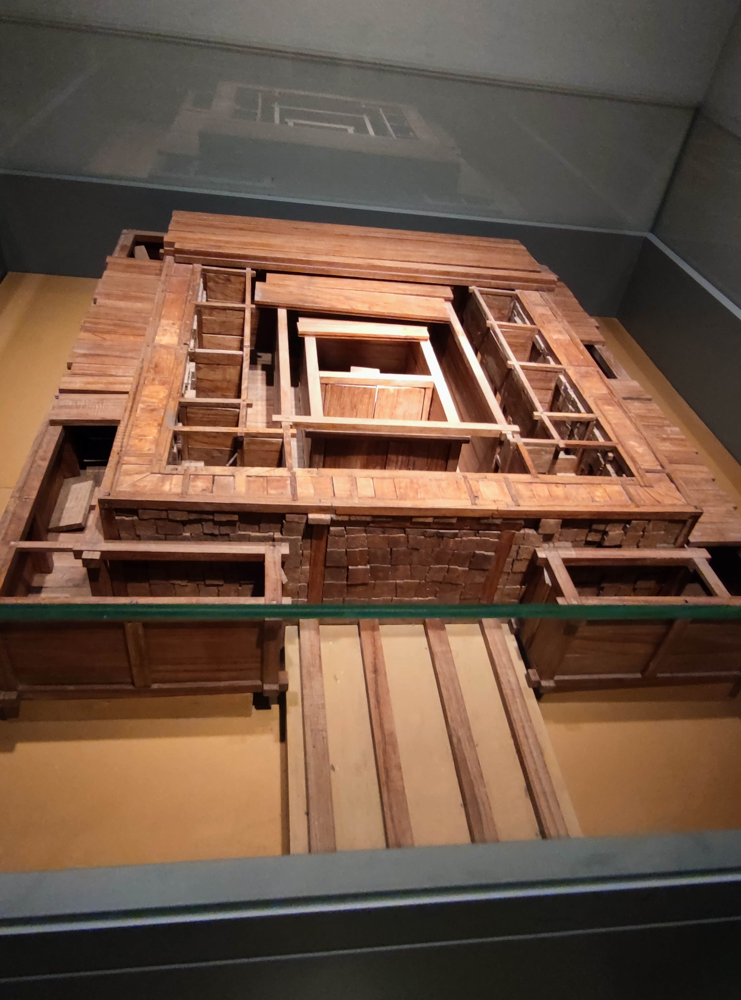
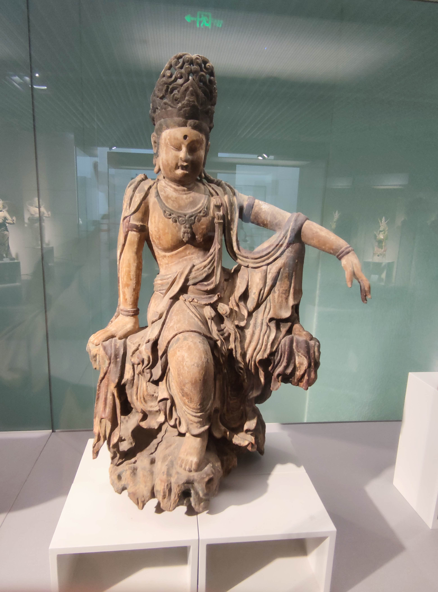
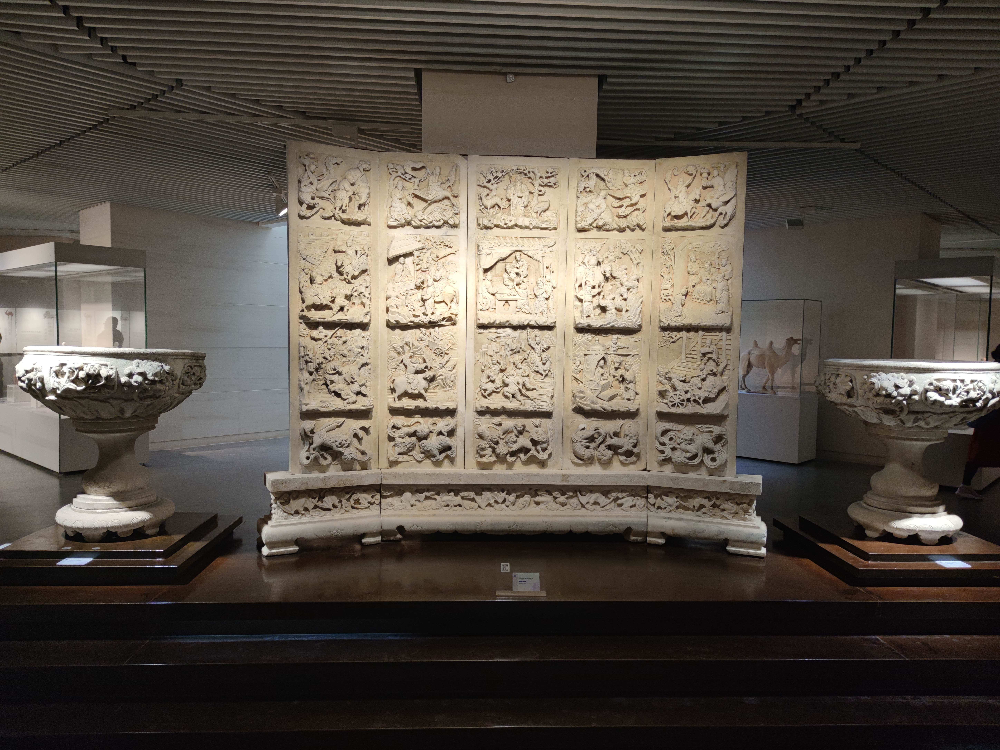
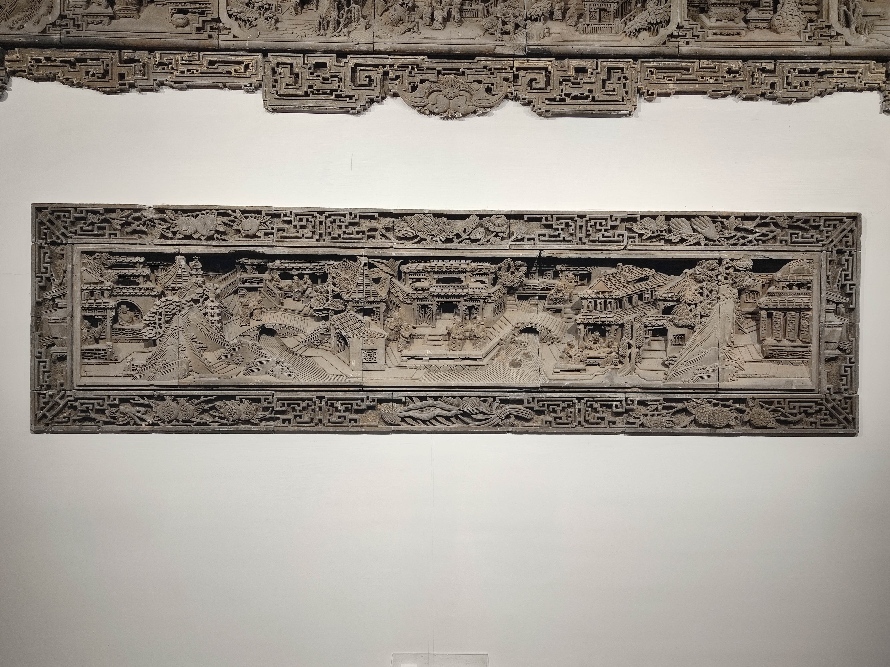
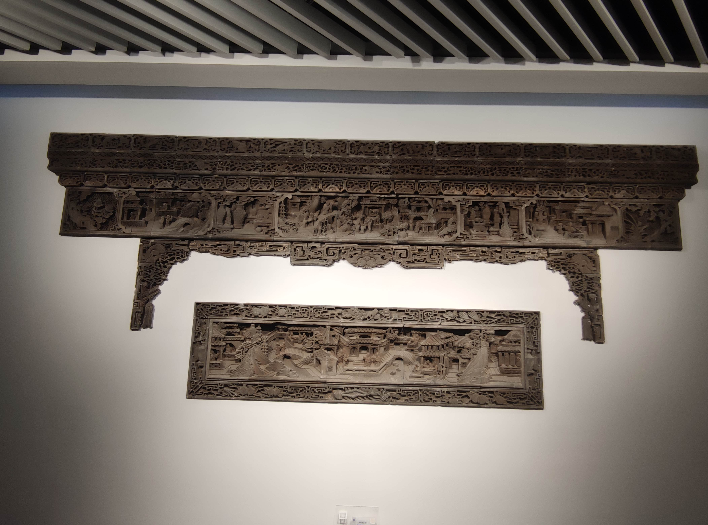
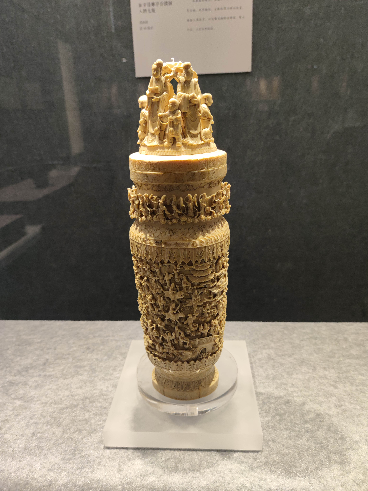
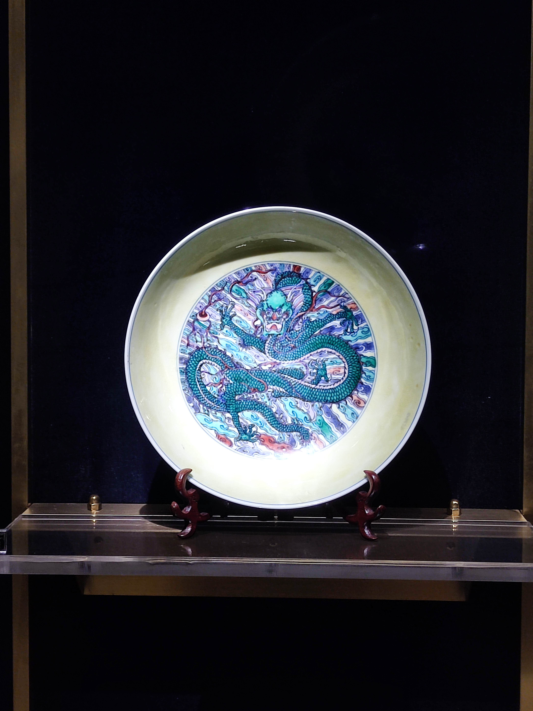
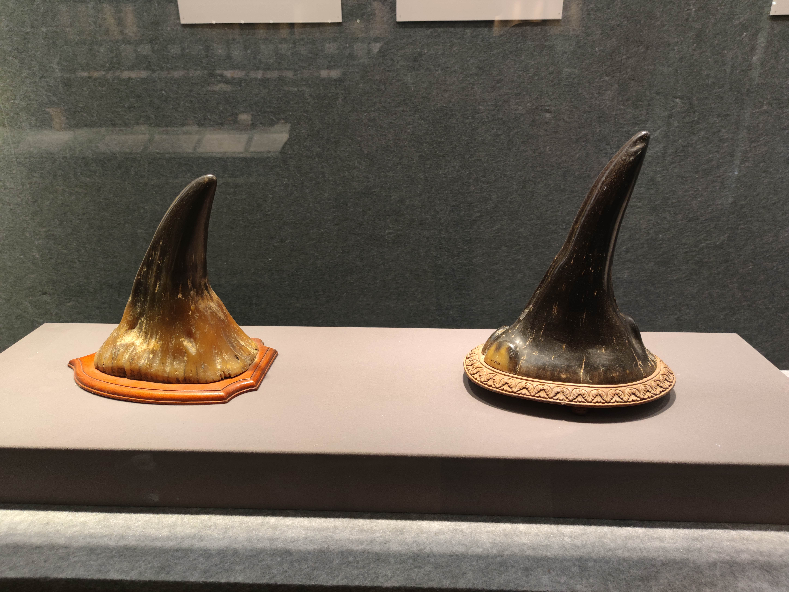
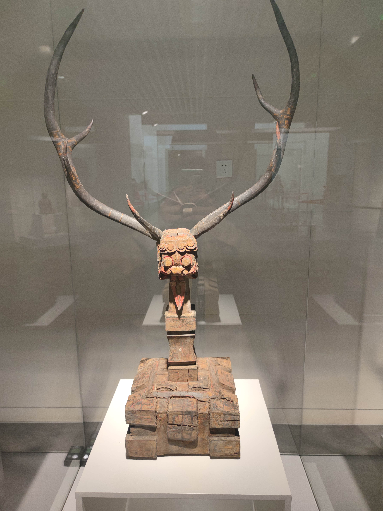
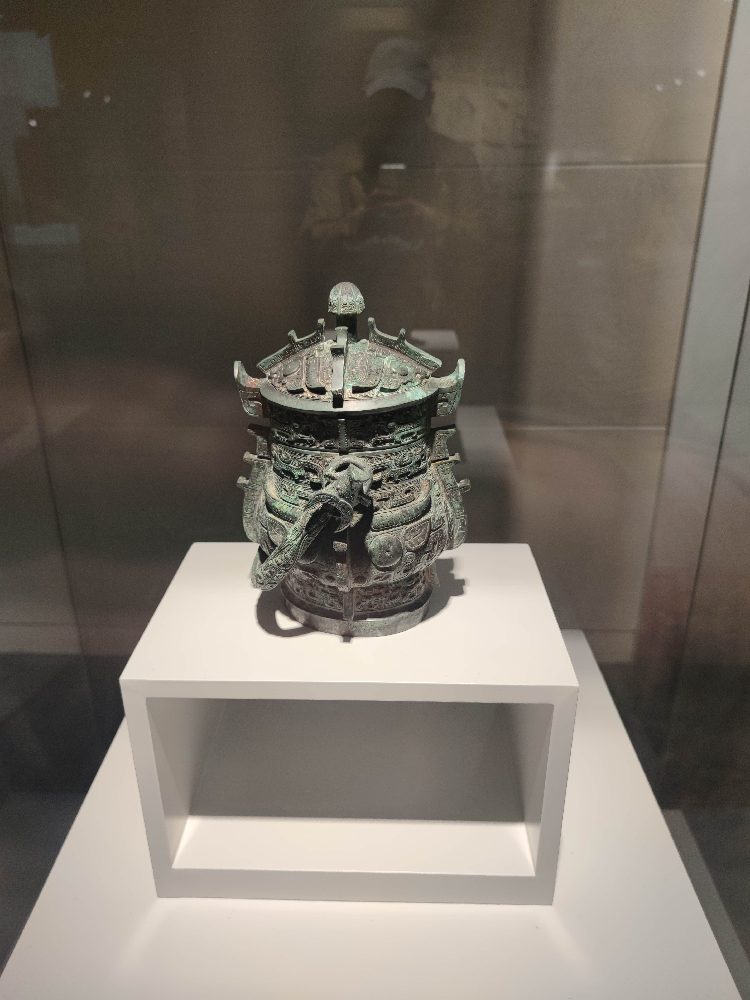

# 前言

> 某天心血来潮一个人去逛的，南京博物院的特点就是藏品量很多，但是说实话那天去没发现多少令我眼前一亮的珍品，可能没拿出来或者外借了，另外好像没怎么看到南朝的文物，南京作为六朝古都，应该有很多的才对，应该是在六朝博物馆那里，改天去逛一逛！

# 入口

- 正门

# 历史馆

## 远古时代

## 新石器时代

## 先秦

- 成套的编钟

- 镇馆之宝- 青铜错金银立鸟几何饮壶

- 青铜马

- 青铜猪

---

## 两汉

- 黄肠题凑

- 陶俑

- 烛台

- 厕所

> 汉代厕所建在猪圈上，如厕完正好喂猪，所以猪在古代的地位很底下
>
> 这也体现了我国古代人民的智慧
>
> 记得有位名人好像是如厕时掉进猪圈摔死的😄。

- 鎏金铜弩机

# 特展馆

## 南北朝-唐代厅

- 北魏石刻一佛二菩萨

- 北魏陶俑

- 唐代佛像

- 佛头

- 战马

## 雕像馆

- 浮雕

- 八仙砖雕

## 文房用具厅

## 佛像厅

- 鎏金白马头金刚佛铜像（清）

## 故宫旧藏厅

> 抗战时期，国民政府为了防止故宫文物被日军掠夺，将数百万件故宫藏品打包运往南方
>
> 其中不少被南京博物院所收藏

- 座椅

- 红珊瑚

- 龙盘

- 粉瓷

- 玉葫芦

- 白玉如意

- 碧玉如意

- 金册

## 西洋钟表厅

> 清代开始，陆续有西洋的钟表进入皇家视野，备受皇家喜爱，收藏了不少外国钟表
>
> 在全国各地也开设钟表厂，尤以广州和苏州为最

- 铜镀金仙鹤时乐钟（清 乾隆）

- 铜镀金嵌彩料石人敲时乐钟（清 乾隆 英国造）

- 铜镀金亭子人物敲钟（清 英国造）

## 民国文物厅

- 犀牛角（国礼）

# 民国馆

# 镇馆之宝

- 东汉错银铜牛灯

# 忘了在哪逛到的。。。

