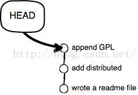
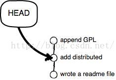

# 版本回退-撤销文件修改

{针对文件修改恢复}

## a.工作区修改一个文件后，又想回到修改前(git add前)

1. 当然可以直接手动再在工作区中将文件修改回去

2. 修改后，通过命令git status查看

```
$ git status
# On branch master

# Changes not staged for commit:
#   (use "git add <file>..." to update what will be committed)

#   (use "git checkout -- <file>..." to discard changes in working directory)

#
#       modified:   readme.txt

#

no changes added to commit (use "git add" and/or "git commit -a")
```

这时Git会告诉你，git checkout -- file可以丢弃工作区的修改：

```html
$ git checkout -- readme.txt
```

**Note**:

\1. git checkout -- file命令中的--很重要，没有--，就变成了“切换到另一个分支”的命令，我们在后面的分支管理中会再次遇到git checkout命令。

\2. 命令git checkout -- readme.txt意思就是，把readme.txt文件在工作区的修改全部撤销，这里有两种情况：

一种是readme.txt自修改后还没有被放到暂存区，现在，撤销修改就回到和版本库一模一样的状态；一种是readme.txt已经添加到暂存区后，又作了修改，现在，撤销修改就回到添加到暂存区后的状态。总之，就是让这个文件回到最近一次git commit或git add时的状态。

\3. 工作区、暂存区的概念不清楚的可见于[Git版本控制教程 - Git本地仓库](http://blog.csdn.net/pipisorry/article/details/44588351)

## b.如果在工作区中修改了文件还git add到暂存区（但是在commit之前）

用git status查看一下，修改只是添加到了暂存区，还没有提交：

```html
$ git status


# On branch master


# Changes to be committed:


#   (use "git reset HEAD <file>..." to unstage)


#


#       modified:   readme.txt


#
```

Git同样告诉我们，用命令git reset HEAD file可以把暂存区的修改撤销掉（unstage），重新放回工作区：

```html
$ git reset HEAD readme.txt


Unstaged changes after reset:


M       readme.txt
```

git reset命令既可以回退版本，也可以把暂存区的修改回退到工作区。当我们用HEAD时，表示最新的版本。

再用git status查看一下，现在暂存区是干净的，工作区有修改。

然后丢弃工作区的修改

```html
$ git checkout -- readme.txt


 


$ git status


# On branch master


nothing to commit (working directory clean)
```

## c.不但修改了文件还从暂存区提交commit到了版本库 - 版本回退

版本回退可以回退到上一个版本。不过，这是有条件的，就是你还没有把自己的本地版本库推送到远程。Git是分布式版本控制系统。

在工作中对某个文件（如readme.txt）进行多次修改交commit。

可以通过版本控制系统命令告诉我们提交的历史记录，在Git中，我们用git log命令查看：

```html
$ git log

commit 3628164fb26d48395383f8f31179f24e0882e1e0
Author: Michael Liao <askxuefeng@gmail.com>
Date:   Tue Aug 20 15:11:49 2013 +0800
    append GPL

commit ea34578d5496d7dd233c827ed32a8cd576c5ee85
Author: Michael Liao <askxuefeng@gmail.com>
Date:   Tue Aug 20 14:53:12 2013 +0800
    add distributed

commit cb926e7ea50ad11b8f9e909c05226233bf755030
Author: Michael Liao <askxuefeng@gmail.com>
Date:   Mon Aug 19 17:51:55 2013 +0800
    wrote a readme file
```

**Note**:

> 1. git log命令显示从最近到最远的提交日志，我们可以看到3次提交，最近的一次是append GPL，上一次是add distributed，最早的一次是wrote a readme file。

> 2. 如果嫌输出信息太多，看得眼花缭乱的，可以试试加上--pretty=oneline参数：

```html
$ git log --pretty=oneline
3628164fb26d48395383f8f31179f24e0882e1e0 append GPL

ea34578d5496d7dd233c827ed32a8cd576c5ee85 add distributed

cb926e7ea50ad11b8f9e909c05226233bf755030 wrote a readme file
```

> 3. 你看到的一大串类似3628164...882e1e0的是commit id（版本号），和SVN不一样，Git的commit id不是1，2，3……递增的数字，而是一个SHA1计算出来的一个非常大的数字，用十六进制表示，而且你看到的commit id和我的肯定不一样，以你自己的为准。
> 4. 为什么commit id需要用这么一大串数字表示呢？因为Git是分布式的版本控制系统，后面我们还要研究多人在同一个版本库里工作，如果大家都用1，2，3……作为版本号，那肯定就冲突了。

> 5. 每提交一个新版本，实际上Git就会把它们自动串成一条时间线。如果使用可视化工具（如GitX、github的客户端、pycharm）查看Git历史，就可以更清楚地看到提交历史的时间线。

- 现在我们想要把readme.txt回退到上一个版本

如“add distributed”的那个版本，怎么做呢？

首先，Git必须知道当前版本是哪个版本，在Git中，用HEAD表示当前版本，也就是最新的提交3628164...882e1e0（注意我的提交ID和你的肯定不一样）。

现在，我们要把当前版本“append GPL”回退到上一个版本“add distributed”，就可以使用git reset命令：

```csharp
$ git reset --hard HEAD^
HEAD is now at ea34578 add distributed
```

这时readme.txt的内容就成了版本add distributed

我们用git log再看看现在版本库的状态：

```html
$ git log
commit ea34578d5496d7dd233c827ed32a8cd576c5ee85
Author: Michael Liao <askxuefeng@gmail.com>
Date:   Tue Aug 20 14:53:12 2013 +0800
    add distributed

commit cb926e7ea50ad11b8f9e909c05226233bf755030
Author: Michael Liao <askxuefeng@gmail.com>
Date:   Mon Aug 19 17:51:55 2013 +0800
    wrote a readme file
```

最新的那个版本append GPL已经看不到了！

## d.恢复文件后，要是我们又想回到修改后的文件呢？（命令行窗口还没有被关掉）

{这个是git reset --hard后，又反悔了，想回到修改后的状态}

只要上面的命令行窗口还没有被关掉，你就可以顺着往上找啊找啊，找到那个append GPL的commit id是3628164...，于是就可以指定回到未来的某个版本：

```html
$ git reset --hard 3628164
HEAD is now at 3628164 append GPL
```

版本号没必要写全，前几位就可以了，Git会自动去找。

Git的版本回退速度非常快，因为Git在内部有个指向当前版本的HEAD指针，当你回退版本的时候，Git仅仅是把HEAD从指向append GPL：



改为指向add distributed：



然后顺便把工作区的文件更新了。所以你让HEAD指向哪个版本号，你就把当前版本定位在哪。

## 恢复文件后，要是我们又想回到修改后的文件呢？（命令行窗口早就关掉了）

{这个是git reset --hard后，又反悔了，想回到修改后的状态}

想恢复到新版本怎么办？找不到新版本的commit id怎么办？当你用$ git reset --hard HEAD^回退到add distributed版本时，再想恢复到append GPL，就必须找到append GPL的commit id。

Git提供了一个命令git reflog用来记录你的每一次命令：[[Git高级教程](http://blog.csdn.net/pipisorry/article/details/50669350):git log与git reflog]

```html
$ git reflog
ea34578 HEAD@{0}: reset: moving to HEAD^


3628164 HEAD@{1}: commit: append GPL


ea34578 HEAD@{2}: commit: add distributed


cb926e7 HEAD@{3}: commit (initial): wrote a readme file
```

第二行显示append GPL的commit id是3628164，现在，你又可以乘坐时光机回到未来了。