> 引自 [guide哥](https://blog.csdn.net/qq_34337272/article/details/105626975)
>
> https://blog.csdn.net/qq_34337272/article/details/105955512

## JAVADOC

> 作用：用于在Java类元素（例如字段，方法等）上生成Java文档的插件

可以配置模板

## IDE Features Trainer—IDEA交互式教程

可以在 IDEA 中以交互方式学习IDEA最常用的快捷方式和最基本功能。

当我们安装了这个插件之后，你会发现我们的IDEA 编辑器的右边多了一个“Learn”的选项，我们点击这个选项就可以看到如下界面,可以在里面进行学习。

## RestfulTool—RESTful服务开发

专为 RESTful 服务开发而设计的插件，有了它之后，你可以：

1. 根据 URL 直接跳转到对应的方法定义 ctrl + Alt + / 并且提供了一个 Services tree 的可视化显示窗口。 

2. 作为一个简单的 http 请求工具来使用。

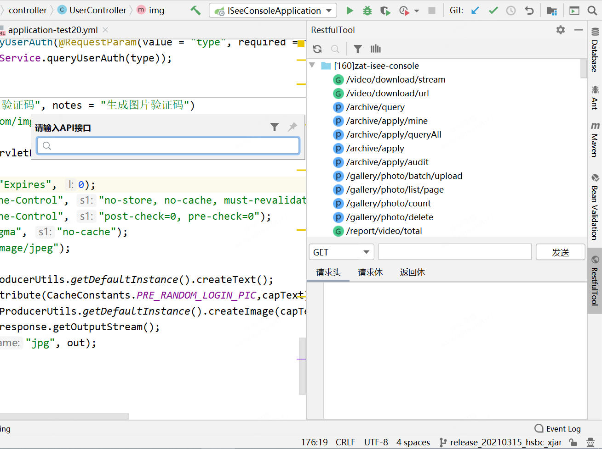

在请求方法上添加了有用功能: 复制生成 URL、复制方法参数…

---

## Key Promoter X+Presentation Assistant—快捷键提示+统计

> 前者用于快捷键统计，后者用于提示快捷键

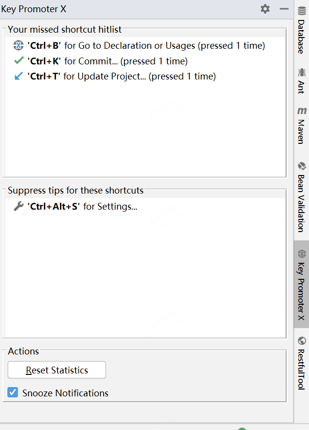

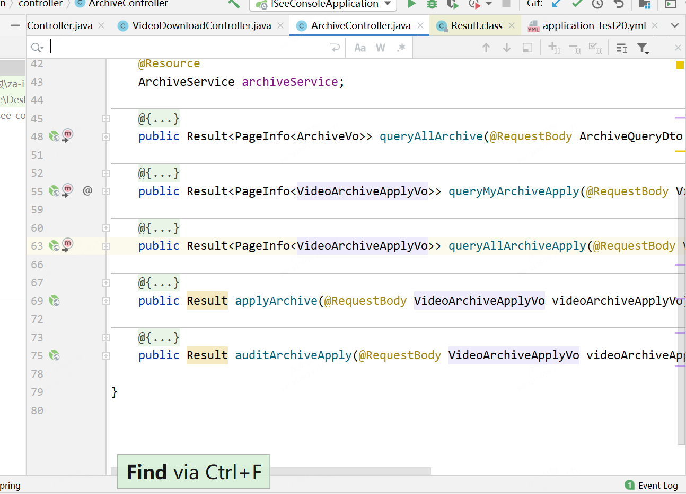

## TabNine/Codota—代码智能提示(还在体验中)

> 用于智能代码补全，它基于数百万Java程序，能够根据程序上下文提示补全代码。
>
> 相比于IDEA自带的智能提示来说，TabNine 的提示更加全面一些.

我们创建线程池现在变成下面这样：

上面只是为了演示这个插件的强大，实际上创建线程池不推荐使用这种方式， 推荐使用 ThreadPoolExecutor 构造函数创建线程池。我下面要介绍的一个阿里巴巴的插件-Alibaba Java Code Guidelines 就检测出来了这个问题，所以，Executors下面用波浪线标记了出来。

除了，在写代码的时候智能提示之外。你还可以直接选中代码然后搜索相关代码示例。

> Codota 还有一个在线网站，在这个网站上你可以根据代码关键字搜索相关代码示例。
>
> 网站地址：https://www.codota.com/code 

## Alibaba Java Code Guidelines—阿里巴巴 Java 代码规范

阿里巴巴 Java 代码规范，对应的Github地址为：https://github.com/alibaba/p3c 。非常推荐安装！

根据官方描述：

> 目前这个插件实现了开发手册中的的53条规则，大部分基于PMD实现，其中有4条规则基于IDEA实现，并且基于IDEA Inspection实现了实时检测功能。部分规则实现了Quick Fix功能，对于可以提供Quick Fix但没有提供的，我们会尽快实现，也欢迎有兴趣的同学加入进来一起努力。目前插件检测有两种模式：实时检测、手动触发。

上述提到的开发手册也就是在Java开发领域赫赫有名的《阿里巴巴Java开发手册》。

你还可以手动配置相关 inspection规则：

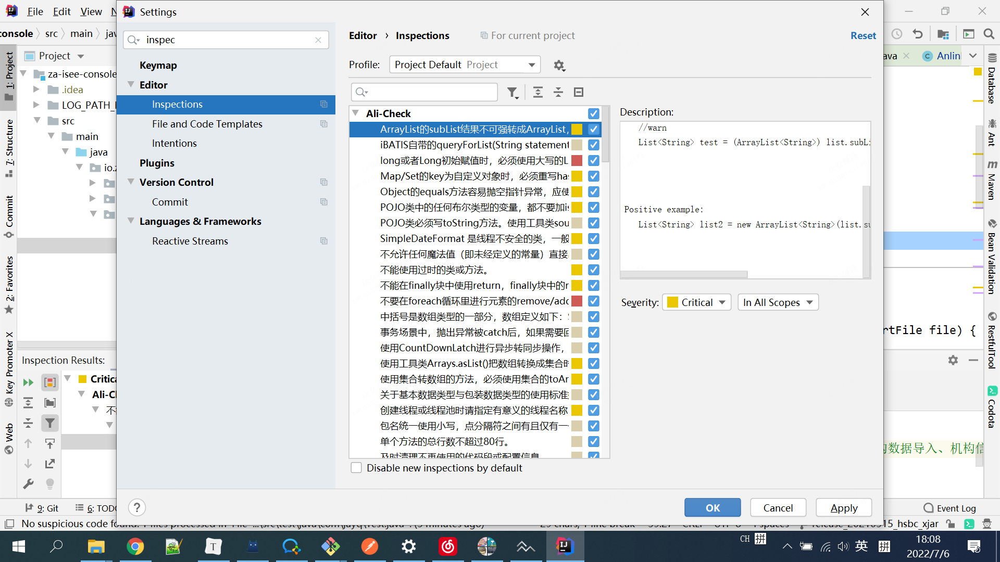

这个插件会实时检测出我们的代码不匹配它的规则的地方，并且会给出修改建议。

## GsonFormat+RoboPOJOGenerator—JSON转类对象(还未使用)

这个插件可以根据Gson库使用的要求,将JSONObject格式的String 解析成实体类。

这个插件使用起来非常简单，我们新建一个类，然后在类中使用快捷键 option + s(Mac)或alt + s (win)调出操作窗口（必须在类中使用快捷键才有效），如下图所示。

这个插件是一个国人几年前写的，不过已经很久没有更新了，可能会因为IDEA的版本问题有一些小Bug。而且，这个插件无法将JSON转换为Kotlin（这个其实无关痛痒，IDEA自带的就有Java转Kotlin的功能）。

另外一个与之相似的插件是 ：RoboPOJOGenerator ，这个插件的更新频率比较快。

File-> new -> Generate POJO from JSON

然后将JSON格式的数据粘贴进去之后，配置相关属性之后选择“Generate”

## Statistic—项目信息统计

有了这个插件之后你可以非常直观地看到你的项目中所有类型的文件的信息比如数量、大小等等，可以帮助你更好地了解你们的项目。

你还可以使用它看所有类的总行数、有效代码行数、注释行数、以及有效代码比重等等这些东西。

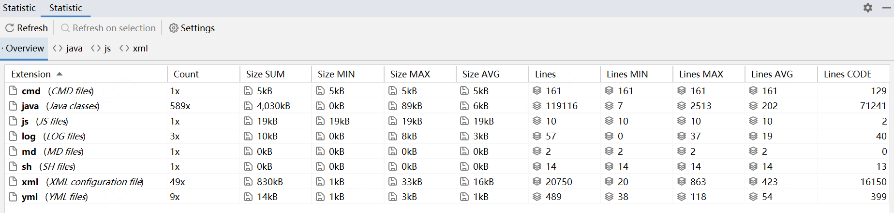

## Translation-必备的翻译插件

- 支持多种翻译源：
  - Google 翻译
  - Youdao 翻译
  - Baidu 翻译

除了翻译功能之外还提供了语音朗读、单词本等实用功能。

Github地址 : https://github.com/YiiGuxing/TranslationPlugin 

- 使用方法

  > 选中你要翻译的单词或者句子
  >
  > 使用快捷键 shift+ctrl+y
  >
  > 如果你忘记了快捷的话，鼠标右键操作即可！

- 快速打开翻译框，使用快捷键 ctrl + shift + o(win/linux)

如果你需要将某个重要的单词添加到生词本的话，只需要点击单词旁边的收藏按钮即可！

## CamelCase-多种命名格式之间切换(暂时没用)

非常有用！这个插件可以实现包含6种常见命名格式之间的切换。并且，你还可以对转换格式进行相关配置（转换格式），如下图所示：

有了这个插件之后，你只需要使用快捷键 shift+option+u(mac) / shift+alt+u 对准你要修改的变量或者方法名字，就能实现在多种格式之间切换了，如下图所示：

如果你突然忘记快捷键的话，可以直接在IDEA的菜单栏的 Edit 部分找到。

使用这个插件对开发效率提升高吗？拿我之前项目组的情况举个例子：

我之前有一个项目组的测试名字是驼峰这种形式:ShouldReturnTicketWhenRobotSaveBagGiven1LockersWith2FreeSpace 。但是，使用驼峰形式命名测试方法的名字不太明显，一般建议用下划线_的形式：should_return_ticket_when_robot_save_bag_given_1_lockers_with_2_free_space

如果我们不用这个插件，而是手动去一个一个改的话，工作量想必会很大，而且正确率也会因为手工的原因降低。

## Grep Console:控制台输出处理

这个插件主要的功能有两个：

1. 自定义设置控制台输出颜色

我们可以在设置中进行相关的配置:

配置完成之后的 log warn 的效果对比图如下：

2. 过滤控制台输出

## Rainbow Brackets:彩虹🌈括号

使用各种鲜明的颜色来展示你的括号，效果图如下。可以看出代码层级变得更加清晰了，可以说非常实用友好了！

## Save Actions:优化保存操作

真必备插件！可以帮助我们在保存文件的时候：

优化导入；
格式化代码；
执行一些quick fix
…
这个插件是支持可配置的，我的配置如下：

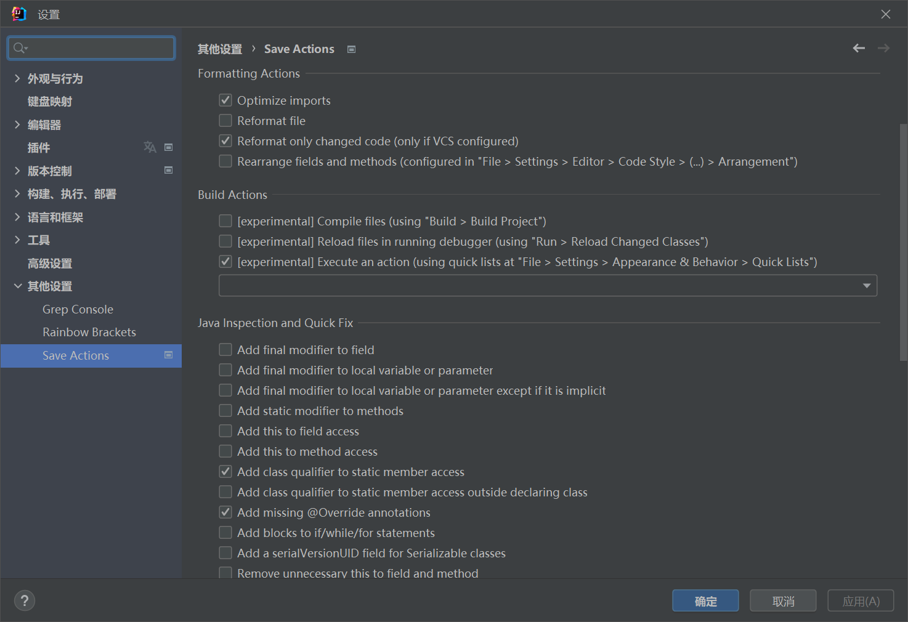

实际使用效果如下：

## SequenceDiagram:一键生成时序图

> 必备！一般用它来生成简单的方法时序图，方便我们阅读代码，特别是在代码的调用层级比较多的时候。

- 使用方法

> 选中方法名（注意不要选类名），然后点击鼠标右键，选择 Sequence Diagram 选项即可！

配置完一些基本的选项比如调用深度之后，我们点击ok即可！

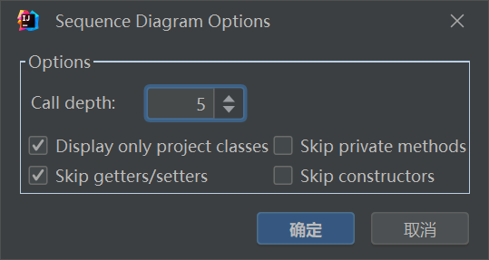

在这张图中我们已经生成了调用方法之间的时序图。

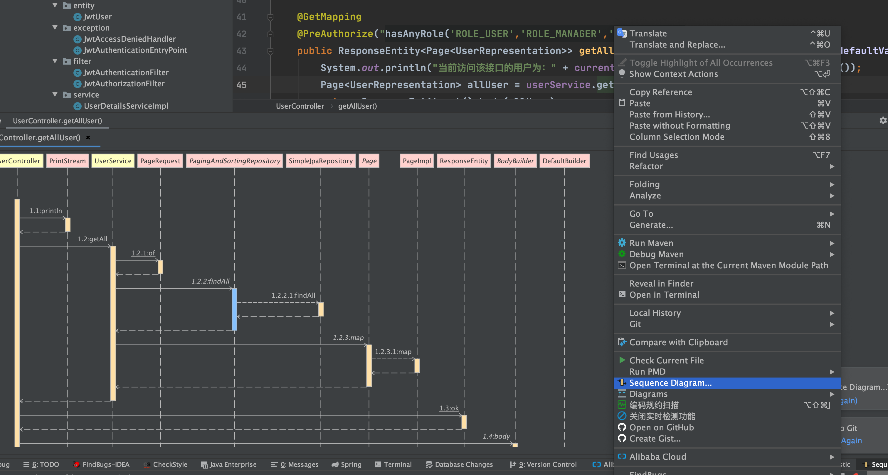

时序图生成完成之后，你可以选择导出为图片或者text文件，你还可以通过生成的时序图来定位到相关的代码，这对于我们阅读源码的时候尤其有帮助！

## Maven Helper:分析Maven项目的相关依赖

> 主要用来分析Maven项目的相关依赖，可以帮助我们解决Maven依赖冲突问题。

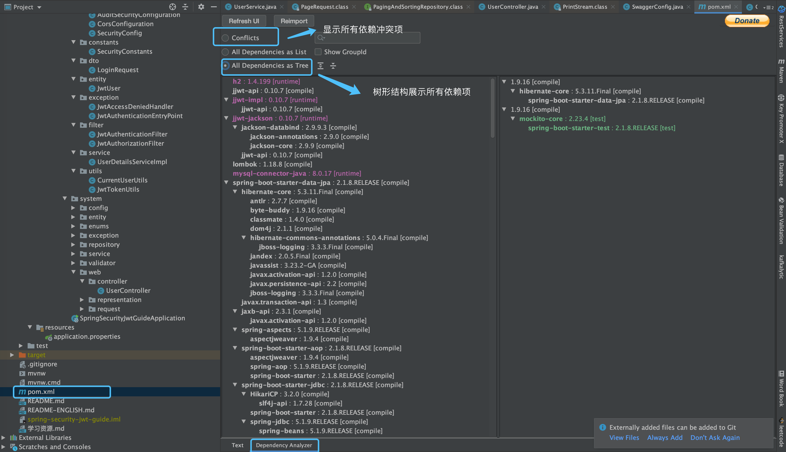

- 何为依赖冲突？

说白了就是你的项目使用的2个jar包引用了同一个依赖h，并且h的版本还不一样,这个时候你的项目就存在两个不同版本的 h。这时Maven会依据依赖路径最短优先原则，来决定使用哪个版本的Jar包，而另一个无用的Jar包则未被使用，这就是所谓的依赖冲突。

大部分情况下，依赖冲突可能并不会对系统造成什么异常，因为Maven始终选择了一个Jar包来使用。但是，不排除在某些特定条件下，会出现类似找不到类的异常，所以，只要存在依赖冲突，在我看来，最好还是解决掉，不要给系统留下隐患。

## EasyCode:一键帮你生成所需代码

> Easycode 可以直接对数据的表生成entity、controller、service、dao、mapper无需任何编码，简单而强大。

> 更多内容可以查看这篇文章：[《懒人 IDEA 插件插件:EasyCode 一键帮你生成所需代码~》](https://mp.weixin.qq.com/s?__biz=Mzg2OTA0Njk0OA==&mid=2247486205&idx=1&sn=0ff2f87f0d82a1bd9c0c44328ef69435&chksm=cea24536f9d5cc20c6cc7669f0d4167d747fe8b8c05a64546c0162d694aa96044a2862e24b57&token=1862674725&lang=zh_CN#rd)

## CheckStyle:代码格式检查

这个插件的作用主要是为了规范代码格式比如说项目中一行代码最长是多少、项目中有没有无用的引用等等。非常实用！

一般情况下我们会在项目中配置 CheckStyle，并且自定义规则，然后再配置一个Commit 的 Git 钩子，这样我们在Commit代码的时候就会跑一遍 CheckStyle，看看项目代码的格式有问题不。

这个插件的作用主要是帮助我们定位问题，示例如下：

我们使用一个自定义的规则，然后运行 CheckStyle ，可以看到这个插件就帮我们找到有一个无用的 import。

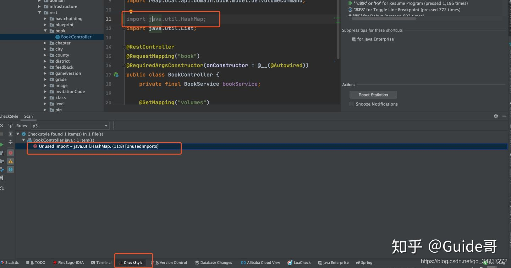

## SonarLint:帮你优化代码

SonarLint 帮助你发现代码的错误和漏洞，就像是代码拼写检查器一样，SonarLint 可以实时显示出代码的问题，并提供清晰的修复指导，以便你提交代码之前就可以解决它们。

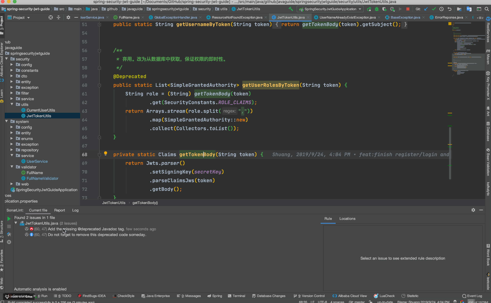

并且，很多项目都集成了 SonarQube,SonarLint 可以很方便地与 SonarQube 集成。

## Lombok:帮你简化代码

> 人手必备
>
> 如果你要使用 Lombok 的话，不光是要安装这个插件，你的项目也要引入相关的依赖。

        <dependency>
            <groupId>org.projectlombok</groupId>
            <artifactId>lombok</artifactId>
            <optional>true</optional>
        </dependency>

使用 Lombok 能够帮助我们少写很多代码比如 Getter/Setter、Constructor等等。

关于Lombok的使用，可以查看这篇文章：[《十分钟搞懂Java效率工具Lombok使用与原理》](https://mp.weixin.qq.com/s?__biz=Mzg2OTA0Njk0OA==&mid=2247485385&idx=2&sn=a7c3fb4485ffd8c019e5541e9b1580cd&chksm=cea24802f9d5c1144eee0da52cfc0cc5e8ee3590990de3bb642df4d4b2a8cd07f12dd54947b9&token=1667678311&lang=zh_CN#rd)。

## CodeGlance:代码微型地图

提供一个代码的微型地图，当你的类比较多的时候可以帮忙你快速定位到要去的位置。这个插件在我们日常做普通开发的时候用处不大，不过，在你阅读源码的时候还是很有用的，如下图所示：

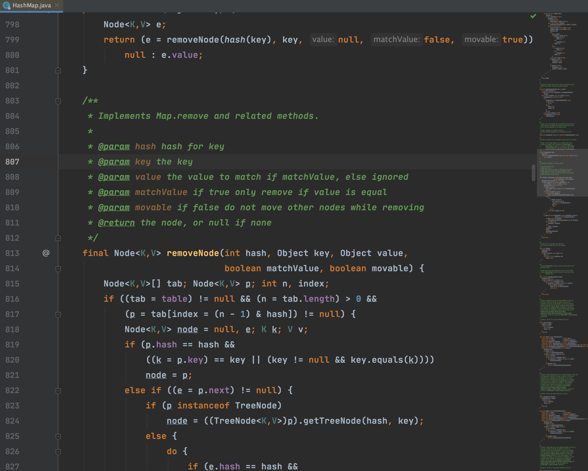

## Java Stream Debugger:Java8 Stream调试器

> Stream API 让你的代码更加优雅，但是有一个缺点是代码更难阅读和理解，没关系，这个插件应该可以帮助到你！

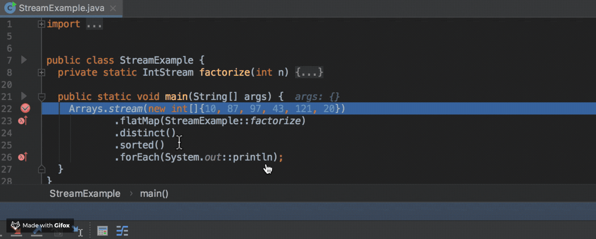

> 注意：Not compatible with the version of your running IDE (IntelliJ IDEA 2022.1.3)

## Git Commit Template:使用模板创建commit信息（没用过）

没有安装这个插件之前，我们使用IDEA提供的Commit功能提交代码是下面这样的：

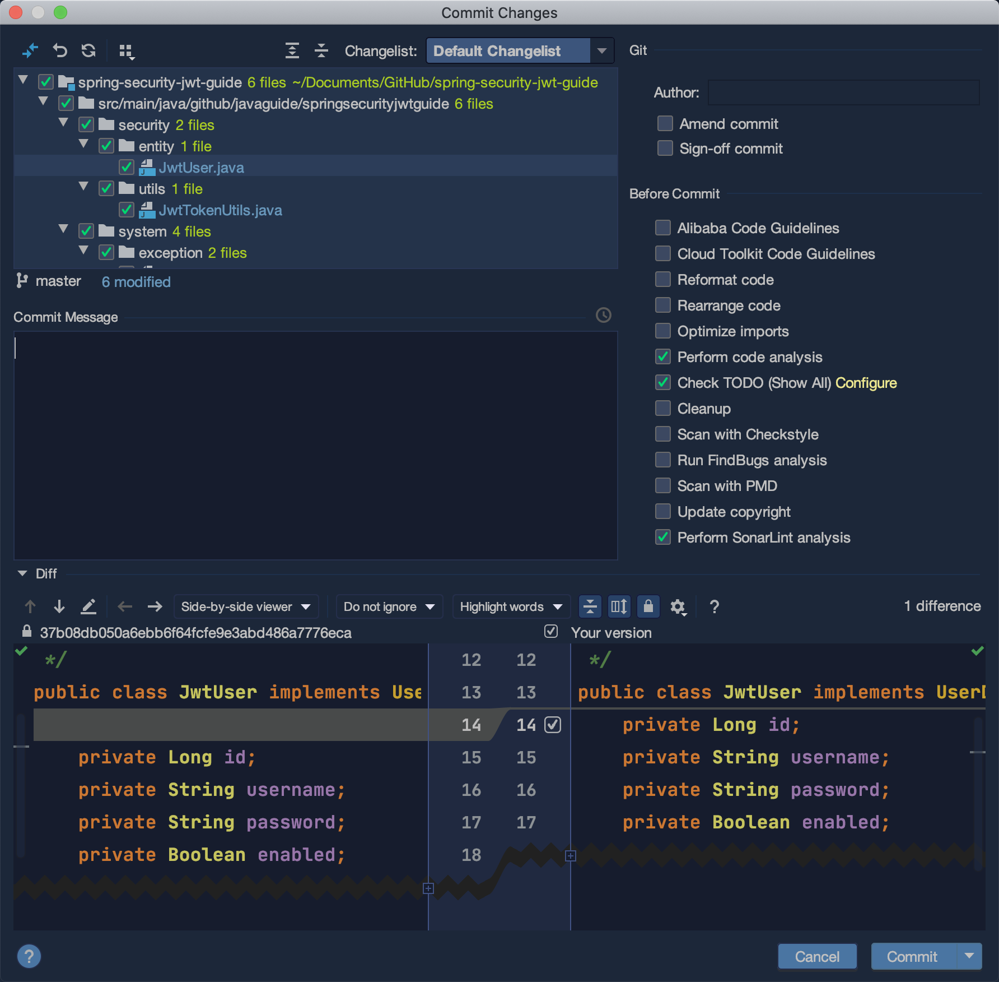

使用了这个插件之后是下面这样的，提供了一个commit信息模板的输入框：

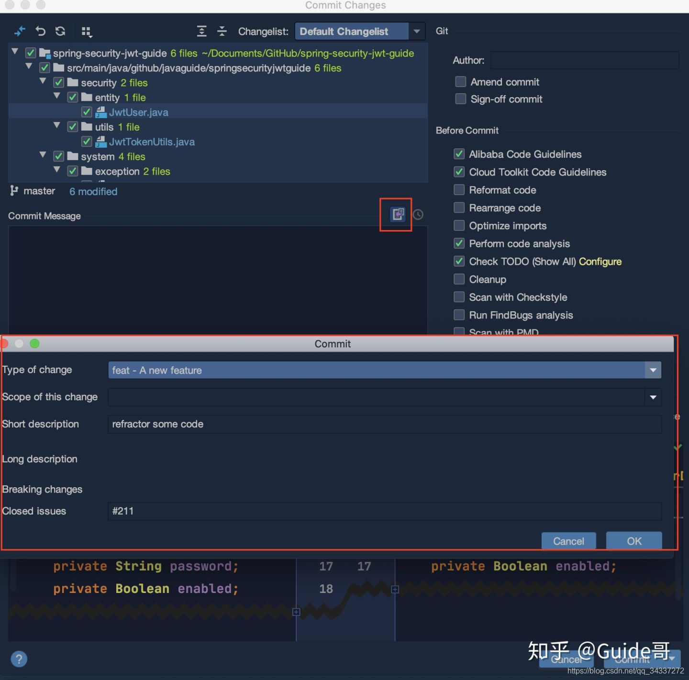

完成之后的效果是这样的：

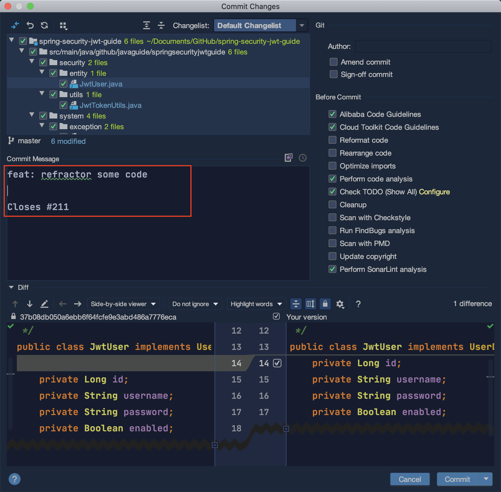

## 其他常用插件推荐

- leetcode editor :提供在线 Leetcode 刷题功能，比较方便我们刷题，不过我试用之后发现有一些小 bug，个人感觉还是直接在网站找题目刷来的痛快一些。
- A Search with Github ：直接通过 Github搜索相关代码。
- stackoverflow : 选中相关内容后单击右键即可快速跳转到 stackoverflow 。
- CodeStream ：让code review变得更加容易。
- Code screenshots ：代码片段保存为图片。
- activate-power-mode : 写代码的时候自带动画效果！
- GitToolBox :Git工具箱
- OK, Gradle! ：搜索Java库用于Gradle项目
