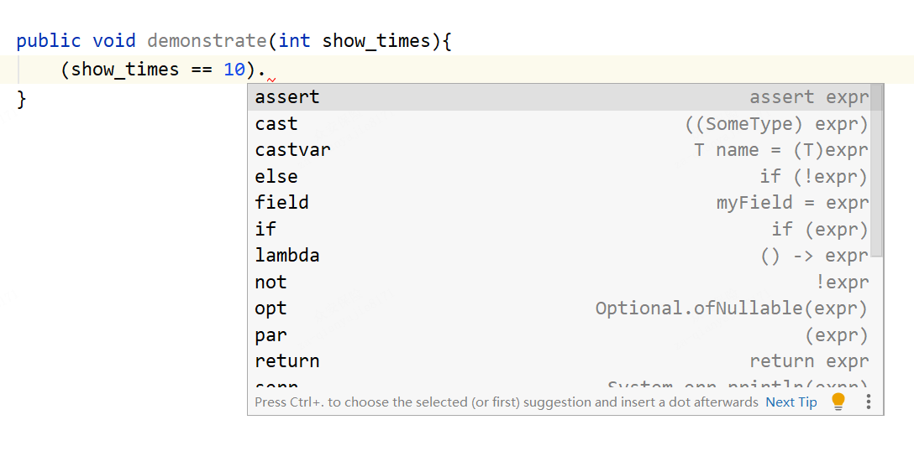
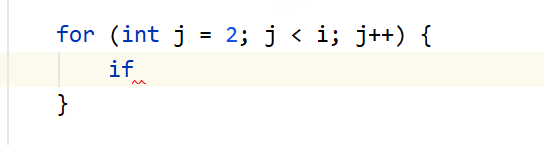
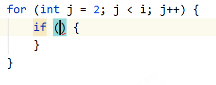
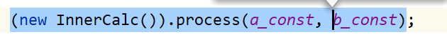
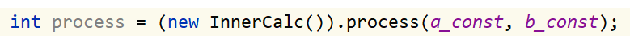

# idea常用快捷键

## 本人目前常用

- 格式化代码
- 看方法有哪些参数
- 选择重复的参数
- 处理异常
- 加环绕
- 追源码
- 全局查找

## 1.基础操作

#### 全局设置查找

Ctrl + Shift + A

#### 快速定位到代码块最开始/最后面

> ctrl + { / }

#### 选择

- 快速选择右边部分，到空格结束

  Ctrl + Shift + 向右箭头

- 快速选择代码块，到下一个代码块之前

  Ctrl + W

- 取消选择

  Ctrl + Shift + W

#### 注释

- 单行注释

  Ctrl + /

- 多行注释

  Ctrl + Shift + /

#### 复制/删除

- 复制当前行

  Ctrl + D

- 删除当前行

  Ctrl + Y

#### 移动

- 向上/向下移动当前行，当前方法

  Ctrl + Shift + 向上箭头/向下箭头

#### 折叠/打开方法

- 折叠/打开当前方法

  Ctrl + - / +

- 折叠/打开所有方法

  Ctrl + Shift + - / +

### 加/取消环绕

- 加

  Ctrl + Alt + T

- 取消

  Ctrl + Shift + Delete

#### 多选

- 加上下一个

  Alt + J

- 取消当前个

  Alt + Shift + J

- 全部选择

  Ctrl + Alt + Shift + J 

---

## 2.提高代码效率

- 后缀 .

  

- if快速补全

  Ctrl + Shift + Enter

  

  

- 全局替换变量或者方法名

  Shift + F6

- 自动补全生成的变量

  Ctrl + Alt + V

  

  

- 提取部分代码生成常量/方法/参数/变量

  Ctrl + Alt + C / M / P / V

- 格式化代码

  Ctrl + Alt + L

- 看方法有哪些参数

  Ctrl + P

- 看方法组成

  Ctrl + Q

- 看方法源码

  Ctrl + Shift + I

### 异常处理

- 快速定位到异常

  F2

- 处理异常

  Alt + Enter

---

## 3.提高代码阅读效率

- 追源码

  Ctrl + 左键

- 看文件结果

  Ctrl + F12

- 查找

  Ctrl + F

- 全局查找

  Ctrl + Shift + F